# Get Elected

A Claude AI Skill that helps any person in the United States run a legally compliant, strategically sound campaign for public office — from school board to Congress.

## What This Skill Does

Get Elected is a comprehensive campaign assistant that provides guidance across every phase of running for office:

- **Campaign Finance Compliance** — Federal FEC rules and state-specific filing requirements, contribution limits, disclosure deadlines, and reporting obligations.
- **Campaign Strategy** — Race analysis, voter targeting, timeline planning, staffing structures, and budget frameworks tailored to the office you are seeking.
- **Messaging and Communications** — Platform development, stump speeches, debate preparation, press releases, op-eds, and issue framing.
- **GOTV (Get Out The Vote)** — Canvassing plans, phone bank scripts, poll watcher coordination, Election Day logistics, and early/absentee vote strategies.
- **Voter Engagement Tools** — 15 interactive tools for town halls, petition drives, voter registration events, community listening sessions, and more.

### Skill Core Loop

Every session follows the same five-step routing process to deliver the right guidance for the right person at the right time.

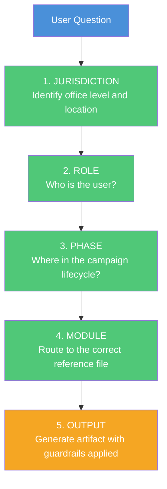

### Campaign Lifecycle

A campaign moves through seven distinct phases, each with its own priorities, tasks, and compliance requirements.

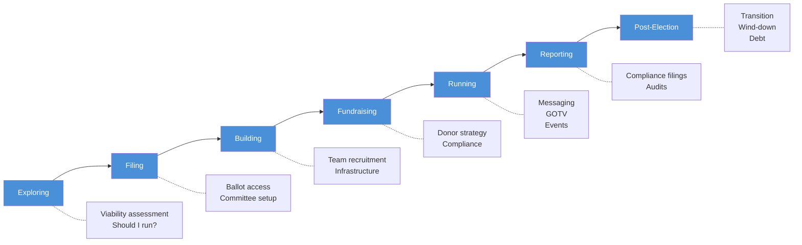

## How to Use It

Get Elected is a Claude AI skill. It triggers automatically when you ask campaign-related questions. You can also invoke any of its 80+ slash commands directly for instant artifact generation — everything from a fundraising plan to a compliance checklist to a volunteer onboarding packet.

Examples:

- "I want to run for city council in Phoenix. Where do I start?"
- "What are the campaign finance rules for a state senate race in Missouri?"
- "Help me write a stump speech about infrastructure and education."
- `/campaign-plan` — Generate a full campaign plan framework
- `/fundraising-strategy` — Build a fundraising strategy with timelines and targets
- `/compliance-checklist` — Produce a filing and compliance checklist for your race

### Jurisdiction Routing

Campaign rules are layered. Federal rules govern federal races, state rules govern state and local races, and some localities add additional requirements on top.

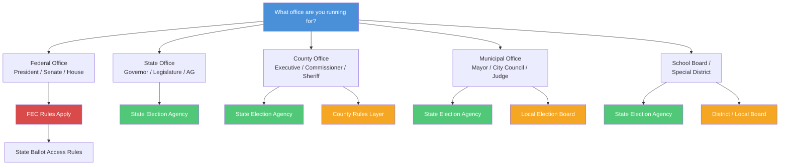

### User Roles

The skill adapts its guidance based on who you are. Each role is routed to the modules most relevant to their responsibilities.

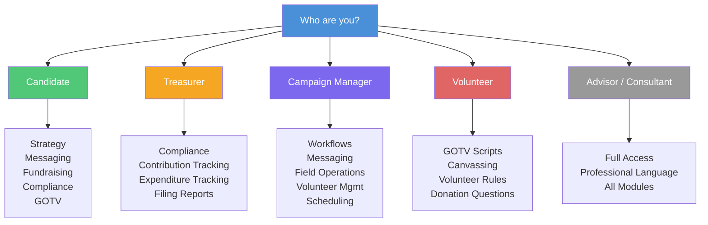

## Directory Structure

The following diagram shows how the major module groups connect and feed into each other.

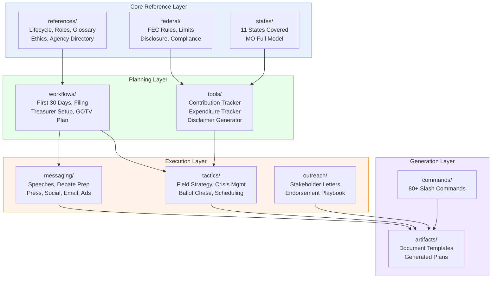

```
get-elected/
├── references/          # Core reference materials and legal foundations
├── federal/             # Federal election law, FEC rules, and compliance guides
├── states/              # State-specific election law and filing requirements
│   ├── AZ/
│   ├── CA/
│   ├── FL/
│   ├── GA/
│   ├── IL/
│   ├── MI/
│   ├── MO/              # Full coverage — complete state model
│   ├── NY/
│   ├── OH/
│   ├── PA/
│   └── TX/
├── workflows/           # Step-by-step campaign workflow guides
├── tools/               # Calculators, generators, and planning utilities
├── messaging/           # Speech templates, talking points, and comms frameworks
├── outreach/            # Voter contact, canvassing, and coalition-building
├── tactics/             # Field strategy, digital tactics, and GOTV operations
├── artifacts/           # Templates and generated document frameworks
├── commands.md          # Full catalog of 80+ slash commands
└── voter-engagement-tools.md  # 15 interactive voter engagement tools
```

## Coverage

Get Elected currently covers **11 states** with state-specific election law, filing requirements, and compliance guidance:

| State | Abbreviation | Coverage Level |
|-------|--------------|----------------|
| Arizona | AZ | Core coverage |
| California | CA | Core coverage |
| Florida | FL | Core coverage |
| Georgia | GA | Core coverage |
| Illinois | IL | Core coverage |
| Michigan | MI | Core coverage |
| Missouri | MO | **Full coverage** |
| New York | NY | Core coverage |
| Ohio | OH | Core coverage |
| Pennsylvania | PA | Core coverage |
| Texas | TX | Core coverage |

Missouri serves as the complete state model with exhaustive coverage of every office level, filing deadline, contribution limit, and compliance requirement. Other states include core coverage sufficient to guide candidates through the major requirements of running for office.

### State Coverage Model

Missouri provides the template for full state coverage. Each state begins with an overview file and expands to the full five-file structure as coverage deepens.

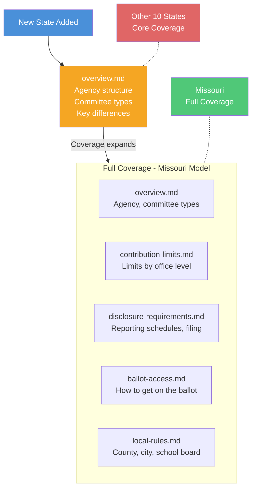

Federal election law and FEC compliance guidance apply to all 50 states.

## Key Workflows

### Should I Run? Decision Tree

The skill walks prospective candidates through a structured viability assessment before they commit to a campaign.

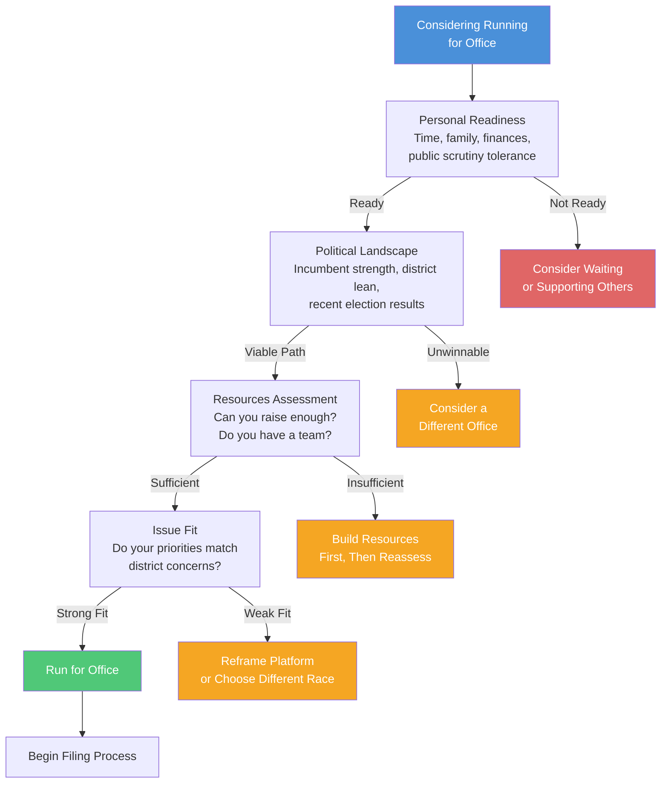

### Donation Processing Flow

Every contribution must pass through a compliance pipeline before it can be deposited and reported.

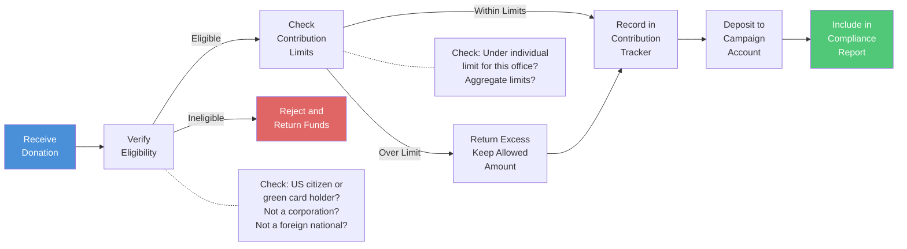

### Compliance Reporting Cycle

Campaign finance compliance is not a one-time task. It is an ongoing cycle that runs throughout the life of the campaign.

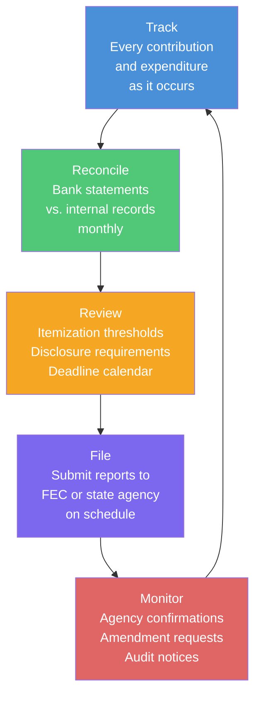

## Slash Commands

Over **80 slash commands** provide instant artifact generation for every aspect of a campaign. Commands span categories including:

- Campaign planning and launch
- Finance and fundraising
- Legal compliance and filing
- Messaging and communications
- Field operations and GOTV
- Digital strategy and social media
- Volunteer management
- Opposition research frameworks

Run any command by name to generate a ready-to-use document, checklist, or plan.

## Messaging and Communications

### Messaging Channels

A campaign's core message must be adapted consistently across every communication channel. The skill generates tailored content for each.

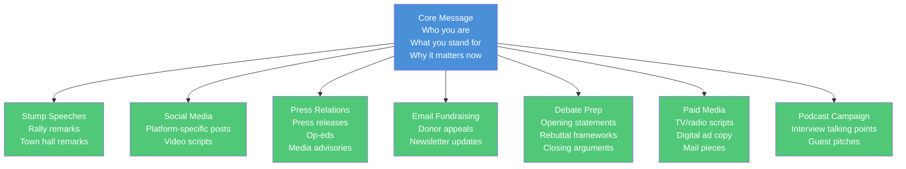

### Issue Response Engine

When an issue or attack surfaces, the skill generates a complete response package across all required formats from a single input.

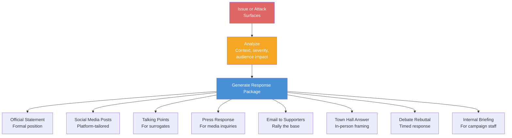

## Field Operations

### Voter Contact Pipeline

The voter contact operation follows a progressive engagement funnel from raw voter data to Election Day turnout.

```mermaid
flowchart LR
    VF["Voter File\nAcquire registered\nvoter data"] --> TGT["Target\nScore and segment\nby persuadability"]
    TGT --> ID["Identify\nDoor knocks and\ncalls to ID support"]
    ID --> PER["Persuade\nTailored messaging\nto undecided voters"]
    PER --> MOB["Mobilize\nLock in supporters\nVolunteer recruitment"]
    MOB --> GOTV["GOTV\nEarly vote chase\nElection Day turnout"]
    GOTV --> VOTE["Vote\nPoll monitoring\nBallot cure"]

    style VF fill:#4a90d9,color:#fff
    style TGT fill:#50c878,color:#fff
    style ID fill:#50c878,color:#fff
    style PER fill:#f5a623,color:#fff
    style MOB fill:#f5a623,color:#fff
    style GOTV fill:#e06666,color:#fff
    style VOTE fill:#7b68ee,color:#fff
```

### GOTV Operations Timeline

The final two weeks of a campaign follow a structured escalation from early vote operations through Election Day.

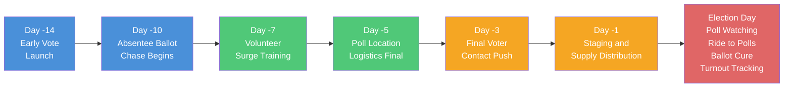

### Crisis Management: The RESPOND Framework

When a crisis hits, the skill guides users through a structured seven-step response protocol.

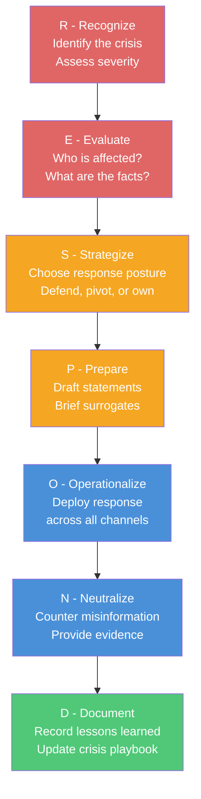

## Voter Engagement Tools

**15 interactive tools** help candidates build genuine connections with voters:

- Town hall planning and facilitation guides
- Voter registration drive toolkits
- Community listening session frameworks
- Petition and ballot initiative support
- Neighborhood canvassing systems
- Phone and text banking scripts
- Coalition-building workshops
- And more

## Guardrails

Get Elected operates under strict guardrails to ensure responsible use:

- **Nonpartisan** — This skill serves candidates of any party or no party. It does not advocate for any political ideology, party, or candidate.
- **No Invented Law** — All legal and compliance information is grounded in referenced source material. The skill will never fabricate statutes, regulations, or filing requirements.
- **Educational Only** — This skill provides educational information to help citizens participate in democracy. It is not a substitute for professional legal, financial, or strategic counsel.
- **No Dark Arts** — This skill will not assist with voter suppression, disinformation, illegal coordination, or any other unethical campaign practice.

## Contributing

Contributions are welcome. Areas where help is especially valuable:

- Adding or expanding state-specific coverage beyond the current 11 states
- Updating legal references to reflect new legislation or rule changes
- Improving templates and artifact quality
- Adding new slash commands for underserved campaign needs
- Testing workflows against real-world campaign scenarios

Please open an issue or submit a pull request. All contributions must maintain the nonpartisan, educational character of the project.

## Disclaimer

Get Elected provides **educational information only** and does **not** constitute legal advice. Campaign finance law, election law, and filing requirements vary by jurisdiction and change frequently. Always consult a qualified attorney, your state or local election authority, or the Federal Election Commission for authoritative guidance specific to your race and jurisdiction. Use of this skill does not create an attorney-client relationship or any other professional advisory relationship.

## License

This project is licensed under the MIT License. See [LICENSE](LICENSE) for details.
