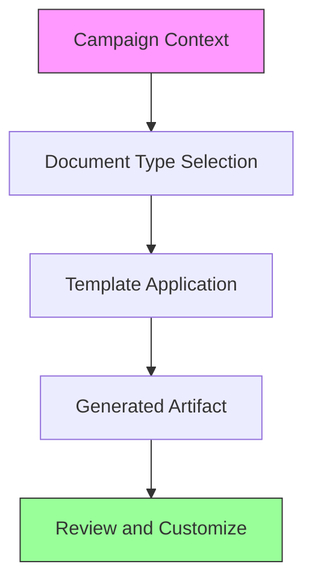

# Artifacts

Master templates and structural guides for every document type a campaign produces. Use these as starting frameworks and adapt to your candidate, race, and moment.

## Files

- [campaign-documents.md](campaign-documents.md) -- Index of every campaign document type with purpose, audience, tone, structure, and length guidance
