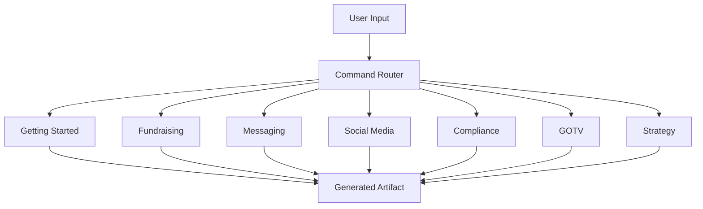

# Commands

Slash command reference for instant document generation. Type any command to generate the specified artifact using your campaign context.

## Files

- [commands.md](commands.md) -- Complete list of all slash commands with descriptions and usage

See also: [/commands.md](../commands.md) in the repository root for the top-level command reference.
