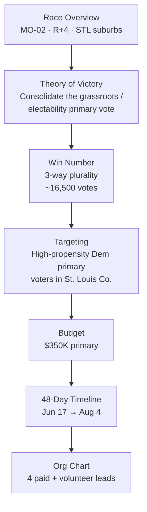

# Campaign Plan — Matt Grant for Congress (MO-02)

The strategic blueprint for winning the **August 4, 2026 Democratic primary** in Missouri's 2nd Congressional District. Built from `workflows/campaign-plan-builder.md`. Every dollar, hour, and door in the other files in this folder traces back to a decision made here. Figures are illustrative; district data is real and sourced (see `README.md`).



---

## Section 1 — Executive Summary

> **Matt Grant** is running for **U.S. House, Missouri's 2nd Congressional District**, in the **August 4, 2026 Democratic primary**. The primary win number is **~16,500 votes** based on a projected three-way primary turnout of roughly **40,000**. The campaign will raise and spend **$350,000** through the primary and execute a **voter-contact-first** strategy concentrated on **high-propensity Democratic primary voters in the St. Louis County portion of the district**. Victory depends on consolidating grassroots and electability-minded primary voters behind a single credible, locally-rooted nominee — Matt — while two opponents split the rest.

- **Biggest single risk:** a self-funding opponent buys late mail/TV and defines the race on money, not message. Mitigation: lock in earned media + field advantage early; bank cash for a final mail wave.

---

## Section 2 — Race Overview

### District profile (real, sourced)

| Attribute | MO-02 |
|---|---|
| Region | Eastern Missouri — suburbs south & west of St. Louis |
| Counties | **All of Franklin County**; portions of **St. Louis, St. Charles, and Warren** counties |
| Anchor communities | Chesterfield, Town and Country, Wildwood, Ballwin, Arnold, Oakville |
| Population | 773,921 |
| Median household income | $101,494 |
| Race/ethnicity | ~84% White, ~5% Asian, ~3% Black, ~3% Hispanic |
| Partisan lean | **Cook PVI R+4** |
| Media market | St. Louis DMA (#23 nationally — expensive TV) |

### Electoral history (real, sourced)

- **2024 general:** Ann Wagner (R, incumbent) **54.5%** def. Ray Hartmann (D) **42.5%**, plus Libertarian and Green candidates. ~428,392 total votes.
- **County splits (2024 general, R share):** Franklin **69.2%**, Warren **72.5%**, St. Charles **61.7%**, **St. Louis County 49.7% R / 47.6% D** (the competitive county).
- **2024 Democratic primary:** Ray Hartmann def. Chuck Summers.

**Strategic read:** In a *general*, MO-02 is R+4 and leans Republican. But this plan is scoped to the **Democratic primary**, where the electorate is far smaller, more concentrated in St. Louis County, and won with intensity and contact rather than persuasion across a hostile general electorate. The path to the nomination runs through **St. Louis County Democratic primary voters**.

### Opponent assessment (illustrative)

| Opponent | Profile | Strength | Vulnerability |
|---|---|---|---|
| "The self-funder" | Businessman, first-time candidate, can write a large check | Money for late paid media | No local base, no record, buys his way in |
| "The returning candidate" | Ran before, has name ID with older primary voters | Name recognition, earned-media comfort | Seen as a repeat loser; limited new energy |
| **Matt Grant** | Teacher, small-business owner, school-board member | **Local roots, electability story, grassroots energy** | Lower name ID at start, smaller checkbook |

**Matt's lane:** the candidate who is *both* authentically local *and* the most electable in November. Own "new, credible, and ours."

---

## Section 3 — Theory of Victory

> **We win the primary by consolidating the grassroots and electability-minded share of the Democratic primary electorate — concentrated in St. Louis County — behind one credible local candidate, while the self-funder and the returning candidate split the remainder. We reach ~16,500 votes through the highest voter-contact operation in the race, an early absentee/mail-vote chase, and an electability message that the only Democrat who has actually won an election here (school board) is the safest bet to compete in November.**

- **Coalition:** (1) reliable Democratic primary voters who prioritize *beating the incumbent in November*; (2) parents and educators (Matt's base); (3) small-business and "kitchen-table economy" Democrats; (4) newly-activated grassroots volunteers.
- **Battleground type:** This is a **base-mobilization + consolidation** race, not a persuasion race. Almost everyone voting in an August Democratic primary already shares broad values; the contest is *who* they pick.
- **What must be true on Aug 4:** turnout among our identified supporters and absentee voters holds; the field/contact advantage converts; no late cash bomb defines Matt negatively unanswered.
- **Why now / why Matt:** voters want someone who can actually *win* the district back and who shows up — Matt's local record and energy answer both.

---

## Section 4 — Vote Goal (Win Number)

### Assumptions (illustrative — verify turnout against past results)

> ⚠️ The turnout figure below is an **illustrative estimate**, not a verified count. Pull actual past MO-02 Democratic primary turnout from the **Missouri Secretary of State** results archive before finalizing your real win number.

```
Estimated 2026 MO-02 Democratic primary turnout ........ ~40,000 voters (assumption)
Number of credible candidates .......................... 3
```

### The math (three-way plurality)

A primary is won by **plurality**, not majority. In a clean three-way split the average is 33.3%; we target a clear plurality with margin:

```
Target share .................. 40% of 40,000  = 16,000
Safety margin (≈1.25%) ........ + 500
WIN NUMBER .................... ~16,500 votes
```

If turnout runs hotter (50,000) the win number rises to ~20,000; if cooler (30,000), ~12,500. **Build the field plan to the high estimate (~20,000) so we are never caught short.**

### Targeting breakdown to the win number

| Bucket | Definition | Target |
|---|---|---|
| **Hard base** | Voted in 2+ recent Dem primaries, already ID'd Grant | ~8,000 |
| **Soft supporters** | Dem primary voters leaning Grant, need a mobilization touch | ~6,000 |
| **Persuadable primary voters** | Undecided between the three; reachable by contact/electability message | ~2,500 |
| **Total to win number** | | **~16,500** |

**Contact rule of thumb:** ID ~2–3× the win number in supporters across the cycle to insure against drop-off → **ID universe goal ≈ 35,000–40,000 voter contacts.**

---

## Section 5 — Targeting Strategy

Detailed methodology lives in `05-field-and-gotv.md`. Priority order:

- **Tier 1 (geographic):** **St. Louis County** precincts of MO-02 — the largest and most Democratic share of the primary electorate. This is where the nomination is won.
- **Tier 2:** St. Charles County Democratic primary voters (smaller, but reachable and underserved by opponents).
- **Tier 3:** Franklin/Warren County Democratic primary voters — low density; touch by mail/digital, not heavy field.
- **Demographic priorities:** parents/educators; union households; older reliable primary voters (for absentee chase); newly-registered Democrats.
- **Issue-based:** cost-of-living, public-school funding, protecting Social Security/Medicare — the issues that move primary turnout here.

---

## Section 6 — Budget Framework

**Total primary budget: $350,000.** Federal House primary; St. Louis is an expensive TV market, so this plan goes **field- and mail-heavy, digital-smart, and skips broadcast TV** (unaffordable at this level) in favor of cost-per-vote efficiency. Mapped against the "Large/Federal" column of `workflows/campaign-plan-builder.md`, adjusted down for a primary.

| Category | % | $ | Notes |
|---|---:|---:|---|
| Staff / consultants | 25% | $87,500 | 4 core paid staff + compliance/finance consultant |
| Paid media (digital + radio/streaming) | 22% | $77,000 | Targeted digital, streaming/CTV, local radio — **no broadcast TV** |
| Direct mail | 20% | $70,000 | 4–5 pieces to the primary universe; the workhorse channel |
| Field (doors, phones, GOTV) | 13% | $45,500 | Literature, canvass app, paid canvass on GOTV weekend |
| Fundraising costs | 8% | $28,000 | Processing fees, finance events, call-time tools |
| Printed materials / signs | 4% | $14,000 | Yard signs, palm cards, banners |
| Office / operations | 5% | $17,500 | HQ space, phones, software, insurance |
| Reserve / contingency | 3% | $10,500 | Held for a late opponent attack response |
| **Total** | **100%** | **$350,000** | |

- **Minimum viable budget:** ~$180,000 (staff + mail + core field). Everything above that buys margin.
- **Late reserve:** the $10,500 contingency + the final mail wave are protected — do not spend before the last 10 days.
- **Cash-flow gate:** to hit a credible **July 23 pre-primary FEC report**, target **$60,000+ cash on hand** disclosed (see `02` and `03`).

---

## Section 7 — Timeline (48 days, June 17 → Aug 4)

Full day/week detail in `06-execution-calendar.md`. Phase summary:

| Phase | Dates | Focus |
|---|---|---|
| **Consolidate** | Jun 17 – Jun 30 | Lock endorsements, launch heavy call time, open canvass, first mail drop, hit July Quarterly numbers |
| **Define** | Jul 1 – Jul 15 | Electability contrast, earned-media push, absentee/mail-vote chase begins, second mail, **July Quarterly report (due Jul 15)** |
| **Pre-primary surge** | Jul 16 – Jul 26 | Paid digital/radio live, third mail, **48-hour notices** as needed, **pre-primary report (due Jul 23)** |
| **GOTV** | Jul 27 – Aug 4 | Final mail wave, daily ballot chase, weekend canvass blitz, **Election Day (Aug 4)** |

**Hard external dates (real, sourced):**

| Date | Event |
|---|---|
| **Jul 15, 2026** | FEC **July Quarterly report** due (covers Apr 1–Jun 30) |
| **Jul 23, 2026** | FEC **12-Day Pre-Primary report** due (covers Jul 1–Jul 15) |
| **Jul 16 – Aug 1** | **48-Hour notice** window for contributions ≥ $1,000 |
| **Aug 4, 2026** | **Primary Election Day** |
| **Nov 3, 2026** | General Election (if nominated) |

---

## Section 8 — Organizational Chart

```
                     Matt Grant (Candidate)
                              |
                     Campaign Manager (paid)
                              |
   +---------------+----------+-----------+----------------+
   |               |          |           |                |
Finance Dir.   Field Dir.  Comms/Digital  Treasurer    Volunteer
  (paid)        (paid)      (paid)        (vol/consult)  Leads (vol)
   |               |          |
 Call-time      Canvass     Earned media
 + events       + phones    + social + email
```

- **Paid (4):** Campaign Manager, Finance Director, Field Director, Communications/Digital Director.
- **Contract:** Treasurer / FEC compliance consultant; mail/digital vendor; voter-file/data vendor.
- **Volunteer leads:** regional canvass captains (St. Louis Co., St. Charles Co.), phone-bank host, data entry lead, events lead.
- **Cadence:** 8:30 a.m. daily stand-up (CM + directors); Sunday-night weekly all-hands + metrics review; candidate gets a one-page nightly brief (`tactics/scheduling-advance.md`).

---

## Section 9 — Message Framework (summary)

Full version in `04-messaging-and-issues.md`.

- **Core message:** *"Lower costs, stronger schools, and a representative who actually shows up."*
- **One-sentence why:** *"I'm running because families here are working harder than ever and getting less back — and because the only way to win this seat in November is to nominate someone who's actually won an election in this community."*
- **Top 3 issues:** (1) cost of living / kitchen-table economy; (2) public-school funding and educators; (3) protecting Social Security & Medicare.
- **Contrast (primary):** *local roots + a record of winning* vs. a self-funder with no base and a returning candidate without new energy. Values and electability — never personal attacks.

---

## Section 10–12 — Media, Field, GOTV (pointers)

- **Media plan:** `04-messaging-and-issues.md` (message) + `03-fundraising-plan.md` (paid budget). Earned-media-first; digital/radio/streaming paid; no broadcast TV.
- **Field plan:** `05-field-and-gotv.md` — door/phone goals scaled to **35,000–40,000 IDs**, turf prioritized St. Louis County → St. Charles → Franklin/Warren.
- **GOTV:** `05-field-and-gotv.md` — absentee/mail-vote chase from early July; final-4-days blitz; election-day boiler room.

---

## Finalizing & maintaining the plan

- [ ] Core team (CM + 4 directors) has read and internalized this plan.
- [ ] Win number re-checked against **actual** past MO-02 Dem primary turnout from the SOS archive.
- [ ] Budget cash-flow projection built monthly; burn rate reviewed every Sunday.
- [ ] Plan revisited after the **July Quarterly** numbers land (mid-July decision point on the paid-media wave).
- [ ] Keep confidential — this document contains strategic targeting information.

> Consistent execution of this plan beats constant pivots. Review weekly; change strategy only on a real trend, never a single data point.
