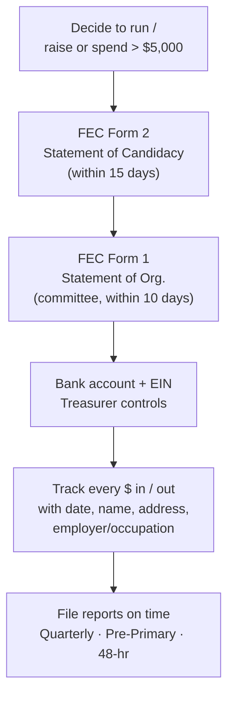
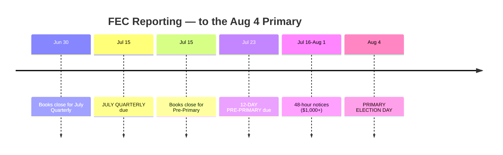

# Compliance & Filing — Matt Grant for Congress (MO-02)

Everything the campaign must do to stay legal with the **Federal Election Commission (FEC)** through the **August 4, 2026 primary**: committee registration, treasurer setup, contribution limits, the reporting calendar, and disclaimers. A U.S. House race is governed primarily by the **FEC** (federal); Missouri law governs **ballot access** only. Built from `federal/fec-overview.md`, `federal/contribution-limits.md`, `federal/disclosure-requirements.md`, `federal/compliance-calendar.md`, and `workflows/treasurer-setup.md`.

> **Confidence: VERIFIED** for the figures and dates below (cited, verified **2026-06-17**). **Re-verify before relying** — limits and deadlines change every cycle.

---

## 1. Registration status (where Matt already is)

Because Matt filed for the ballot before the **March 31, 2026** Missouri deadline and has long since crossed the **$5,000** raise-or-spend threshold, these are **already done** — shown here so a real campaign knows the sequence:

| Form | What it does | Deadline rule | Status |
|---|---|---|---|
| **FEC Form 2** — Statement of Candidacy | Declares Matt a federal candidate; names his principal committee | Within **15 days** of crossing $5,000 | ✅ Filed |
| **FEC Form 1** — Statement of Organization | Registers **"Matt Grant for Congress"** as the principal campaign committee; names treasurer, bank, address | Within **10 days** of the committee being designated | ✅ Filed |
| **Missouri candidate filing** | Ballot access for the primary | Filing window **Feb 24 – Mar 31, 2026**, at the James C. Kirkpatrick State Information Center, Jefferson City | ✅ Filed |

> A House committee files with the **FEC electronically** (FECFile or an approved vendor). One committee, one treasurer of record, one designated bank.

---

## 2. Treasurer & banking (the compliance backbone)

From `workflows/treasurer-setup.md`. The **treasurer is personally responsible** for the accuracy and timeliness of every report.

- [ ] **EIN** obtained from the IRS (free; needed to open the account).
- [ ] **Dedicated campaign bank account** — all contributions deposited here, all expenditures paid from here. **Never** commingle with personal funds.
- [ ] **Two-person money controls** — treasurer + one other for reconciliation; candidate does not freelance spending.
- [ ] **Record for every contribution:** date received, amount, full name, mailing address, and — for anyone who aggregates **over $200** — **employer and occupation**.
- [ ] **Record for every disbursement:** date, amount, full name & address of payee, and purpose.
- [ ] **Keep records 3 years.** Back up the donor database; treat it as sensitive PII.

> **Privacy:** never store Social Security numbers, full bank-account numbers, or card numbers in the campaign database. Handle donor lists securely.

---

## 3. Contribution limits (2025–2026 cycle, real & sourced)

The cycle runs **Nov 6, 2024 – Nov 3, 2026**. **Primary and general are separate elections**, so a donor "resets" for the general.

| Source | Per election | Through the cycle (primary + general) |
|---|---:|---:|
| **Individual** | **$3,500** | **$7,000** |
| **Multicandidate PAC** (qualified) | **$5,000** | $10,000 |
| Non-multicandidate (non-qualified) PAC | $3,500 | $7,000 |
| National party committee → House candidate | $5,000 | — (plus separate coordinated-expenditure limits) |

**Practical rules for "Matt Grant for Congress":**

- The **primary** limit is what matters now: **$3,500 per individual**, **$5,000 per multicandidate PAC**.
- A donor who gives the **$3,500 primary max** may give **another $3,500 for the general** — but only **general-election money cannot be spent on the primary**. Designate the election in writing for any general-election contribution and segregate it. If Matt loses the primary, general-designated funds must be **refunded** (or redesignated/reattributed per FEC rules).
- **Prohibited sources (never accept):** corporate or labor-union treasury funds, **foreign nationals**, **federal government contractors**, contributions **in the name of another** (straw donors), and **cash over $100**. See `federal/prohibited-contributions.md`.
- **Earmarking / conduit** contributions (e.g., via an online platform) count against the original donor's limit and must be itemized correctly.

> ⚠️ **Staleness:** these limits are indexed and change each cycle. Verify against the **FEC contribution-limits page** before accepting large checks.

---

## 4. Reporting calendar to August 4 (real & sourced)

"Matt Grant for Congress" is a **quarterly filer** in 2026. Here is every deadline between now and the primary:

| # | Report | Coverage period (close of books) | **Filing deadline** | Status |
|---|---|---|---|---|
| 1 | **July Quarterly** | Apr 1 – **Jun 30, 2026** | **Wed, Jul 15, 2026** | Upcoming |
| 2 | **12-Day Pre-Primary** | Jul 1 – **Jul 15, 2026** | **Thu, Jul 23, 2026** | Upcoming |
| 3 | **48-Hour Notices** | Any contribution **≥ $1,000** received **Jul 16 – Aug 1** | Within **48 hours** of receipt | As needed |
| 4 | **October Quarterly** | Jul 1 – Sep 30, 2026 | Oct 15, 2026 | After primary (general only) |

**What this means operationally:**

- The **July Quarterly (Jul 15)** is the campaign's first big public credibility test. Finance plan (`03`) is timed so the cash-on-hand number tells a winning story.
- The **Pre-Primary (Jul 23)** is the *last* full picture voters and press see before voting — it covers the all-important first half of July. Target **$60,000+ cash on hand** disclosed here.
- During **Jul 16 – Aug 1**, any single contribution of **$1,000 or more** triggers a **48-hour notice**. Build a standing process so the treasurer files these without scrambling.
- **Miss nothing.** Late or non-filing draws FEC administrative fines and hands opponents an easy story. Set reminders **5 days early** for each deadline.

> Generate calendar reminders with `tools/filing-deadline-calendar.md`. Prep each report with `workflows/compliance-report-prep.md` (reconcile bank to software, scrub employer/occupation, review for itemization errors).

---

## 5. Disclaimers ("Paid for by") — required on communications

Federal "public communications" and most paid digital ads must carry a disclaimer. Generate exact text with `tools/disclaimer-generator.md`.

- **Standard committee disclaimer:**
  > **Paid for by Matt Grant for Congress.**
- This is a candidate's **own** committee paying for its own ads → the short "authorized" form is sufficient (no "and authorized by" line needed when the candidate's own committee pays).
- **Where it's required:** TV/streaming/radio, mass mailings & phone banks (to 500+), websites, paid digital/social ads, yard signs (where space allows). Small items (pens, buttons, bumper stickers) are exempt under the "small-items" exception.
- **Digital specifics:** see `federal/digital-advertising.md` — paid social ads need the disclaimer in the ad or via an adapted/“indicator” disclaimer where the format is character-limited; organic posts from the campaign account generally don't need the box but should be clearly the campaign's.

---

## 6. Coordination & outside groups (stay clean)

From `workflows/coordination-rules.md`:

- The campaign **may not coordinate** strategy, spending, content, or targeting with any **Super PAC** or independent-expenditure group. Doing so converts their spending into an illegal in-kind over-the-limit contribution.
- Keep a firewall: public information only; no sharing of polling, media buys, or canvass data with outside spenders.
- **Party committee** coordinated expenditures are allowed up to separate limits — route through counsel.

---

## 7. Compliance checklist (pin this up)

- [ ] FEC Form 2 + Form 1 on file; treasurer of record correct.
- [ ] Dedicated bank account; no commingling; two-person controls.
- [ ] Every contribution logged with name/address (+ employer/occupation over $200 aggregate).
- [ ] No prohibited sources; no cash over $100; no straw donors.
- [ ] General-election funds (if any) designated and segregated from primary spending.
- [ ] **July Quarterly filed by Jul 15.**
- [ ] **Pre-Primary filed by Jul 23.**
- [ ] **48-hour notices** filed within 48 hrs for $1,000+ gifts, Jul 16–Aug 1.
- [ ] Disclaimers on all paid communications.
- [ ] No coordination with Super PACs.
- [ ] Records retained 3 years; donor data secured.

---

> **This is educational information, not legal advice. Consult a campaign finance attorney or your filing agency (the FEC for this federal race; the Missouri Secretary of State for ballot-access questions) for guidance specific to your situation.** Figures and deadlines verified **2026-06-17**.

### Sources
- [FEC — Contribution limits 2025–2026](https://www.fec.gov/help-candidates-and-committees/candidate-taking-receipts/contribution-limits/)
- [FEC — 2026 Missouri primary election report notice](https://www.fec.gov/help-candidates-and-committees/dates-and-deadlines/2026-reporting-dates/prior-notices-2026/election-report-notice-missouri/)
- [FEC — Congressional pre-election reporting dates (2026)](https://www.fec.gov/help-candidates-and-committees/dates-and-deadlines/2026-reporting-dates/congressional-pre-election-reporting-dates-2026/)
- [FEC — 2026 Quarterly filers](https://www.fec.gov/help-candidates-and-committees/dates-and-deadlines/2026-reporting-dates/2026-quarterly-filers/)
- [Missouri Secretary of State — 2026 Candidate Filing Information](https://www.sos.mo.gov/CMSImages/ElectionCandidates/2026FilingDocuments/2026CandidateFilingInformation.pdf)
