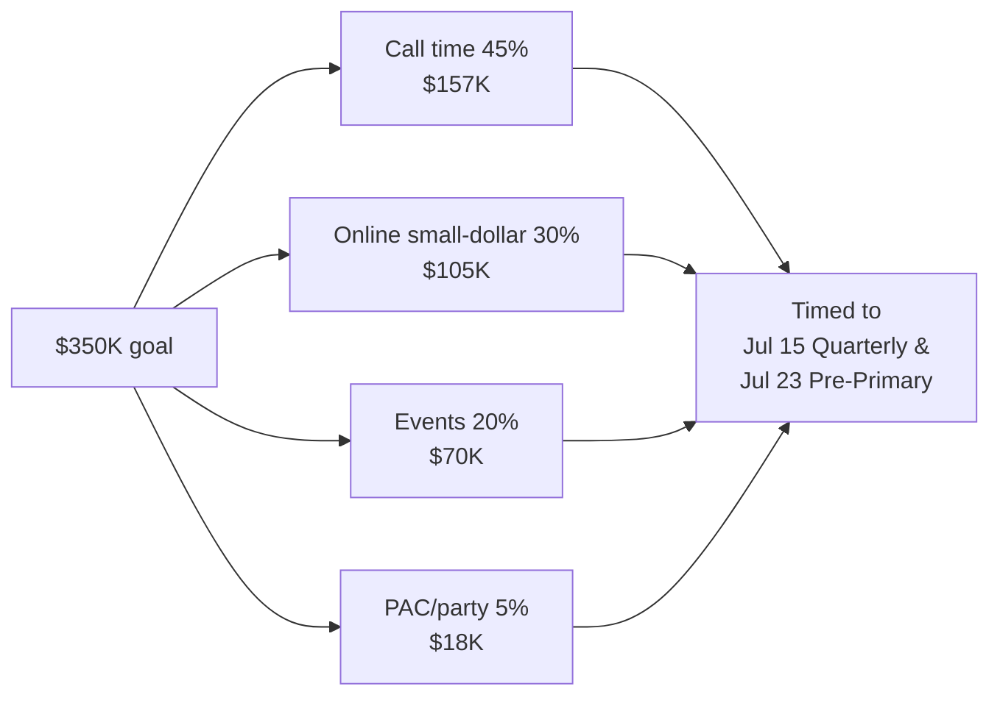
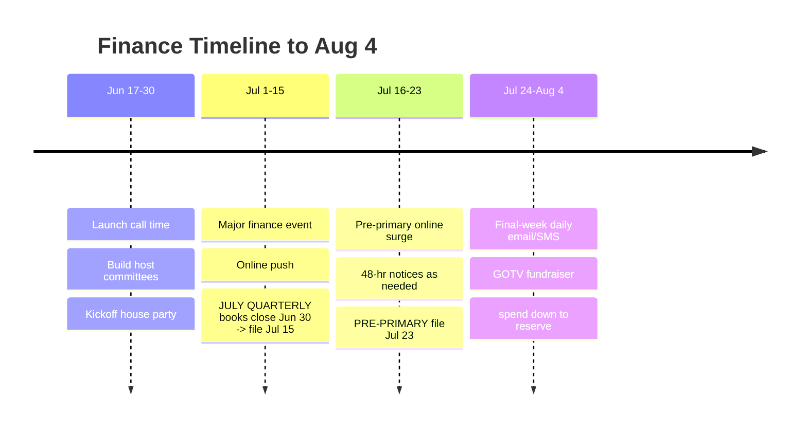

# Fundraising Plan — Matt Grant for Congress (MO-02)

How the campaign raises the **$350,000** the plan in `01` requires, in **48 days**, legally and on a finance calendar timed to the FEC reporting deadlines. Built from `workflows/fundraising-plan.md`, `messaging/email-fundraising.md`, and `tools/contribution-tracker.md`. All limits enforced per `02-compliance-and-filing.md`.

---

## 1. The goal and where it comes from

| Channel | Target | Share | Engine |
|---|---:|---:|---|
| **Candidate call time** | $157,000 | 45% | Matt on the phone to max & mid donors |
| **Online small-dollar** | $105,000 | 30% | Email + SMS + social, ActBlue/processor |
| **Events** | $70,000 | 20% | House parties + one major finance event |
| **PAC / party / endorser** | $18,000 | 5% | Aligned multicandidate PACs, labor, local orgs |
| **Total (primary)** | **$350,000** | 100% | |

> **Reality check:** raising $350K in 7 weeks ≈ **$50K/week**. That pace is only possible if the candidate protects **call time** daily and the online list is worked relentlessly around the two FEC report deadlines.

---

## 2. Donor math (with limits from `02`)

Primary limit: **$3,500/individual**, **$5,000/multicandidate PAC**. The call-time target breaks down as a **donor pyramid**:

| Tier | Gift | # of donors | Raises |
|---|---:|---:|---:|
| Maxout (primary) | $3,500 | 20 | $70,000 |
| Major | $1,000–$2,500 | 45 (avg ~$1,500) | $67,500 |
| Mid | $250–$500 | ~65 (avg ~$300) | $19,500 |
| **Call-time subtotal** | | | **$157,000** |
| Online avg gift ~$45 | | ~2,330 gifts | $105,000 |
| Event guests | varies | ~150 attendees | $70,000 |
| PAC/party | $2,500–$5,000 | ~5 | $18,000 |

- Build the **prospect list** first: personal network, past Democratic donors in MO-02 (from the voter/donor file), professional and education networks, small-business contacts.
- **Ask high, then lower** — always lead with the max ask; let the donor bring the number down.
- Maxout primary donors are immediately re-soluble for the **general** ($3,500 more) **if** Matt wins — but that money is **segregated** and unusable now (`02`).

---

## 3. Candidate call time (the non-negotiable)

Call time is the single highest-ROI use of the candidate's hours. From `workflows/fundraising-plan.md`:

- **Schedule:** **2–3 hours of call time, 5 days/week**, blocked and protected like a doctor's appointment. The Finance Director sits in.
- **Prep:** a daily **call sheet** — name, suggested ask, connection, last contact, notes. 10–15 quality dials/hour.
- **The ask, every time:** make the specific dollar ask and then **stop talking**. Silence closes.
- **Follow-up within 24 hrs:** pledge → link/check instructions; "no" → ask for a host or a name; "maybe" → schedule the recall.
- **Track everything** in the contribution tracker (`tools/contribution-tracker.md`) so the treasurer can reconcile and itemize.

### Sample call-time script (short)

> "Hi [Name], it's Matt Grant — I'm running for Congress here in the 2nd District, and I'm calling personally because I need your help. Families here are paying more and getting less, our schools are stretched thin, and the only way we win this seat back in November is to nominate someone who's actually won an election in this community — and that's me. **Can I count on you for $3,500 to get us through the August 4th primary?**" *(stop — let them respond)*

---

## 4. Online small-dollar program ($105K)

From `messaging/email-fundraising.md`. The list is the campaign's compounding asset.

- **Stack:** ActBlue (or equivalent) for processing; an email platform; SMS (with opt-in compliance); social drive-to-donate.
- **Cadence:** **3–5 emails/week**, rising to **daily in the final week**, plus SMS on deadline days. Segment: never-givers vs. past donors vs. lapsed.
- **Best-performing sends:** the two **FEC deadline moments** (Jul 15 Quarterly, Jul 23 Pre-Primary) and the **final 72 hours**. Real deadlines outperform fake urgency — use the real ones.
- **Content mix:** story (Matt's classroom/hardware-store roots) → stakes (beat the incumbent) → specific ask → social proof (grassroots momentum).
- **Every email needs:** a clear ask, a working link, and the **"Paid for by Matt Grant for Congress"** disclaimer.

A 6-email primary sequence and a sample fundraising email are in `07-sample-artifacts.md`.

---

## 5. Events ($70K)

| Event | Goal | When | Format |
|---|---:|---|---|
| Kickoff house party (Wildwood) | $15,000 | Late June | Host committee of 8–10, $250–$1,000 suggested |
| St. Charles County reception | $12,000 | Early July | Local host; mid-dollar |
| **Major finance event** (named host/featured guest) | $30,000 | Mid-July (pre-quarterly→pre-primary window) | $500–$3,500 tickets |
| Grassroots BBQ / low-dollar rally | $8,000 | Late July | $25–$50, doubles as volunteer recruitment |
| Online "virtual phone-bank + fundraiser" | $5,000 | Final week | Zoom + donate drive |

- Every event has a **host committee** that commits to selling tickets — the host's network is the point.
- **Net, not gross:** keep event costs under ~15% (venue donated where possible).
- Collect **full donor info at the door** (name, address, employer/occupation over $200) for compliance.

---

## 6. PAC, party & endorser money ($18K)

- Approach **aligned multicandidate PACs** (e.g., education, labor, issue groups) — limit **$5,000/election** (`02`).
- Coordinate **only** within legal bounds; **no Super PAC coordination** (`02`, `workflows/coordination-rules.md`).
- Endorsements (see `outreach/endorsement-playbook.md`) often unlock both list access and PAC checks — sequence asks accordingly.

---

## 7. Finance calendar (timed to FEC reports)

| Week | Raise target | Milestone |
|---|---:|---|
| Jun 17–22 | $35,000 | Call time live; kickoff party booked |
| Jun 23–30 | $45,000 | Kickoff party; **books close Jun 30** |
| Jul 1–8 | $55,000 | St. Charles reception; online push |
| Jul 9–15 | $60,000 | Major finance event; **file July Quarterly (Jul 15)** |
| Jul 16–23 | $55,000 | Pre-primary surge; **file Pre-Primary (Jul 23)**; 48-hr notices |
| Jul 24–31 | $55,000 | Final-week sequence begins |
| Aug 1–4 | $45,000 | GOTV money + day-of email |
| **Total** | **$350,000** | |

- **Cash-on-hand gate:** ensure **$60,000+ COH** is disclosed on the **Jul 23 pre-primary report** — the public credibility number.
- **Spend discipline:** protect the **$10,500 reserve** and the final mail wave (`01` budget) — do not outrun the bank.

---

## 8. Compliance guardrails (always on)

- Enforce **per-election limits**; flag anyone approaching $3,500 (use the limit logic in `tools/donor-limit-checker.md`).
- **Refuse prohibited sources** (corporate/union treasury, foreign nationals, federal contractors, straw donors, cash > $100).
- Collect **employer/occupation** for anyone aggregating **over $200**.
- File **48-hour notices** for $1,000+ gifts received **Jul 16–Aug 1**.
- Secure donor PII; never store SSNs or bank/card numbers.

> **This is educational information, not legal advice. Consult a campaign finance attorney or the FEC for guidance specific to your situation.** Contribution limits verified **2026-06-17** (see `02` for sources).
