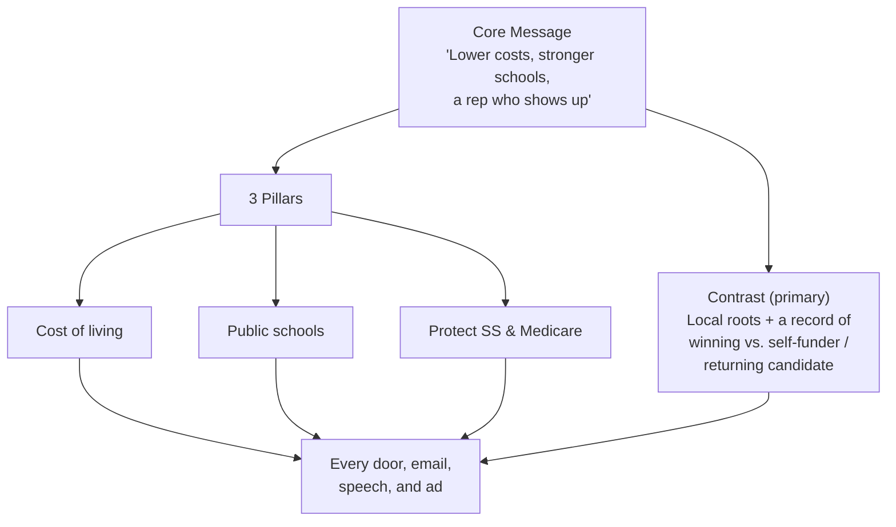

# Messaging & Issues — Matt Grant for Congress (MO-02)

The message architecture for the primary: the core message, the message box, the stump speech, the top-three issues with positions, and the contrast framework. Built from `messaging/positioning-framework.md`, `messaging/stump-speech-builder.md`, and `tactics/issue-response-engine.md`. Issue positions are **illustrative** for this fictional candidate, written to be locally grounded and non-inflammatory — adapt to the real candidate's actual convictions.

---

## 1. Core message

> **"Lower costs, stronger schools, and a representative who actually shows up."**

- **One-sentence "why I'm running":** *"Families here are working harder than ever and getting less back — and the only way we win this seat in November is to nominate a Democrat who's actually won an election in this community and shown up for it. That's me."*
- **The three words people should remember:** **local, credible, ours.**

### 30-second elevator pitch

> "I'm Matt Grant. I taught in our public schools for a decade, my wife's a nurse, and we run a small hardware store in Wildwood — so I know what it costs to make a payroll and a grocery run in this district. I serve on the school board because I believe in showing up. I'm running for Congress to lower the everyday costs squeezing families, fund our schools, and protect the Social Security and Medicare people paid into their whole lives. And I'm the Democrat who can actually win this seat back in November."

---

## 2. The message box

A four-quadrant discipline tool (`messaging/positioning-framework.md`). Know all four; live in the top-left.

| | **About Matt** | **About the opponents** |
|---|---|---|
| **What WE say** | Local teacher & small-business owner who's won here before; lower costs, fund schools, protect SS/Medicare; shows up | Untested self-funder buying a seat with no base; a returning candidate with no new plan — neither can win in November |
| **What THEY say** | "Underfunded," "just a school-board member," "can't compete with the incumbent's money" | "Successful businessman/proven name," "best positioned to take on the incumbent" |

**Rule:** spend your time in the **top-left** (your positive case). Visit top-right (contrast) on **values and electability**, never personal attacks. Have answers ready for bottom-left (your vulnerabilities) and bottom-right (don't amplify their message).

---

## 3. Top 3 issues (positions)

> Illustrative positions. Keep them concrete, local, and about people's lives.

### Issue 1 — Cost of living / the kitchen-table economy
**Position:** "Working families here are getting squeezed on groceries, housing, prescriptions, and childcare while the biggest players do fine. In Congress I'll fight to cap prescription-drug and insulin costs, crack down on price-gouging, and cut taxes for the middle class — not for those who already have the most."
**Proof point:** "I run a small business — I see exactly how rising costs hit a family budget and a Main Street storefront."

### Issue 2 — Public schools and the people in them
**Position:** "Our public schools are the backbone of these communities, and they're stretched thin. I'll fight for the federal investment our schools and teachers need, protect special-education funding, and make college and the trades affordable so a kid's future isn't capped by a ZIP code."
**Proof point:** "I taught in these classrooms and I sit on the school board. I've actually done this work."

### Issue 3 — Protect Social Security & Medicare
**Position:** "Seniors paid into Social Security and Medicare their entire working lives. I will never vote to cut, privatize, or raise the retirement age on the benefits people earned — and I'll work to lower what seniors pay for prescriptions and care."
**Proof point:** "This is a promise, and I'll put it in writing."

### Supporting issues (one line each)
- **Infrastructure & jobs:** fix the roads and bridges (I-44/I-70 corridors), bring good jobs and apprenticeships here.
- **Healthcare:** protect coverage for pre-existing conditions; expand access in suburban and exurban communities.
- **Veterans:** cut VA wait times; honor the commitment to those who served.
- **Reproductive freedom & personal liberty:** keep government out of families' private medical decisions.
- **Protecting democracy:** defend the freedom to vote and the rule of law.

---

## 4. Contrast framework (primary)

Three clean contrasts — all on **values and electability**, never personal:

| Contrast | Matt | The field |
|---|---|---|
| **Roots** | Lives, works, raises kids, and has **won an election** in this district | A self-funder with no local base; a candidate voters have already passed on |
| **Record** | A real record of showing up — classroom, small business, school board | A checkbook, or a re-run of an old campaign |
| **Electability** | The Democrat who can actually **flip this seat in November** | Can't expand the map against an entrenched incumbent |

**Inoculation lines (answer your own vulnerabilities before opponents weaponize them):**
- *On money:* "I won't have the biggest checkbook — I'll have the biggest grassroots army. This seat is won at the doors, not bought on TV."
- *On experience:* "I've balanced a small-business budget and a school-district budget. That's more real-world governing than most members of Congress have done."

> For instant, multi-format responses to any new issue, attack, or news event during the campaign, run `tactics/issue-response-engine.md` (door / forum / statement / social / empathy / surrogate / inoculation / bridge).

---

## 5. Stump speech (2-minute core)

From `messaging/stump-speech-builder.md`. Open with story, move to stakes, close with the ask.

> "Twelve years ago I stood in front of a classroom of ninth-graders in this district. Some of those kids didn't have breakfast that morning. Their parents weren't lazy — they were working two jobs and still falling behind. That's stayed with me.
>
> My wife Sarah is a nurse. We run a little hardware store in Wildwood. So when I tell you costs are crushing families here, I'm not reading it off a poll — I'm living it, and I see it in every customer who comes through our door.
>
> I got on the school board because I got tired of complaining and decided to **show up**. And here's what I learned: showing up actually works. We protected programs people said we'd have to cut. We did it by listening, by counting every dollar, and by refusing to play the usual games.
>
> Washington has the showing-up part exactly backwards. They show up for the big donors and the loudest voices, and they forget the family in Arnold trying to cover a prescription, the senior in Chesterfield who earned her Social Security, the teacher in Wildwood buying her own classroom supplies.
>
> I'm running for Congress to flip that. **Lower the costs squeezing families. Fund our schools. Protect Social Security and Medicare — period.** And I'm running because I'm the Democrat who can actually **win this seat back in November** — because I've already won here, doing the work, in this community.
>
> But I can't do it without you. The other folks in this primary are betting on big checks. I'm betting on you — on knocking on more doors and making more calls than anyone in this race. **So I'm asking you for your vote on August 4th, and I'm asking you to knock a few doors with me between now and then.** Let's go win this thing."

Length variants (15-sec, 60-sec, 5-min, 15-min) build off this spine — see `messaging/stump-speech-builder.md`.

---

## 6. Message discipline rules

- **Repeat relentlessly.** The core message goes in every door knock, email, speech, sign, and ad. You'll be sick of it long before voters have heard it once.
- **Positive-first.** Lead with what Matt is *for*. Contrast is seasoning, not the meal.
- **Nonpartisan-process, values-forward.** Frame around people's lives, not partisan team sport.
- **Stay on the three pillars.** When asked about anything else, answer briefly, then **bridge** back to cost / schools / showing up.
- **Never punch down or personal.** Contrast on record and electability only — protects against the "negative campaigner" backlash and keeps coalitions open for the general.

> **Bridge phrases:** "That matters — and it connects to why I'm running…" · "Here's what people actually ask me at the door…" · "The real question is who can win this seat back in November…"
