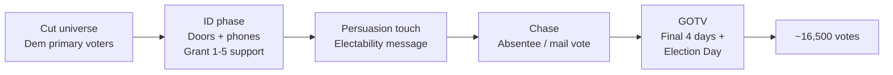
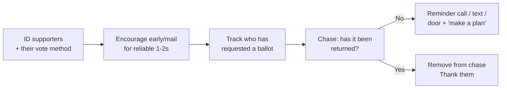

# Field & GOTV — Matt Grant for Congress (MO-02)

The voter-contact engine that wins a low-turnout August primary: targeting, turf, door and phone scripts, the absentee/mail-vote chase, and the election-day operation. In a primary you don't persuade a hostile electorate — you **identify your supporters and drag them to the ballot box.** Built from `workflows/voter-targeting.md`, `workflows/gotv-plan.md`, `tactics/ballot-chase-program.md`, and `workflows/volunteer-management.md`.

---

## 1. The universe (who we contact)

The win number is **~16,500** (`01`); build to the high estimate (~20,000). ID **2–3× the win number** to survive drop-off → **ID-universe goal: 35,000–40,000 contacts.**

| Tier | Who | Channel | Priority |
|---|---|---|---|
| **Tier 1** | High-propensity Dem primary voters, **St. Louis County** | Doors + phones + mail | Highest |
| **Tier 2** | Dem primary voters, **St. Charles County** | Phones + mail + targeted doors | High |
| **Tier 3** | Dem primary voters, **Franklin / Warren** | Mail + digital | Maintain |
| **Add-on** | Newly-registered Dems; 1–2 cycle "drop-off" primary voters | Mail + SMS + GOTV | Mobilize |

- Pull the universe from the **voter file** (state file via a vendor — VAN/PDI or similar; see `tools/campaign-tech-stack.md`).
- **Score support 1–5** on every contact: 1 = strong Grant, 5 = strong opponent. Chase 1s and 2s; persuade soft 3s; never turn out a 4 or 5.

---

## 2. Voter-contact goals (48 days)

Doors are ~3–5× the persuasion target; phones backfill and re-ID. Targets:

| Activity | Goal | Math |
|---|---:|---|
| **Doors knocked** | 45,000 attempts | ~15 contacts/shift × shifts |
| **Phone attempts** | 60,000 | dialers + volunteer banks |
| **Live IDs collected** | 35,000–40,000 | the real deliverable |
| **Volunteer shifts** | ~900 | ~50 doors or ~80 dials per shift |
| **Active volunteers** | 150–250 | recruited via events, digital, doors |

**Weekly canvass rhythm:** launches Sat **Jun 20**; runs **Thu eve, Sat, Sun** every week, scaling to **daily** in the final 10 days. Saturdays are the big push (10 a.m. & 1 p.m. launches).

---

## 3. Turf & operations

- **Cut turf** in the canvass app — ~50–70 doors per packet, geographically tight, Tier-1 precincts first.
- **Launch sites:** a St. Louis County HQ/staging spot + rotating St. Charles County host home. Coffee, packets, quick training, then out the door within 15 minutes.
- **Data discipline:** every result entered within 24 hrs (canvass app preferred; paper backup synced nightly). Clean data is the campaign's memory — it drives the chase.
- **Volunteer ladder** (`workflows/volunteer-management.md`): first-timer → repeat canvasser → shift captain → turf/precinct lead. Recruit the ask *at the door*: "Will you knock a few doors with us Saturday?"

---

## 4. Door script (ID + persuasion)

> **Knock. Smile. Be quick — 60–90 seconds.**

> "Hi, I'm [Name], a volunteer for **Matt Grant**, who's running for Congress in the August 4th Democratic primary. Are you planning to vote in that primary?" *(if yes…)*
>
> "Great. Matt's a former public-school teacher and small-business owner right here in the district — he's on the school board now. He's focused on **lowering everyday costs, funding our schools, and protecting Social Security and Medicare** — and he's the Democrat who can actually win this seat back in November. **On a scale of 1 to 5, how likely are you to support Matt on August 4th?**" *(record the score)*
>
> - **1–2 (supporter):** "That's wonderful — can I ask, do you usually vote early/by mail or on Election Day?" *(record → feeds the chase)* "Here's how to make a plan…" *(leave palm card)* "And would you knock a few doors with us?"
> - **3 (undecided):** "Totally fair. The thing that moves a lot of folks: Matt's the only one in this race who's actually won an election here — that's who can flip the seat in November. Can I leave you this?"
> - **4–5 / supporting an opponent:** "Thanks for your time — appreciate you voting!" *(disengage politely, mark, move on)*

**Not home:** hang the lit, mark "not home" for a re-knock or phone follow-up.

---

## 5. Phone script (short)

> "Hi, may I speak with [Name]? Hi, I'm a volunteer with **Matt Grant for Congress**. We're reaching out before the **August 4th Democratic primary**. Are you planning to vote? … Matt's a local teacher and small-business owner running to lower costs, fund our schools, and protect Social Security and Medicare. **Can Matt count on your support on August 4th?**" *(score 1–5; if 1–2, capture vote method and pitch a mail-ballot plan; if undecided, give the electability line; thank and log.)*

> All paid texts/calls to 500+ recipients carry **"Paid for by Matt Grant for Congress"** and honor opt-outs (`02`, `federal/digital-advertising.md`).

---

## 6. Absentee / mail-vote chase (starts early July)

The highest-ROI GOTV work. From `tactics/ballot-chase-program.md`. In Missouri, voters can vote absentee/by mail under the state's rules and there is an in-person no-excuse early-voting window before Election Day — **confirm current dates and rules with the local election authority and the Missouri SOS** (verify; rules change).

- **Build a chase list:** every Tier-1/Tier-2 supporter who votes early or by mail.
- **Three-touch chase:** (1) "request/return your ballot" → (2) "have you sent it back?" → (3) "today's the day" — by text, call, and door.
- **Remove returned voters** from the chase so you don't waste touches (and don't annoy them).
- **Verify the mechanics** (request deadlines, witness/notary requirements if any, return deadlines) with the **local election authority** before instructing any voter — never improvise election law.

---

## 7. GOTV — final 4 days (Jul 31 – Aug 4)

| Day | Operation |
|---|---|
| **Fri Jul 31** | Final mail in homes; full phone bank; confirm Election-Day volunteer shifts and turf |
| **Sat Aug 1** | Biggest canvass of the cycle — knock every Tier-1 supporter; 48-hr-notice window closes Aug 1 (`02`) |
| **Sun Aug 2** | Canvass + faith-community/visibility; final chase on unreturned mail ballots |
| **Mon Aug 3** | Phones all day; "make your plan to vote tomorrow"; staging/material prep; volunteer confirmations |
| **Tue Aug 4 — Election Day** | Boiler room live 6 a.m.; knock/call **only identified 1–2 supporters**; ride-to-polls; poll-place visibility; track turnout vs. model and surge to lagging precincts |

### Election-Day boiler room

- **Goal:** turn out every identified supporter who hasn't yet voted.
- **Cut a "flush" list** of 1–2 supporters with no vote recorded; work it in waves (morning text, midday call, afternoon door, evening "polls close at [time]!").
- **Ride-to-polls** for anyone who needs it (`tools/voter-engagement-tools.md` has a ride signup).
- **Track turnout** by precinct against the model; redeploy canvassers to underperforming Tier-1 turf.
- **Poll observers / election protection:** know voter rights and the local election-authority contact; see `tactics/election-protection.md`. Be a calm, lawful presence — no intimidation, ever.

---

## 8. Field metrics (review every Sunday)

| Metric | Target by Aug 4 | Tracking |
|---|---:|---|
| Live voter IDs | 35,000–40,000 | Daily, from canvass app |
| Confirmed 1–2 supporters | ≥ 20,000 | The flush universe |
| Mail ballots requested by supporters | tracked | Chase list |
| Mail ballots returned | maximize | Removed from chase |
| Active volunteers | 150–250 | Recruitment ladder |
| Volunteer shifts filled | ~900 | Shift calendar |

> **The discipline that wins:** contact more voters than anyone else in the race, score them honestly, and turn out every 1 and 2. Field beats money in a low-turnout primary — that's the whole theory of victory (`01`).
