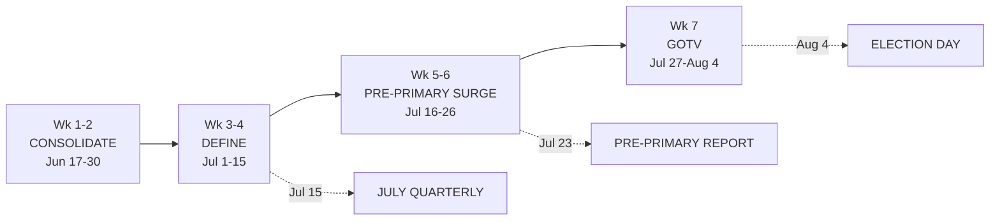

# 7-Week Execution Calendar — Matt Grant for Congress (MO-02)

The single integrated calendar that ties strategy (`01`), compliance (`02`), fundraising (`03`), messaging (`04`), and field (`05`) to actual dates — **June 17 → August 4, 2026 (48 days).** This is the master checklist the campaign manager runs every morning. Hard external dates are **real and sourced** (see `02`); internal milestones are illustrative.

---

## Key dates at a glance (real, sourced)

| Date | Event | Owner |
|---|---|---|
| **Jun 30** | July Quarterly books close | Treasurer |
| **Jul 15** | **FEC July Quarterly report due** | Treasurer |
| **Jul 15** | Pre-Primary books close | Treasurer |
| **Jul 16–Aug 1** | 48-hour notice window ($1,000+) | Treasurer |
| **Jul 23** | **FEC 12-Day Pre-Primary report due** | Treasurer |
| **Aug 4** | **PRIMARY ELECTION DAY** | All |
| **Nov 3** | General election (if nominated) | — |

---

## Phase 1 — CONSOLIDATE (Weeks 1–2 · Jun 17–30)

**Goal:** lock the grassroots/electability lane, launch the contact and money machines, bank a strong July Quarterly.

### Week 1 — Jun 17–22
- **Strategy/Ops:** finalize and distribute the campaign plan; 8:30 a.m. daily stand-ups begin; confirm the 4 paid roles are filled.
- **Compliance:** confirm Form 1/Form 2 current; treasurer reconciles books; set 5-days-early reminders for Jul 15 & Jul 23 (`tools/filing-deadline-calendar.md`).
- **Fundraising:** **call time live** (2–3 hrs/day); build prospect & host lists; book kickoff house party.
- **Messaging:** lock core message; record launch video; **send launch press release** (`07`); op-ed pitched to *St. Louis Post-Dispatch* / local outlets.
- **Field:** finalize voter universe + turf cut; recruit first canvass captains; **first canvass launch Sat Jun 20** (Tier-1 St. Louis County).
- **Endorsements:** open asks to educators' groups, local electeds, labor, county party activists (`outreach/endorsement-playbook.md`).

### Week 2 — Jun 23–30
- **Fundraising:** **kickoff house party (Wildwood)**; push toward week's $45K; **books close Jun 30**.
- **Field:** scale canvass to Thu/Sat/Sun; phone bank opens; ID goal ramping.
- **Messaging:** **Mail Piece #1** (bio/intro) to print → in homes ~early July; first roll-out of an endorsement.
- **Digital:** email 3–5×/wk; grow list; begin low-dollar online.
- **Milestone check (Sun Jun 28):** on pace for ~$80K raised cycle-to-date? Canvass producing clean IDs? Adjust.

---

## Phase 2 — DEFINE (Weeks 3–4 · Jul 1–15)

**Goal:** own the electability contrast, generate earned media, start the ballot chase, post a credible July Quarterly.

### Week 3 — Jul 1–8
- **Fundraising:** **St. Charles County reception**; online push; week target ~$55K.
- **Messaging:** electability contrast goes public (on values/record only, `04`); pitch earned-media hits; surrogate program live (`tactics/surrogate-program.md`).
- **Field:** **Mail Piece #2** (issues: costs/schools/SS-Medicare); **absentee/mail-vote chase begins** for ID'd supporters (`05`); confirm Missouri early-vote/absentee mechanics with local election authority.
- **Compliance:** treasurer assembles July Quarterly; scrub employer/occupation, itemization (`workflows/compliance-report-prep.md`).

### Week 4 — Jul 9–15
- **Fundraising:** **major finance event** (mid-July); week target ~$60K.
- **Compliance:** **FILE JULY QUARTERLY (due Jul 15)**; pre-primary books also close Jul 15 — keep logging.
- **Messaging:** amplify the cash-on-hand/momentum story from the report; second endorsement roll-out.
- **Field:** scale doors/phones; review ID progress vs. 35–40K goal at Sunday metrics.
- **Decision point (Jul 15):** with quarterly numbers in hand, lock the **paid-media wave** size (digital/radio/streaming) for Jul 16+.

---

## Phase 3 — PRE-PRIMARY SURGE (Weeks 5–6 · Jul 16–26)

**Goal:** maximum visibility and contact; clean pre-primary report; protect the close.

### Week 5 — Jul 16–22
- **Paid media:** **digital + streaming/CTV + local radio LIVE** (no broadcast TV); all carry the disclaimer.
- **Compliance:** **48-hour notices** for any $1,000+ gift (window open through Aug 1); assemble pre-primary report.
- **Field:** **Mail Piece #3** (contrast/electability); doors/phones scaling toward daily; chase intensifies.
- **Fundraising:** pre-primary online surge tied to the real Jul 23 deadline; week target ~$55K.

### Week 6 — Jul 23–26
- **Compliance:** **FILE 12-DAY PRE-PRIMARY (due Jul 23)** — target **$60K+ cash on hand** disclosed.
- **Messaging:** earned-media push off the report; rapid-response ready for any late opponent attack (`tactics/crisis-management.md`); reserve held for response mail.
- **Field:** lock down GOTV plan, turf, and volunteer shifts for the final stretch; finalize flush universe (1–2 supporters not yet voted).

---

## Phase 4 — GOTV (Week 7 · Jul 27–Aug 4)

**Goal:** turn out every identified supporter. Nothing new is learned now — it's all execution.

### Jul 27–30
- **Field:** daily canvass + phones; chase unreturned mail ballots hard; confirm every Election-Day shift and ride-to-polls request.
- **Messaging:** **final mail wave** (GOTV: "Vote Tuesday Aug 4") drops to be in homes by Jul 31; daily email/SMS.
- **Fundraising:** final-week sequence; spend down to the protected reserve only.

### Jul 31 – Aug 4 (see `05` for the hour-by-hour)
- **Fri Jul 31:** final mail landed; full phone bank; volunteer confirmations.
- **Sat Aug 1:** largest canvass of the cycle; **48-hr notice window closes**.
- **Sun Aug 2:** canvass + visibility; final mail-ballot chase.
- **Mon Aug 3:** phones all day; "make your plan"; boiler-room setup.
- **Tue Aug 4 — ELECTION DAY:** boiler room from 6 a.m.; flush only 1–2 supporters; ride-to-polls; poll visibility & election protection (`tactics/election-protection.md`); track turnout vs. model; **watch returns**.

---

## Weekly money + field scoreboard

| Week | $ target | Cumulative $ | Field focus |
|---|---:|---:|---|
| 1 (Jun 17–22) | $35K | $35K | Universe/turf cut; canvass launch |
| 2 (Jun 23–30) | $45K | $80K | Kickoff party; Mail #1; ID ramp |
| 3 (Jul 1–8) | $55K | $135K | Mail #2; chase begins |
| 4 (Jul 9–15) | $60K | $195K | Finance event; **Quarterly filed** |
| 5 (Jul 16–22) | $55K | $250K | Paid media live; Mail #3 |
| 6 (Jul 23–26) | $55K | $305K | **Pre-Primary filed**; GOTV lock |
| 7 (Jul 27–Aug 4) | $45K | $350K | Final mail; GOTV; **Election Day** |

---

## The campaign manager's daily loop

1. **8:30 a.m. stand-up** — yesterday's IDs, dials, dollars vs. plan; today's top 3 priorities; blockers.
2. **Protect candidate call time** (2–3 hrs) and the day's voter-contact shifts above all else.
3. **Check the compliance countdown** — is the next FEC deadline on track? Any $1,000+ gift needing a 48-hr notice?
4. **Enter and review data** — IDs, chase status, money — within 24 hrs.
5. **Sunday night:** weekly all-hands + metrics review; adjust on real trends only, never a single data point.

> **The one-line version:** Consolidate the lane → define the contrast → file clean → turn out your 1s and 2s. Win the primary Aug 4, then pivot the whole machine to the **Nov 3 general**.

> Compliance deadlines verified **2026-06-17** (sources in `02-compliance-and-filing.md`). **This is educational information, not legal advice.**
