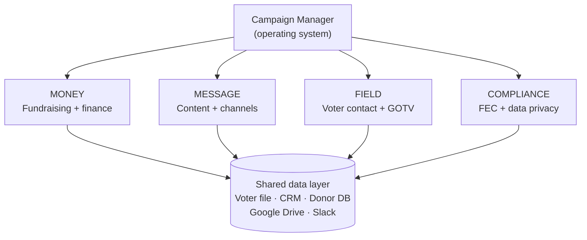
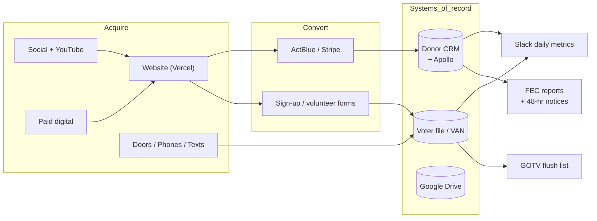
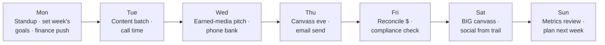

# Campaign Manager's Field Manual — Channel & Integration Playbook

The operator's guide for **Matt Grant's campaign manager**: how to stand up every marketing channel, app, and integration and run them on a weekly rhythm to the **August 4, 2026 primary**. This file turns the strategy in `01`–`07` into a concrete tech stack and a day-by-day setup sprint. Tool names are recommendations; swap equivalents freely. Apply the compliance rules in `02` to **everything** you publish.

> **Scope note:** This is an *implementation* layer on top of the strategy package. Dollar figures, vendors, and the candidate are illustrative (see `README.md`). **Re-verify all compliance facts** (FEC limits/deadlines, disclaimer rules) before relying on them.

---

## 1. How to run the operating system

A campaign is a 48-day startup. Your job as CM is to keep four engines running at once — **money, message, field, and compliance** — and to make sure every channel reinforces the same core message: *"Lower costs, stronger schools, and a representative who actually shows up."*

**The three rules of the stack:**
1. **One source of truth per data type.** Voter file = field CRM. Donors = finance CRM. Never let them fork.
2. **Every channel carries the disclaimer** and feeds data back (sign-ups, IDs, donations) into the shared layer.
3. **If it isn't on the calendar, it doesn't happen.** The execution calendar (`06`) governs all channels.

---

## 2. The campaign tech stack (master map)

Functions → recommended tool → the integration available in this workspace → who owns it. Tools marked **★ connected** can be driven directly from this assistant today (see §10).

| Function | Recommended tool | Connected integration | Owner | Cost tier |
|---|---|---|---|---|
| Website / digital HQ | Next.js on **Vercel** | **★ Vercel** | Comms/Digital | $ |
| Donations / payments | **ActBlue** (political standard) + Stripe for merch | ★ Stripe | Finance Dir | % of raise |
| Donor & finance CRM | NGP / **Numero** / Airtable | (Airtable via Drive) | Finance Dir | $$ |
| Voter file & field CRM | **VAN / PDI** + canvass app (MiniVAN) | — (vendor) | Field Dir | $$ |
| Prospect / donor / volunteer research | **Apollo.io** | **★ Apollo** | Finance + Field | $$ |
| Mass email (ESP) | ActBlue Express / **Mailchimp** | (drafts via ★ Lois247) | Digital | $ |
| Finance & VIP email (1:1) | **Gmail** | **★ Gmail** | Finance Dir | $ |
| Peer-to-peer SMS | **Scale to Win / Hustle** | — (vendor) | Field/Digital | $$ |
| Design / creative | **Canva** | **★ Canva** | Digital | $ |
| Video / YouTube growth | **vidIQ** + YouTube | **★ vidIQ** | Digital | $ |
| Content drafting | in-house + **Lois247** | **★ Lois247** | Comms | $ |
| Team chat & ops | **Slack** | **★ Slack** | CM | $ |
| Docs & file storage | **Google Drive** | **★ Google Drive** | CM | $ |
| Calendar / deadlines / scheduling | **Google Calendar** | **★ Google Calendar** | Scheduler | $ |
| Diagrams / process maps | **Mermaid** | **★ Mermaid** | CM | free |
| Code / website repo | **GitHub** | **★ GitHub** | Digital | free |

> **What "connected" buys you:** I can build the assets and wire these up for you on request — draft the Gmail finance emails, load the FEC deadline calendar, design Canva palm cards, generate YouTube titles/thumbnails, build the Slack ops canvas, and deploy the Vercel site. See **§10**.

---

## 3. Week-1 Setup Sprint (stand the whole stack up in 5 days)

Do this June 17–22 so every channel is live before the first full canvass weekend.

| Day | Build | Done when |
|---|---|---|
| **Mon** | Domain + **Vercel** site skeleton (splash → email capture + ActBlue button); set up **Google Workspace** (shared Drive, group inboxes) | Site live at mattgrantforcongress.com with a working donate + sign-up |
| **Tue** | **ActBlue** page + **Stripe** for merch; **donor CRM** (Numero/Airtable); import past-donor list via **Apollo** enrichment | A test $5 donation flows end-to-end and lands in the CRM |
| **Wed** | **Voter file/VAN** access; cut Tier-1 turf; **MiniVAN** canvass app; **P2P texting** account pending vendor approval | A canvasser can pull a turf packet on their phone |
| **Thu** | **Social** accounts (FB, IG, X, TikTok, YouTube) claimed + branded; **Canva** brand kit (logo, colors, fonts); **vidIQ** connected to YouTube | All handles live with matching art + a pinned intro post |
| **Fri** | **Slack** workspace + channels + ops canvas; **Google Calendar** loaded with FEC deadlines + call time + canvass shifts; **Gmail** finance templates drafted | Team joins Slack; calendar shows Jul 15 / Jul 23 / Aug 4 |

**Brand kit (lock on Day 4, use everywhere):**
- Colors: deep navy + warm red accent + clean white (suburban, trustworthy, non-flashy).
- Logo lockup: **GRANT** wordmark + "for Congress · MO-02".
- Fonts: one strong sans for headlines, one readable sans for body.
- Tagline lockup: *Lower costs. Stronger schools. Showing up.*

---

## 4. Integration architecture (how data flows)

**Golden rule:** money data → Donor CRM → FEC. People/volunteer/ID data → VAN → GOTV. The website and ads only *acquire*; the CRMs *remember*.

---

## 5. Channel playbooks

Each channel: **goal · setup · cadence · what to publish · compliance · owner · KPI.** Every paid/public item carries **"Paid for by Matt Grant for Congress."**

### 5.1 Website & digital HQ — Vercel
- **Goal:** convert visitors into donors, volunteers, and emails; be the link every channel points to.
- **Setup:** Next.js template on Vercel → pages: Home, Issues (the 3 pillars from `04`), About (Matt's story), Volunteer, Donate (ActBlue), Events, Press. Connect form captures to the CRM.
- **Cadence:** update events weekly; add endorsements as they land; swap the homepage hero to "GOTV — Vote Aug 4" in the final week.
- **Publish:** the stump story, issue positions, a 60-sec launch video, an endorsements wall, a clear donate + volunteer ask above the fold.
- **Compliance:** disclaimer in the footer sitewide; privacy note on forms; no PII stored insecurely.
- **Owner:** Digital. **KPI:** email sign-ups/week, donate conversion %.

### 5.2 Email — finance/VIP (Gmail) + mass (ESP)
- **Goal:** Gmail for high-touch finance and endorsement outreach; ESP for the small-dollar program (`03`).
- **Setup:** Google Workspace group inboxes (press@, info@, volunteer@); ESP list imported with consent; segments = never-gave / past donor / lapsed / volunteer.
- **Cadence:** mass: 3–5/week → daily final week, peaking on the **Jul 15** and **Jul 23** FEC deadlines and the final 72 hrs. Finance: personalized sends after every call-time "maybe."
- **Publish:** the 6-email primary sequence + sample email in `07`; endorsement asks in `07`.
- **Compliance:** disclaimer + working unsubscribe on every mass send; CAN-SPAM honored; deadline urgency uses the **real** FEC dates only.
- **Owner:** Digital (mass) / Finance (1:1). **KPI:** $/email, open & click rates, list growth.

### 5.3 Peer-to-peer SMS
- **Goal:** GOTV reminders, volunteer recruiting, deadline-day fundraising, ballot-chase touches.
- **Setup:** P2P vendor (Scale to Win/Hustle); upload opt-in numbers only; build scripts mirroring `05` phone script.
- **Cadence:** light in June; ramps with the **ballot chase** (early July) → heavy in the final 4 days and on Election Day for the flush list.
- **Publish:** "make your plan to vote," "have you returned your mail ballot?," "polls close at [time]."
- **Compliance:** texting consent rules; clear opt-out ("Reply STOP"); disclaimer on paid blasts; respect quiet hours.
- **Owner:** Field/Digital. **KPI:** IDs + ballot returns attributable to texts.

### 5.4 Social media (organic) + Canva creative
- **Goal:** cheap reach, volunteer recruiting, momentum proof, rapid response.
- **Setup:** claim/brand FB, IG, X, TikTok, YouTube; **Canva** brand kit + templated post sizes; a recurring content calendar.
- **Cadence:** 1–2 posts/day across platforms; Stories/Reels from the trail; weekly canvass-recruit post; daily in GOTV week.
- **Publish:** the week-of-posts set in `07`; trail photos; endorsement cards; 15–30 sec issue videos; voter-info graphics.
- **Compliance:** disclaimer on **boosted/paid** posts; organic campaign-account posts are clearly the campaign's; no fake engagement/astroturf.
- **Owner:** Digital. **KPI:** reach, volunteer sign-ups from social, share rate.

### 5.5 Video & YouTube — vidIQ
- **Goal:** a searchable, persuasive video library: launch video, issue explainers, testimonials, GOTV.
- **Setup:** YouTube channel + **vidIQ** for keyword/title/thumbnail optimization; repurpose long clips into Reels/Shorts/TikToks.
- **Cadence:** 1 anchor video/week + 2–3 short cutdowns; testimonial series mid-campaign; GOTV video final week.
- **Publish:** 60-sec launch ("I taught here"); 3 issue shorts (costs/schools/SS-Medicare); supporter testimonials; "how to vote Aug 4."
- **Compliance:** disclaimer in description + end card on paid promotion; music/licensing clean.
- **Owner:** Digital. **KPI:** retention %, views from search, click-through to site.

### 5.6 Paid digital ads
- **Goal:** cost-efficient persuasion + GOTV to the primary universe (no broadcast TV — see `01` budget).
- **Setup:** Meta + Google/YouTube ad accounts with verified political-advertiser status (start verification **Week 1** — it takes days); custom audiences from the voter file (matched, compliant).
- **Cadence:** live **Jul 16** (pre-primary surge, `06`); geo+demo targeted to MO-02 Dem primary voters; heavy-up final 10 days.
- **Publish:** retarget site visitors; lookalike of donors; GOTV creative in the final week.
- **Compliance:** platform political disclaimers + "Paid for by…"; honor the **no-Super-PAC-coordination** firewall (`02`).
- **Owner:** Digital + media vendor. **KPI:** cost per ID, cost per donor, frequency.

### 5.7 Direct mail
- **Goal:** the workhorse persuasion + GOTV channel for a primary ($70K, `01`).
- **Setup:** mail vendor + the VAN universe; 4 pieces mapped to `06` (intro → issues → contrast → GOTV).
- **Cadence:** Piece 1 late June, 2 early July, 3 ~Jul 16, GOTV piece in homes by **Jul 31**.
- **Publish:** designed in Canva → vendor; consistent brand + the 3 pillars; clear "Vote Tuesday Aug 4."
- **Compliance:** disclaimer on every piece; correct postal + targeting.
- **Owner:** Field/Comms + vendor. **KPI:** cost per piece, GOTV lift in mailed precincts.

### 5.8 Earned media / PR
- **Goal:** free credibility — local TV, *Post-Dispatch*, suburban weeklies, radio, podcasts.
- **Setup:** press list (reporters/editors/producers); media kit on the site; spokesperson trained (`tactics/candidate-performance.md`).
- **Cadence:** a press release at each milestone (`07`); pitch off the **Jul 15** report; op-ed mid-campaign; letters-to-editor program (`07`).
- **Publish:** launch/endorsement/milestone releases; op-ed on costs+schools; rapid response (`tactics/crisis-management.md`).
- **Compliance:** truthful claims only; no fabricated endorsements/polls.
- **Owner:** Comms. **KPI:** placements/week, share of voice vs. opponents.

### 5.9 Field / canvassing & voter file
- **Goal:** the engine of the whole theory of victory — 35–40K IDs, turn out the 1s and 2s (`05`).
- **Setup:** VAN + MiniVAN; turf cut Tier-1 first; scripts from `05`; volunteer ladder (`workflows/volunteer-management.md`).
- **Cadence:** canvass Thu/Sat/Sun from Jun 20 → daily final 10 days; phones nightly; chase from early July.
- **Publish (to volunteers):** palm cards (Canva), turf packets, the door/phone scripts in `05`/`07`.
- **Compliance:** disclaimer on lit; data entered ≤24 hrs; voter privacy respected; lawful conduct only.
- **Owner:** Field Dir. **KPI:** IDs/day, contacts/shift, ballot-chase returns.

### 5.10 Fundraising & payments — ActBlue / Stripe
- **Goal:** frictionless legal giving; everything reconciled for FEC.
- **Setup:** ActBlue committee page (primary-designated); Stripe for merch only; auto-export to donor CRM; **limit checks** wired in (`tools/donor-limit-checker.md`).
- **Cadence:** always-on; surge sends on the two FEC deadlines + final 72 hrs (`03`).
- **Publish:** tiered ask links ($25/$50/$100/max $3,500); merch store.
- **Compliance:** capture name/address (+ employer/occupation > $200); block prohibited sources & cash > $100; **48-hr notices** for $1,000+ (Jul 16–Aug 1); refund over-limit; segregate general-election funds.
- **Owner:** Finance Dir + Treasurer. **KPI:** $/day, avg gift, COH for the **Jul 23** report ($60K+ target).

### 5.11 Donor / prospect / volunteer intelligence — Apollo
- **Goal:** build and enrich the call-time list, find host-committee leads and local validators.
- **Setup:** Apollo workspace; import the prospect universe; enrich with verified contact info; segment by capacity.
- **Cadence:** refresh weekly; feed call sheets to the candidate daily (`03`).
- **Publish (internal):** call sheets, host-committee target lists, endorser target lists.
- **Compliance:** outreach honors do-not-contact + privacy; **no** scraping into prohibited-source asks; secure PII.
- **Owner:** Finance Dir. **KPI:** qualified prospects added/week, call-time conversion.

### 5.12 Team coordination & ops — Slack · Drive · Calendar
- **Goal:** one nervous system so 4 staff + 200 volunteers move together.
- **Setup:** Slack channels (#daily-standup, #finance, #field, #comms, #compliance, #press, #volunteers) + a pinned **ops canvas**; Drive folders mirroring `01`–`08`; Calendar with FEC deadlines, call time, canvass shifts, events.
- **Cadence:** 8:30 a.m. Slack standup; Sunday metrics post; calendar reminders **5 days early** for every FEC deadline.
- **Publish (internal):** daily metrics, the weekly plan, role assignments, the compliance countdown.
- **Compliance:** keep strategy private; restrict donor-PII access; firewall any outside-group contact.
- **Owner:** CM + Scheduler. **KPI:** standup adherence, deadline hit-rate (target 100%).

---

## 6. The weekly operating rhythm

- **Daily:** candidate call time (2–3 hrs) + a voter-contact shift + 1–2 social posts, no exceptions.
- **Weekly:** one earned-media hit, one email, one anchor video, one finance event or house party, Sunday metrics.
- **Deadline weeks:** July 15 (Quarterly) and July 23 (Pre-Primary) override everything else for the finance + compliance teams.

---

## 7. KPI dashboard (post in Slack every Sunday)

| Metric | Target by Aug 4 | Source |
|---|---:|---|
| Raised (cumulative) | $350,000 | Donor CRM / ActBlue |
| Cash on hand at Jul 23 report | $60,000+ | Donor CRM |
| Voter IDs | 35,000–40,000 | VAN |
| Confirmed 1–2 supporters | ≥ 20,000 | VAN |
| Mail ballots returned (supporters) | maximize | VAN chase list |
| Email list size | grow weekly | ESP |
| Active volunteers | 150–250 | VAN / Slack |
| FEC deadlines hit | 100% | Compliance |

---

## 8. Owner / RACI snapshot

| Workstream | Responsible | Accountable | Consulted | Informed |
|---|---|---|---|---|
| Fundraising & finance | Finance Dir | CM | Treasurer | Candidate |
| Compliance & FEC reports | Treasurer | CM | Counsel | All |
| Message & content | Comms/Digital | CM | Candidate | All |
| Paid + social + video | Digital | CM | Media vendor | Comms |
| Field & GOTV | Field Dir | CM | Volunteer leads | All |
| Ops, data, tools | CM | CM | All directors | Volunteers |

---

## 9. Compliance overlay (wired into every tool)

- **Disclaimer** auto-included in: site footer, email templates, ad accounts, mail proofs, paid-social presets, lit templates. Generate exact text with `tools/disclaimer-generator.md`.
- **Limit checks** live in the ActBlue/CRM intake; flag anyone nearing **$3,500** (`tools/donor-limit-checker.md`).
- **48-hour-notice trigger:** a Slack alert + treasurer task fires on any **$1,000+** gift during **Jul 16–Aug 1**.
- **Calendar reminders** for **Jul 15** and **Jul 23** set 5 days early.
- **Data privacy:** donor PII access-restricted; no SSNs/bank/card numbers stored; voter file handled per vendor terms.
- **Firewall:** zero coordination with Super PACs (`02`, `workflows/coordination-rules.md`).

> **This is educational information, not legal advice. Consult a campaign finance attorney or the FEC for guidance specific to your situation.** Compliance facts verified **2026-06-17** (sources in `02`).

---

## 10. What I can execute for you now (live integrations)

As your assistant I can build and wire these up directly — tell me which to start (some need a quick auth/confirmation first):

| # | Action | Integration | Outward-facing? |
|---|---|---|---|
| 1 | Load all FEC deadlines, call-time blocks & canvass shifts into your calendar | Google Calendar | Yes — changes your calendar |
| 2 | Draft (not send) the finance, endorsement & 6-email fundraising sequence as Gmail drafts | Gmail | No — drafts only |
| 3 | Design the brand kit, palm card, yard sign & a week of social graphics | Canva | No — creates designs |
| 4 | Generate YouTube titles, descriptions & thumbnails for the launch + 3 issue shorts | vidIQ | No — creates assets |
| 5 | Build the Slack ops canvas + channel structure + the weekly metrics template | Slack | Yes — posts to workspace |
| 6 | Stand up the campaign website skeleton & deploy a splash page | Vercel | Yes — public deploy |
| 7 | Build the call-time prospect list with enriched contacts | Apollo | No — internal list |
| 8 | Draft press releases & op-ed via the content engine | Lois247 | No — drafts |
| 9 | Create the shared Drive folder structure mirroring this playbook | Google Drive | Yes — creates files |

**My recommendation to start (lowest risk, highest leverage):** #2 Gmail drafts, #3 Canva creative, #1 Calendar deadlines, #5 Slack ops canvas. Say the word and I'll begin — I'll confirm before anything sends or publishes externally.
