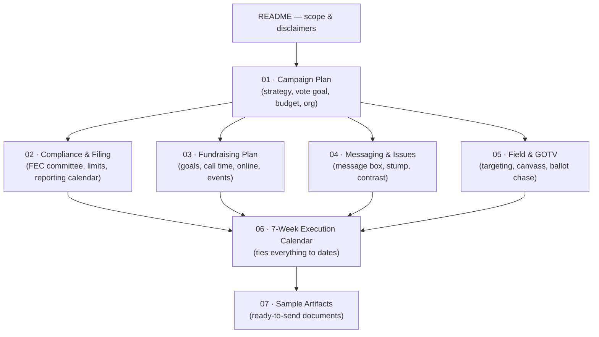

# Worked Example — Matt Grant for Congress (MO-02), to the August 4, 2026 Primary

A complete, end-to-end campaign built from the **Get Elected** skill, demonstrating how the modules combine into a single coherent run for office. This example takes a candidate from **June 17, 2026** through the **August 4, 2026 Missouri primary election** for **U.S. House, Missouri's 2nd Congressional District** — strategy, compliance, fundraising, messaging, field, and a week-by-week execution calendar.

---

## ⚠️ What is real and what is illustrative

This is a **teaching example**. Read this box before using anything here.

| Element | Status |
|---|---|
| **Matt Grant** (the candidate), his biography, his primary opponents, vote tallies, internal poll numbers, and dollar figures | **Fictional / illustrative.** Invented to make the example concrete. Any resemblance to a real person is coincidental. |
| District geography, demographics, Cook PVI, 2024 results | **Real**, sourced (see Sources). |
| Election dates, candidate filing window, FEC contribution limits, FEC reporting deadlines | **Real**, sourced and verified **2026-06-17**. |
| Strategy, scripts, budgets, calendars | **Illustrative best-practice templates** — adapt to your race. |

**Nonpartisan note.** The Get Elected skill is nonpartisan and helps anyone run regardless of party. This example depicts a candidate in the **Democratic primary** purely to make a single contested-primary scenario concrete; the same structure applies identically to any party or any office. Issue positions shown are illustrative, not endorsements.

---

## The scenario in one paragraph

> **Matt Grant** is running for **U.S. House, Missouri's 2nd Congressional District** in the **August 4, 2026 Democratic primary**. He filed before the March 31, 2026 deadline and is now in a contested three-way primary with **48 days** left as of June 17. He is a former public-school teacher, small-business owner (a family hardware store in Wildwood), and current school-board member. His theory of victory: **consolidate the grassroots, electability-minded primary electorate** through relentless voter contact and disciplined small-dollar fundraising, win the nomination, and advance to the **November 3, 2026 general election** against the incumbent.

**Important framing:** August 4 is the **primary**, not the final election. Winning it makes Matt the nominee; the **general election is November 3, 2026**. This package is scoped to *winning the primary*, with hooks noted for the pivot to the general.

---

## How to read this package (in order)

| File | What it contains |
|---|---|
| [`01-campaign-plan.md`](01-campaign-plan.md) | Race overview, theory of victory, win-number math, targeting, budget, timeline, org chart |
| [`02-compliance-and-filing.md`](02-compliance-and-filing.md) | FEC registration, treasurer setup, contribution limits, the full reporting calendar to Aug 4, disclaimers |
| [`03-fundraising-plan.md`](03-fundraising-plan.md) | $350K primary budget, call-time plan, donor tiers, online + events, sample finance timeline |
| [`04-messaging-and-issues.md`](04-messaging-and-issues.md) | Core message, message box, stump speech, top-3 issues, contrast framework |
| [`05-field-and-gotv.md`](05-field-and-gotv.md) | Voter targeting, turf, door/phone scripts, absentee/ballot chase, election-day plan |
| [`06-execution-calendar.md`](06-execution-calendar.md) | Week-by-week June 17 → Aug 4 master calendar integrating every workstream |
| [`07-sample-artifacts.md`](07-sample-artifacts.md) | Launch press release, call script, fundraising email, social posts, endorsement ask, door script |
| [`08-channel-implementation-playbook.md`](08-channel-implementation-playbook.md) | **Campaign manager's field manual** — the full tech stack, a Week-1 setup sprint, channel-by-channel implementation across every marketing channel/app/integration, weekly operating rhythm, KPI dashboard, and compliance overlay |

---

## The campaign at a glance

| Metric | Value (illustrative) |
|---|---|
| Office | U.S. House, MO-02 |
| Election | **Primary: Aug 4, 2026** · General: Nov 3, 2026 |
| Days remaining (from June 17) | **48** |
| Jurisdiction | FEC (federal) + Missouri ballot access |
| Win number (primary, 3-way) | **~16,500 votes** (see `01` for the math + assumptions) |
| Primary budget | **$350,000** |
| Cash-on-hand goal by July 23 pre-primary report | **$60,000+** |
| Core message | *"Lower costs, stronger schools, and a representative who actually shows up."* |

---

## Compliance disclaimer

All compliance figures in this package (contribution limits, filing and reporting deadlines, ballot-access rules) were verified on **2026-06-17** against the sources below. **Election law and limits change every cycle — re-verify against the FEC and the Missouri Secretary of State before relying on any number.**

> **This is educational information, not legal advice. Consult a campaign finance attorney or your filing agency (FEC for federal races; Missouri Secretary of State / Missouri Ethics Commission for state matters) for guidance specific to your situation.**

## Sources

- [FEC — Contribution limits 2025–2026](https://www.fec.gov/help-candidates-and-committees/candidate-taking-receipts/contribution-limits/)
- [FEC — 2026 Missouri primary election report notice](https://www.fec.gov/help-candidates-and-committees/dates-and-deadlines/2026-reporting-dates/prior-notices-2026/election-report-notice-missouri/)
- [FEC — Congressional pre-election reporting dates (2026)](https://www.fec.gov/help-candidates-and-committees/dates-and-deadlines/2026-reporting-dates/congressional-pre-election-reporting-dates-2026/)
- [FEC — 2026 Quarterly filers](https://www.fec.gov/help-candidates-and-committees/dates-and-deadlines/2026-reporting-dates/2026-quarterly-filers/)
- [Missouri Secretary of State — 2026 Candidate Filing Information](https://www.sos.mo.gov/CMSImages/ElectionCandidates/2026FilingDocuments/2026CandidateFilingInformation.pdf)
- [Ballotpedia — Missouri's 2nd Congressional District](https://ballotpedia.org/Missouri's_2nd_Congressional_District)
- [Ballotpedia — MO-02 election, 2024](https://ballotpedia.org/Missouri's_2nd_Congressional_District_election,_2024)
