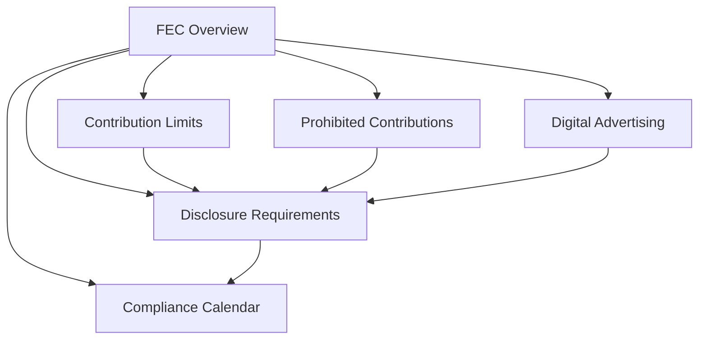

# Federal

Federal election law references covering FEC rules, contribution limits, and compliance requirements. All files include staleness warnings -- verify current rules at fec.gov before relying on any figure.

## Files

- [compliance-calendar.md](compliance-calendar.md) -- FEC filing deadlines and reporting schedule
- [contribution-limits.md](contribution-limits.md) -- Federal contribution limits for the current election cycle
- [digital-advertising.md](digital-advertising.md) -- FEC rules on digital political advertising and platform policies
- [disclosure-requirements.md](disclosure-requirements.md) -- Reporting schedules, itemization thresholds, and filing procedures
- [fec-overview.md](fec-overview.md) -- FEC structure, registration, and general compliance requirements
- [prohibited-contributions.md](prohibited-contributions.md) -- Prohibited sources and contribution types under federal law
