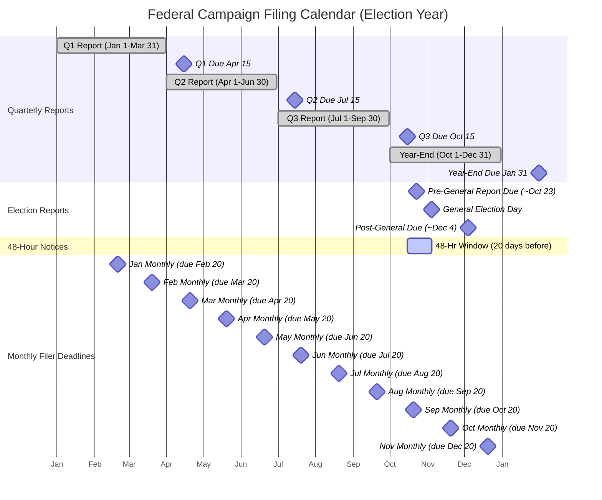

# Federal Campaign Finance Compliance Calendar

> **STALENESS WARNING:** This calendar reflects FEC filing deadlines and requirements as of early 2025. The FEC adjusts deadlines when they fall on weekends or holidays, and occasionally modifies reporting requirements through rulemaking. Always verify current deadlines at [fec.gov/help-candidates-and-committees/dates-and-deadlines/](https://www.fec.gov/help-candidates-and-committees/dates-and-deadlines/) before relying on this reference. Thresholds triggering certain reports (e.g., 48-hour notices) may change.

> **EDUCATIONAL DISCLAIMER:** This is educational information, not legal advice. Missed filing deadlines carry automatic civil penalties. Consult a campaign finance attorney or the FEC directly for guidance specific to your committee's filing obligations.

---

## Filing Frequency Options

Federal committees must choose one of two filing schedules. The choice is binding for the entire election cycle once made.

### Quarterly Filing (Most Common for House and Presidential)

Committees on a **quarterly** schedule file four regular reports per year plus event-driven reports around elections.

### Monthly Filing (Available to All; Required Option for Senate)

Senate committees may elect to file **monthly** instead of quarterly, which provides more frequent but smaller reporting windows. Any authorized committee may opt into monthly filing by notifying the FEC. Monthly filers do **not** file pre-election or post-general reports (with the exception of the pre-general and post-general reports in the general election year for monthly filers who are on the ballot).

---

## Quarterly Filing Deadlines

| Report | Covering Period | Due Date | Form |
|--------|----------------|----------|------|
| Q1 (Year-Start) | Jan 1 -- Mar 31 | **April 15** | FEC Form 3/3P |
| Q2 (Mid-Year) | Apr 1 -- Jun 30 | **July 15** | FEC Form 3/3P |
| Q3 (October Quarterly) | Jul 1 -- Sep 30 | **October 15** | FEC Form 3/3P |
| Year-End | Oct 1 -- Dec 31 | **January 31** (following year) | FEC Form 3/3P |

**Important notes:**
- If a deadline falls on a Saturday, Sunday, or federal holiday, the filing is due the next business day
- Quarterly filers in an election year may have their Q3 report superseded by the pre-general report (see below)
- The year-end report always covers through December 31, regardless of election timing

---

## Election-Related Reports (Quarterly Filers)

These reports are required **in addition to** quarterly reports during election years. They apply to any committee that is on the ballot for the relevant primary or general election.

### Pre-Primary / Pre-Convention Report

| Detail | Requirement |
|--------|-------------|
| **Trigger** | Committee appears on a primary, runoff, or convention ballot |
| **Due date** | **12 days before** the election |
| **Covering period** | Close of books on the last quarterly report through 20 days before the election |
| **Form** | FEC Form 3/3P |

### Pre-General Election Report

| Detail | Requirement |
|--------|-------------|
| **Trigger** | Committee appears on the general election ballot |
| **Due date** | **12 days before** the general election |
| **Covering period** | Close of books on the last report through 20 days before the general election |
| **Form** | FEC Form 3/3P |

### Post-General Election Report

| Detail | Requirement |
|--------|-------------|
| **Trigger** | Committee appeared on the general election ballot |
| **Due date** | **30 days after** the general election |
| **Covering period** | 20 days before the general election through 20 days after |
| **Form** | FEC Form 3/3P |

**Note:** Pre-election reports are filed electronically and must be **received** (not postmarked) by the deadline. The 12-day and 30-day windows are statutory and do not shift for weekends or holidays for electronic filers.

---

## Monthly Filing Deadlines

Monthly filers submit 12 reports per year. Each report covers the first through the last day of the prior month and is due on the 20th of the following month.

| Report | Covering Period | Due Date |
|--------|----------------|----------|
| January Monthly | Jan 1 -- Jan 31 | February 20 |
| February Monthly | Feb 1 -- Feb 28/29 | March 20 |
| March Monthly | Mar 1 -- Mar 31 | April 20 |
| April Monthly | Apr 1 -- Apr 30 | May 20 |
| May Monthly | May 1 -- May 31 | June 20 |
| June Monthly | Jun 1 -- Jun 30 | July 20 |
| July Monthly | Jul 1 -- Jul 31 | August 20 |
| August Monthly | Aug 1 -- Aug 31 | September 20 |
| September Monthly | Sep 1 -- Sep 30 | October 20 |
| October Monthly | Oct 1 -- Oct 31 | November 20 |
| November Monthly | Nov 1 -- Nov 30 | December 20 |
| Year-End | Dec 1 -- Dec 31 | January 31 |

**Exception for election-year monthly filers:** In the general election year, monthly filers who are on the ballot must file pre-general and post-general reports instead of their regular monthly reports for the months immediately surrounding the general election. The November monthly report is replaced by the pre-general and post-general reports.

---

## 48-Hour Notices (Last 20 Days Before Election)

### When Required

Beginning **20 days before an election** through election day, committees must file a **48-hour notice** for any contribution of **$1,000 or more** (aggregate from a single source) received during that window.

### Key Rules

- Filed on **FEC Form 6** (or Schedule A with the 48-hour notice indicator for electronic filers)
- Must be filed within **48 hours** of receipt of the contribution
- Applies to the primary, general, runoff, or special election the committee is participating in
- Includes contributions by check, credit card, wire transfer, in-kind, or any other method
- The $1,000 threshold is per-source, per-election aggregate during the 20-day window
- These are filed **in addition to** reporting the same contributions on the regular periodic report

### Common Pitfalls

- Forgetting that the 48-hour window begins 20 days before the election, not 20 days before election day
- Missing contributions that arrive by mail on weekends -- the 48-hour clock starts on receipt
- Failing to aggregate multiple smaller contributions from the same source that together exceed $1,000

---

## 24-Hour Independent Expenditure Reports

### When Required

Any person or committee making **independent expenditures** aggregating **$1,000 or more** with respect to a given election during the calendar year must file a 24-hour report at any point after the 20-days-before-election threshold (for IEs aggregating $10,000+ at any time during the calendar year, reports are due within 48 hours regardless of timing relative to the election).

### Key Rules

- Filed on **FEC Form 5** (for persons) or **Schedule E** of Form 3X (for PACs and party committees)
- Must be filed within **24 hours** during the last 20 days before an election
- Must be filed within **48 hours** outside the 20-day pre-election window (for expenditures aggregating $10,000+)
- Must include a statement certifying the expenditure was not coordinated with any candidate
- Each independent expenditure communication must include a disclaimer identifying who paid for it and stating it was not authorized by any candidate

### Independent Expenditure Defined

An independent expenditure is a communication that:
1. Expressly advocates the election or defeat of a clearly identified federal candidate
2. Is **not** made in coordination with, or at the request/suggestion of, the candidate, the candidate's campaign, or a party committee

---

## Senate Filing Procedures (Paper vs. Electronic)

Senate candidate committees have a unique filing procedure:

- Senate candidates file with the **Secretary of the Senate** rather than directly with the FEC
- Historically, Senate filings have been on **paper** (not electronic), though legislation to require e-filing was enacted in 2018 and took effect for reports covering periods beginning on or after January 1, 2019
- Senate committees now file electronically with the Secretary of the Senate
- The Secretary of the Senate transmits filings to the FEC for public disclosure

---

## Pre-Filing Checklist: Quarterly Reports

Use this checklist before each quarterly filing:

### 30 Days Before Deadline

- [ ] Reconcile bank statements through the end of the reporting period
- [ ] Verify all contribution records include required donor information (name, address, occupation, employer for contributions over $200)
- [ ] Identify any contributions that may need to be refunded (excessive, prohibited source, etc.)
- [ ] Review disbursements for proper categorization (operating, fundraising, compliance, etc.)
- [ ] Confirm all credit card transactions have cleared and are properly recorded

### 14 Days Before Deadline

- [ ] Run a draft report from your filing software and review for errors
- [ ] Verify beginning cash-on-hand matches the ending cash-on-hand from the prior report
- [ ] Check that all debts and obligations are properly reported (Schedule D)
- [ ] Ensure all loans are reported with correct terms and endorsers (Schedule C)
- [ ] Verify that in-kind contributions are reported at fair market value on both the receipt and disbursement sides
- [ ] Cross-reference large donations against FEC contribution limits for the current cycle
- [ ] Check for contributions requiring redesignation or reattribution

### 7 Days Before Deadline

- [ ] Complete final review of the draft report
- [ ] Have the treasurer (or designated agent) review and approve the report
- [ ] Confirm electronic filing credentials are working
- [ ] Prepare any amendments to prior reports if errors were discovered
- [ ] Verify the committee's FEC ID number and report type are correct on the filing

### Filing Day

- [ ] Submit the report electronically before 11:59 PM Eastern Time
- [ ] Save a confirmation receipt of the filing
- [ ] Download and archive a copy of the filed report
- [ ] Verify the filing appears on the FEC website within 24-48 hours
- [ ] Note the next filing deadline on your compliance calendar

---

## Pre-Filing Checklist: Pre-Election Reports

Pre-election reports require additional diligence because of the compressed timeline and heightened scrutiny.

### Upon Determining You Are on the Ballot

- [ ] Calculate the exact 12-day-before-election deadline and the 20-day-before-election close-of-books date
- [ ] Set up calendar alerts for both dates
- [ ] If you are a quarterly filer, determine how the pre-election report interacts with your regular quarterly report (the pre-election report may supersede part of the quarterly report)

### 20 Days Before Election (Close of Books)

- [ ] Finalize all transactions through this date for the pre-election report
- [ ] Begin preparing the report immediately -- you have only 8 days
- [ ] Activate 48-hour notice monitoring procedures (see above)

### 12 Days Before Election (Filing Deadline)

- [ ] File the pre-election report by 11:59 PM Eastern Time
- [ ] Confirm receipt and check for FEC validation errors
- [ ] Continue monitoring for 48-hour notice obligations through election day

---

## Pre-Filing Checklist: Year-End Report

### December

- [ ] Close books as of December 31
- [ ] Process any year-end contribution refunds before closing books
- [ ] Reconcile all bank accounts through December 31
- [ ] Review all outstanding debts and update Schedule D
- [ ] Account for any contributions received in late December that may not have cleared the bank

### January (Before January 31 Deadline)

- [ ] Complete the year-end report covering the full closing period
- [ ] Verify cumulative cycle-to-date totals for all itemized contributors
- [ ] Ensure all required information is present for itemized contributions (those aggregating over $200 per cycle)
- [ ] Review and file any necessary amendments to prior-period reports
- [ ] File by January 31

---

## Penalty Structure for Late Filings

The FEC assesses **administrative fines** for late or non-filed reports. Penalties are calculated based on:

- The **level of activity** in the report (total receipts + total disbursements)
- The **number of days late**
- Whether the report was eventually filed or never filed
- Whether it is an **election-sensitive** report (pre-election reports carry higher penalties)

Typical penalties range from a few hundred dollars for low-activity late reports to **tens of thousands of dollars** for high-activity reports that are never filed. The FEC publishes its Administrative Fine Program penalty schedule, and penalties are assessed automatically without requiring a complaint or investigation.

### How to Avoid Penalties

1. File on time, even if the report is incomplete -- you can amend later
2. Set multiple reminders well in advance of each deadline
3. Maintain ongoing bookkeeping rather than scrambling at report time
4. Use FEC-certified filing software that validates reports before submission
5. Designate a backup filer in case the treasurer is unavailable

---

## Annual Compliance Calendar Diagram

## Annual Compliance Calendar Summary

| Month | Key Deadlines |
|-------|--------------|
| **January** | Jan 31: Year-End report due; Monthly report due Jan 20 |
| **February** | Monthly report due Feb 20 |
| **March** | Monthly report due Mar 20 |
| **April** | Apr 15: Q1 report due; Monthly report due Apr 20 |
| **May** | Monthly report due May 20; Watch for primary pre-election reports |
| **June** | Monthly report due Jun 20; Primary-season 48-hour notices |
| **July** | Jul 15: Q2 report due; Monthly report due Jul 20 |
| **August** | Monthly report due Aug 20; Watch for primary runoff reports |
| **September** | Monthly report due Sep 20 |
| **October** | Oct 15: Q3 report due; Monthly report due Oct 20; Pre-general report (~12 days before Nov election); 48-hour notice window begins ~20 days before general |
| **November** | General election; Monthly report due Nov 20 (if applicable); Post-general report due ~30 days after election |
| **December** | Monthly report due Dec 20; Close books Dec 31 |

---

## Resources

- **FEC Filing Dates Calendar:** [fec.gov/help-candidates-and-committees/dates-and-deadlines/](https://www.fec.gov/help-candidates-and-committees/dates-and-deadlines/)
- **Electronic Filing System:** [fec.gov/help-candidates-and-committees/filing-reports/e-filing/](https://www.fec.gov/help-candidates-and-committees/filing-reports/e-filing/)
- **Administrative Fines Program:** [fec.gov/legal-resources/enforcement/administrative-fines/](https://www.fec.gov/legal-resources/enforcement/administrative-fines/)
- **FEC Reporting Forms:** [fec.gov/help-candidates-and-committees/forms/](https://www.fec.gov/help-candidates-and-committees/forms/)
- **FEC Information Line:** 1-800-424-9530 (for filing questions)
