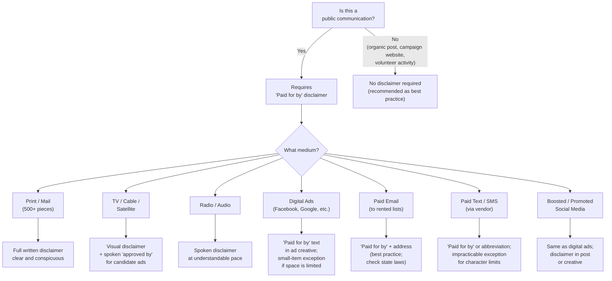

# Federal Digital Advertising Rules

> **STALENESS WARNING:** This reference reflects FEC rules on digital political advertising as of early 2025. Digital advertising regulation is an active area of rulemaking. The FEC has proposed and considered multiple rulemakings on internet communications, AI-generated content disclaimers, and platform-specific requirements. Always verify current requirements at [fec.gov](https://www.fec.gov) and check for recent Advisory Opinions addressing digital communications. Platform policies (Meta, Google, X) change frequently and independently of FEC rules.

> **EDUCATIONAL DISCLAIMER:** This is educational information, not legal advice. Digital advertising compliance involves overlapping federal, state, and platform-specific rules. Consult a campaign finance attorney for guidance specific to your advertising program.

---

## What Counts as a "Public Communication"

Federal campaign finance law requires disclaimers on **public communications**. Under FEC rules, a public communication includes:

- Broadcasting (TV, radio, cable, satellite)
- Newspaper, magazine, outdoor advertising, mass mailings (500+ pieces), phone banks (500+ calls)
- **Paid digital advertising placed for a fee on another person's website, platform, or digital application**

### What Is and Is Not a Public Communication Online

| Communication Type | Public Communication? | Disclaimer Required? |
|---|---|---|
| Paid ads on Facebook, Google, YouTube, X, etc. | **Yes** | **Yes** |
| Paid promoted/boosted social media posts | **Yes** | **Yes** |
| Paid pre-roll video ads | **Yes** | **Yes** |
| Paid display/banner ads on third-party websites | **Yes** | **Yes** |
| Paid search engine ads | **Yes** | **Yes** |
| Organic posts on a campaign's own social media | **No** (unpaid internet activity) | Recommended but not required |
| Campaign's own website content | **No** (unpaid internet activity) | Recommended but not required |
| Emails sent from the campaign to its list | **No** (individual internet activity) | See email-specific rules below |
| Peer-to-peer text messages (unpaid volunteers) | **No** | Not required |
| Paid text message campaigns (via vendor) | **Yes** (mass communication for a fee) | **Yes** |

### The Internet Exemption

The FEC's "internet exemption" (11 CFR 100.94 and 100.155) excludes most **unpaid** individual internet activity from the definition of public communication and from regulation as an expenditure or contribution. This means:

- A campaign's organic social media posts are generally exempt
- Volunteer blogging, sharing, and posting about candidates is exempt
- An individual spending personal funds on internet communications is generally exempt (unless it involves paid advertising placed on another person's platform)

**The key distinction:** Once you **pay** to place content on someone else's platform, it becomes a public communication subject to disclaimer requirements.

---

## Disclaimer Decision Tree



## "Paid for by" Disclaimer Requirements

### Standard Disclaimer for Candidate Committees

All public communications made by an authorized candidate committee must include:

```
Paid for by [Committee Name]
```

Example:
> Paid for by Smith for Congress

### Standard Disclaimer for Non-Candidate Committees (PACs, Party Committees)

Communications by non-candidate committees must include:

```
Paid for by [Committee Name]
```

If the communication is **not authorized** by any candidate:
```
Paid for by [Committee Name]. Not authorized by any candidate or candidate's committee.
```

If the communication **is authorized** by a candidate:
```
Paid for by [Committee Name] and authorized by [Candidate Name/Committee Name]
```

### Requirements for Disclaimer Presentation

Disclaimers must be:
- **Clear and conspicuous** -- a reasonable person must be able to read or hear them
- **Presented in a way that gives them a reasonable degree of permanence** so the viewer can see, read, or hear them
- Not obscured, hidden behind clicks, or rendered illegible by small font size

---

## Small Item and Impracticable Exceptions

The FEC recognizes that some communications are too small to carry a full disclaimer. Under 11 CFR 110.11(f):

### Small Items Exception

Communications on items so small that a disclaimer cannot be conveniently printed (bumper stickers, pins, buttons, pens, similar small items) are **exempt** from disclaimer requirements.

### Digital Applications of the Small Items Exception

- **Small digital ads** (e.g., banner ads with very limited character/pixel space) may qualify for the small items exception
- The FEC has not established a specific pixel size threshold -- the standard is whether the disclaimer "cannot be conveniently" included
- **Best practice:** If the ad format allows any text at all, include at minimum "Paid for by [Committee Name]" even if abbreviated

### Impracticable Exception

If including the disclaimer is "impracticable" given the medium, the communication is exempt. This has been applied to:
- Skywriting
- Water towers
- Very short text messages (character-limited)

**Caution:** Campaigns should not aggressively interpret these exceptions. The FEC evaluates compliance based on whether a reasonable effort was made to include the disclaimer given the medium's constraints.

---

## Platform-Specific Advertising Policies

Major digital platforms impose their own political advertising policies **in addition to** FEC requirements. These policies change frequently and may be more restrictive than federal law.

### Meta (Facebook and Instagram)

**As of early 2025:**
- Requires "Paid for by" disclaimers on all ads about social issues, elections, or politics
- Advertisers must complete an **authorization process** including identity verification and confirmation of the entity paying for the ad
- Maintains an **Ad Library** where all political/social issue ads are archived and publicly searchable for seven years
- Requires a "Paid for by" label that appears on the ad itself (separate from the FEC-required disclaimer in the ad content)
- Provides **targeting transparency** showing who saw the ad and demographic breakdowns
- Restricts certain targeting options for political ads (e.g., removal of detailed targeting exclusions)
- Has specific policies on AI-generated or manipulated media in political ads (requires disclosure)

**Practical impact:** You must apply for authorization as a political advertiser before running any campaign ads. Budget 5-10 business days for the verification process.

### Google (Search, YouTube, Display Network)

**As of early 2025:**
- Requires **election ads verification** -- advertisers must verify their identity and confirm they are eligible to run election ads in the US
- Maintains a **Political Ads Transparency Report and Ad Library**
- Requires a "Paid for by" disclosure on all election ads
- Restricts targeting of election ads to: geographic location (except radius), age, gender, and contextual targeting (topic, keyword, placement). **Demographic, interest-based, and custom audience targeting are prohibited for election ads**
- YouTube pre-roll and bumper ads must include disclaimers
- Has prohibited certain types of demonstrably false claims about election procedures and results
- Limits microtargeting capabilities for political ads more than for commercial ads

**Practical impact:** Google's targeting restrictions significantly limit the precision of digital audience targeting compared to non-political advertising. Plan broader targeting strategies.

### X (Formerly Twitter)

**As of early 2025:**
- Policy has shifted multiple times since 2019 (banned political ads, then partially reinstated them)
- Currently allows political advertising in most contexts with some restrictions
- Requires disclosure of funding source
- Maintains a degree of ad transparency
- Policies are subject to frequent change under current ownership

**Practical impact:** Verify X's current political ad policy before committing budget. The platform's policies have changed significantly and repeatedly.

### Other Platforms

- **TikTok:** Has **banned** political advertising. Campaigns cannot run paid political ads. Organic content is allowed but subject to community guidelines.
- **Snapchat:** Allows political ads with verification requirements and an ad library.
- **LinkedIn:** Allows political ads with restrictions; requires verification.
- **Programmatic/DSP platforms (The Trade Desk, DV360, etc.):** Generally follow the FEC requirements and add their own verification layers. Many require a political advertiser registration process.
- **Connected TV/OTT (Hulu, Roku, etc.):** Treated similarly to broadcast; full disclaimers required. Many require advertiser verification.

---

## Email Disclaimer Requirements

Campaign emails are generally **not** classified as public communications under FEC rules (they are considered individual internet activity, not paid placement on another's platform). However:

- **FEC best practice and advisory opinions recommend** including disclaimers on campaign emails
- Many states **require** disclaimers on political emails regardless of federal rules
- Fundraising solicitations must include legally required language about contribution limits and prohibitions
- If an email is sent via a paid third-party platform that adds the email to a rented list (not the campaign's own list), it may cross into public communication territory

### Recommended Email Disclaimer Format

```
Paid for by [Committee Name]
[Street Address]
[City, State ZIP]
[Website URL]
```

Including the physical address and website is not strictly required by federal law for emails but is considered best practice and may be required by state laws or the CAN-SPAM Act.

---

## Text Message / SMS Disclaimer Requirements

- **Paid mass text messages** (sent via a vendor for a fee) are generally considered public communications and require disclaimers
- **Volunteer peer-to-peer texting** where individual volunteers personally initiate each conversation is generally exempt as unpaid individual internet activity
- The small item / impracticable exception may apply to very short SMS messages where character limits make a full disclaimer impracticable
- **Best practice:** Include at minimum "Paid for by [Committee Name]" or an abbreviation, even in character-limited texts
- Consider including a link to the campaign website where the full disclaimer is displayed

---

## Social Media Organic Post Disclaimers

Organic (unpaid) social media posts by a campaign are **not** required to carry FEC disclaimers because they are unpaid internet activity. However:

- **Best practice:** Include "Paid for by [Committee Name]" in the campaign's social media bio/profile
- If organic posts are **boosted** or **promoted** with paid spending, they become paid public communications and **require disclaimers**
- Some states require disclaimers on all political social media content, regardless of whether it is paid
- Organic posts that include video content should ideally include a disclaimer for consistency and because they may later be promoted

---

## AI-Generated Content Disclaimers

### Current Federal Status

As of early 2025, the FEC has been considering rulemaking on **AI-generated content** in political advertising. Key developments:

- The FEC initiated a rulemaking proceeding in 2023 regarding the use of AI-generated "deepfake" content in campaign ads
- Proposed rules would potentially require disclosure when campaign communications contain AI-generated or AI-altered images, audio, or video of real individuals
- No final rule had been adopted as of early 2025, but this is an active area of regulatory development

### Best Practices Pending Final Rules

Even without a final federal AI disclaimer rule, campaigns should:

1. **Disclose AI-generated content voluntarily** -- include a label such as "This image/audio/video was created or altered with AI" when using AI to generate or significantly modify depictions of real people
2. **Avoid deceptive deepfakes** -- the FEC has existing authority over fraudulent misrepresentation (52 USC 30124), and AI-generated content that falsely depicts a candidate could trigger enforcement
3. **Check state laws** -- multiple states have enacted laws requiring disclosure of AI-generated political content or banning deceptive AI-generated political media (including Texas, California, Michigan, Minnesota, Washington, and others)
4. **Monitor platform policies** -- Meta, Google, and others have implemented or announced AI content labeling requirements for political ads
5. **Document your AI use** -- maintain records of what AI tools were used and how content was generated or modified, in case of complaints or investigations

### State AI Disclosure Laws (Selected)

Several states have moved faster than the federal government on AI political content:

- **Texas (SB 1571):** Prohibits distribution of deceptive AI-generated videos of candidates within 30 days of an election
- **California (AB 2839):** Requires disclosure of AI-generated or manipulated content in election communications
- **Michigan:** Requires disclosure of AI-generated media in political ads
- **Minnesota:** Requires labeling of deepfake political content
- **Washington:** Prohibits synthetic media depicting candidates in false actions without disclosure

---

## Coordination and Disclaimer Interactions

Disclaimers serve as evidence of who paid for and authorized a communication, which is directly relevant to **coordination** analysis:

- If a communication carries a candidate's authorization, it is treated as a **coordinated communication** and counts as an in-kind contribution
- Independent expenditure communications must state they are **not authorized** by any candidate
- Improperly disclaimed communications can trigger coordination inquiries from the FEC
- Super PAC ads must **never** state or imply candidate authorization

---

## Practical Compliance Checklist for Digital Ads

### Before Launching Any Paid Digital Campaign

- [ ] Complete advertiser verification on all platforms (Meta, Google, etc.) -- allow 5-10 business days
- [ ] Prepare disclaimer text: "Paid for by [Full Committee Name]"
- [ ] For non-candidate committees: add "Not authorized by any candidate or candidate's committee" where applicable
- [ ] Design ad creatives with disclaimer space built in (don't try to add it as an afterthought)
- [ ] Verify disclaimer is legible at the smallest display size the ad will appear
- [ ] For video ads: ensure disclaimer appears for sufficient duration to be read (typically at least 4 seconds)
- [ ] For audio ads: ensure disclaimer is spoken clearly and at an understandable pace

### Ongoing Compliance

- [ ] Monitor platform policy changes monthly (subscribe to platform policy blogs)
- [ ] Archive all ad creatives, targeting parameters, and spend records
- [ ] Report all digital ad spending on FEC reports in the correct categories
- [ ] Track and report in-kind contributions for coordinated digital content
- [ ] Review state-specific digital ad requirements for any state where ads will be shown
- [ ] Audit live ads quarterly to confirm disclaimers are displaying correctly

---

## Reporting Digital Advertising Spending

Digital advertising expenditures must be reported on FEC reports (Schedule B):

- **Disbursements to platforms** (Meta, Google, etc.) are reported as operating expenditures
- **Disbursements to digital vendors** (consultants, ad agencies) are reported as operating expenditures with a memo entry itemizing the ultimate payees when the vendor pays subvendors
- **Purpose of disbursement** should be descriptive: "Digital advertising -- Facebook," "Online advertising -- Google Ads," "Digital consulting services," etc.
- The FEC requires **itemization of all disbursements over $200** to a single payee per cycle

---

## Resources

- **FEC Disclaimer Guide:** [fec.gov/help-candidates-and-committees/making-disbursements/disclaimer-notices/](https://www.fec.gov/help-candidates-and-committees/making-disbursements/disclaimer-notices/)
- **FEC Internet Communication Rules:** [fec.gov/updates/internet-communication-disclaimers/](https://www.fec.gov/updates/internet-communication-disclaimers/)
- **Meta Ad Library:** [facebook.com/ads/library](https://www.facebook.com/ads/library)
- **Google Political Ads Transparency Report:** [transparencyreport.google.com/political-ads](https://transparencyreport.google.com/political-ads)
- **FEC Advisory Opinions on Digital Ads:** Search at [fec.gov/data/legal/advisory-opinions/](https://www.fec.gov/data/legal/advisory-opinions/)
