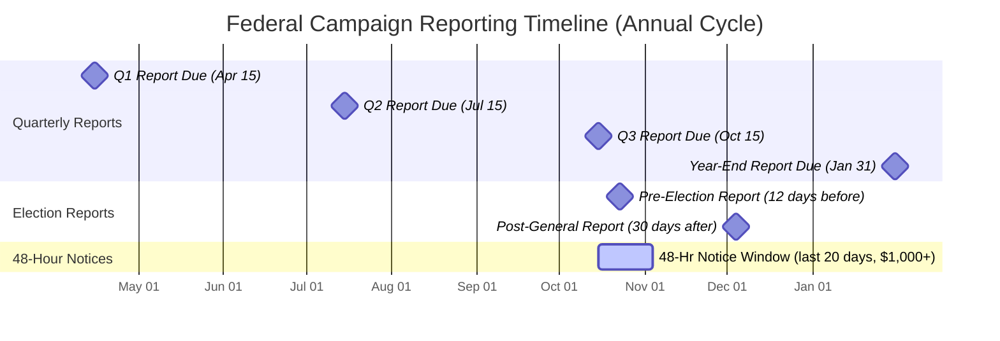

# Federal Disclosure and Reporting Requirements

> **STALENESS WARNING:** Reporting schedules, itemization thresholds, and filing procedures are subject to change by the FEC. This reference reflects requirements as of early 2025. Always verify current reporting requirements and deadlines at [fec.gov](https://www.fec.gov) before filing.

> **EDUCATIONAL DISCLAIMER:** This is educational information, not legal advice. Consult a campaign finance attorney or the FEC directly for guidance specific to your situation.

> **CURRENT CYCLE NOTICE:** All reporting deadlines and compliance information in this file must be verified via the FEC website for the current election cycle before use in campaign operations.

---

## Reporting Cycle Overview

## Reporting Schedules

Federal candidate committees must file regular financial disclosure reports with the FEC. The schedule depends on the type of committee and the office sought.

### House Candidates: Quarterly Filing

House candidates file on a **quarterly** basis:

| Report | Covers Period | Due Date |
|--------|---------------|----------|
| **Q1 (Year 1)** | January 1 - March 31 | April 15 |
| **Q2 (Year 1)** | April 1 - June 30 | July 15 |
| **Q3 (Year 1)** | July 1 - September 30 | October 15 |
| **Year-End** | October 1 - December 31 | January 31 (of next year) |
| **Q1 (Year 2 / Election Year)** | January 1 - March 31 | April 15 |
| **Q2 (Year 2 / Election Year)** | April 1 - June 30 | July 15 |
| **Pre-Primary (12-day)** | July 1 - 20 days before primary | 12 days before primary |
| **Pre-General (12-day)** | Close of last report - 20 days before general | 12 days before general (late October) |
| **Post-General** | 20 days before general - November 25 | December 5 |
| **Year-End** | November 26 - December 31 | January 31 |

**Note:** In election years, the Q3 report is replaced by the pre-election reports.

### Senate Candidates: Choice of Schedule

Senate candidates may choose either:

**Option A -- Semi-Annual + Pre/Post-Election Reports (default)**
- Semi-annual reports (covers January 1 - June 30, due August 1; July 1 - December 31, due January 31)
- Pre-primary and pre-general 12-day reports
- Post-general report

**Option B -- Monthly Filing**
- Monthly reports filed on the 20th of each month for the prior month's activity
- No separate pre-election or post-election reports required (the monthly schedule covers them)
- To elect monthly filing, the committee must notify the FEC (this choice can be changed for subsequent cycles)

**Senate Filing Note:** Senate candidate reports are filed with the **Secretary of the Senate**, not directly with the FEC. The Secretary transmits them to the FEC. Senate candidates may now file electronically through the Senate's e-filing system.

### PACs, Super PACs, and Party Committees

PACs and party committees may choose either quarterly or monthly filing:
- **Quarterly filers:** Same schedule as House candidates (plus pre- and post-election reports in election years)
- **Monthly filers:** File by the 20th of each month; no separate pre/post-election reports

---

## Pre-Election Reports

### 12-Day Pre-Election Report

This is one of the most important reports in the cycle. It gives voters a snapshot of a campaign's finances shortly before they vote.

- **When due:** 12 days before any election (primary, general, runoff, special)
- **Covers:** The period from the close of the last report through 20 days before the election
- **Who files:** All candidate committees and PACs making contributions or expenditures in connection with that election
- **No grace period:** Late filing results in automatic fines under the Administrative Fines Program

### 30-Day Pre-Election Report (Post-Primary / Pre-General Context)

Some committees may also be subject to a 30-day post-election report requirement depending on their filing schedule. Check the FEC's filing schedule tool for your specific committee type and election dates.

---

## Post-General Election Report

- **When due:** 30 days after the general election (typically December 5 for November elections)
- **Covers:** The period from the close of the pre-general report through 20 days after the general election
- **Purpose:** Captures last-minute spending and contributions around election day

---

## Year-End Report

- **When due:** January 31 of the following year
- **Covers:** The period from the close of the post-general report (or last quarterly report) through December 31
- **Filed by:** All registered committees, regardless of activity level
- **Note:** Even committees with zero activity must file year-end reports as long as they remain registered

---

## 48-Hour Notices for Late Contributions

### When Required

During the **last 20 days before an election** (primary or general), any candidate committee that receives a contribution of **$1,000 or more** must file a **48-hour notice** with the FEC.

### What to Report

Each 48-hour notice must include:
- Date of receipt
- Amount
- Contributor's full name, mailing address, occupation, and employer
- Election designation (primary or general)

### How to File

- Filed **electronically** through the FEC e-filing system
- Must be filed within **48 hours** of receipt (not 48 business hours -- calendar hours including weekends)
- Each qualifying contribution requires a separate notice
- These are in ADDITION to reporting the contribution on your regular report

### Penalty for Failure

Late or missing 48-hour notices can result in FEC enforcement action. Because these notices are designed to inform voters before they cast ballots, the FEC takes compliance seriously.

---

## 24-Hour Independent Expenditure Reports

### When Required

Any person or committee that makes an **independent expenditure** of **$1,000 or more** during the period **20 days before an election through election day** must file a **24-hour report**.

For independent expenditures of **$10,000 or more** at any time during the calendar year (not just the pre-election period), a 24-hour report is also required.

### What to Report

- Amount and date of the expenditure
- Name and address of the payee (vendor)
- Description/purpose of the expenditure
- The candidate(s) the expenditure supports or opposes
- Whether the expenditure supports or opposes the candidate
- A certification that the expenditure was not coordinated with any candidate

### Who Files

- Super PACs (most common filers)
- Traditional PACs making independent expenditures
- Party committees making independent expenditures
- Individuals spending over the threshold independently

---

## Itemization Thresholds

Not every contribution or expenditure must be individually listed (itemized) on a report. The FEC uses **aggregate thresholds** to determine when itemization is required.

### Contributions: $200 Aggregate Threshold

- Contributions from a single source that **aggregate over $200** during a calendar year (or election cycle, depending on the type of committee) must be **itemized** on the report
- Contributions of $200 or less may be reported in a lump sum as "unitemized contributions"
- Once a donor crosses the $200 threshold, **all contributions** from that donor for the reporting period must be itemized (including the ones that were previously below the threshold)

### What Itemization Requires (for Each Contribution)

| Data Point | Required? | Notes |
|------------|-----------|-------|
| **Full name** | Yes | As given by the donor; first and last name |
| **Mailing address** | Yes | Street address, city, state, ZIP |
| **Occupation** | Yes | Self-reported by donor |
| **Employer** | Yes | Self-reported by donor; "self-employed" or "retired" if applicable |
| **Date of receipt** | Yes | The date the committee received the contribution |
| **Amount** | Yes | Dollar amount of this specific contribution |
| **Aggregate cycle-to-date total** | Yes | Running total from this donor for the election cycle |
| **Election designation** | Yes | Primary, general, runoff, special, etc. |

### Expenditures: Itemization Rules

- All disbursements to a **single payee** aggregating over **$200** per calendar year must be itemized
- Include: payee name and address, date, amount, and purpose of disbursement
- Purpose must be sufficiently descriptive (e.g., "printing" or "TV ad buy" -- not just "campaign expenses")

---

## What Information to Collect from Donors

### Best Practice: Collect from EVERY Donor, Regardless of Amount

Even though itemization is only required above $200, best practice is to collect full information from every donor because:

1. **You don't know in advance** if a donor will cross the $200 threshold with future contributions
2. If they cross it, you need to **retroactively report** all their information
3. It is much harder to collect information after the fact than at the time of the contribution

### Required Donor Information

For every itemized contribution, collect:
- **Full legal name** (first and last; middle initial recommended)
- **Mailing address** (street, city, state, ZIP code)
- **Occupation** (what the donor does for a living)
- **Employer** (who the donor works for, or "self-employed," "retired," "not employed," "student," etc.)

### Best Efforts Defense

If a campaign makes **"best efforts"** to obtain donor information and the donor does not respond, the campaign has a defense against penalties. "Best efforts" means:

1. **Request the information at the time of the solicitation** (include a line on donation forms asking for name, address, occupation, employer)
2. If information is missing, **send a follow-up request** within 30 days of receipt
3. If the donor still does not respond, **document the follow-up attempts**
4. Report the contribution with whatever information you have, and note that best efforts were made

**Practical tip:** Online donation platforms (ActBlue, WinRed, etc.) require this information at the time of the contribution, which largely solves the best-efforts problem for online gifts. The issue arises most often with mailed checks, event contributions, and in-person donations.

---

## Record-Keeping Requirements

Federal campaign committees must maintain records that are sufficient to verify the accuracy of their reports. At a minimum, retain:

### For Contributions
- The donor's name, address, occupation, and employer
- Date and amount of each contribution
- The check, credit card receipt, or wire transfer confirmation
- For in-kind contributions: documentation of the fair market value
- Records of redesignations and reattributions (written donor authorizations)
- Copies of solicitations (to prove best efforts compliance)

### For Expenditures
- Invoices, receipts, or contracts for every expenditure
- Date, amount, payee, and purpose
- For credit card expenses: the underlying receipts (not just the credit card statement)
- For reimbursements: the original receipts from the person being reimbursed, plus documentation of the campaign purpose

### Retention Period

- Keep all records for **at least 3 years** after the report to which they relate is filed
- The FEC statute of limitations for enforcement is **5 years**, so many compliance professionals recommend retaining records for at least 5 years
- If the committee is subject to an audit or enforcement action, retain records until the matter is fully resolved

---

## Electronic Filing

### Who Must File Electronically

Any committee that **receives contributions or makes expenditures exceeding $50,000** in a calendar year, or expects to do so, **must file electronically** with the FEC.

- This threshold applies to virtually all competitive federal campaigns
- Committees below the threshold may still choose to file electronically (and most do)
- Senate candidates file through the Secretary of the Senate's system

### E-Filing System

- The FEC provides free filing software: **FECFile**
- Most campaigns use commercial compliance software (e.g., NGP VAN, Aristotle, ISPolitical, Campaign Deputy) that generates FEC-formatted reports
- Reports must be filed by 11:59 PM Eastern Time on the due date
- Electronic filers get a **confirmation receipt** -- save this as proof of timely filing

---

## Penalties for Late Filing

### Administrative Fines Program

The FEC operates an **Administrative Fines Program** for late or non-filed reports. Fines are calculated by formula based on:

- **How late the report is** (number of days)
- **The level of financial activity** on the report
- **Whether it is an election-sensitive report** (pre-election reports carry higher penalties)
- **Whether the committee is a repeat offender**

### Approximate Fine Structure

| Report Type | Days Late | Approximate Civil Penalty |
|-------------|-----------|---------------------------|
| Non-election-sensitive (quarterly) | 1-4 days | $55 - $280+ per day (scaled by activity level) |
| Non-election-sensitive (quarterly) | 5-30 days | Escalating per-day penalties |
| Election-sensitive (pre-election) | 1-4 days | Higher per-day penalties than quarterly |
| Election-sensitive (pre-election) | 5+ days | Significantly escalating penalties |
| Non-filing | 30+ days | Maximum penalty up to the lesser of the activity level or statutory cap |

**Note:** Exact penalty amounts are set by FEC schedule and are updated periodically. The maximum civil penalty for a single violation can exceed $70,000. Check the current fine schedule at fec.gov.

### Beyond Fines

In egregious cases (intentional non-filing, concealment), the FEC can:
- Initiate a full enforcement proceeding (MUR)
- Seek injunctive relief in federal court
- Refer the matter to the Department of Justice for criminal prosecution
- Criminal penalties under FECA can include fines and imprisonment

---

## Amendments

If a filed report contains errors or omissions, the committee should file an **amended report** as soon as the error is discovered. Amendments:

- Are filed on the same form as the original report, marked as an "amendment"
- Should correct all errors in a single amendment (avoid serial amendments)
- Do not eliminate potential liability for the original error, but demonstrate good faith
- The FEC provides guidance on common amendment scenarios in the Campaign Guide

---

## Special Reporting Situations

### Bundled Contributions

Lobbyist/registrants and PACs that **bundle** contributions (collect and forward contributions from multiple donors to a candidate) must report:
- The name of the bundler
- The aggregate amount bundled during the reporting period and election cycle
- This applies when bundled contributions exceed **$18,200** (indexed for inflation; verify current threshold)

### Independent Expenditures (Ongoing Reporting)

In addition to 24-hour reports near elections, committees must report all independent expenditures on their regular periodic reports, including:
- Each expenditure itemized
- The candidate supported or opposed
- Whether the expenditure was in support or opposition
- A signed certification of independence from the candidate

### Electioneering Communications

Any person who spends more than **$10,000** on **electioneering communications** (broadcast ads that refer to a clearly identified federal candidate within 30 days of a primary or 60 days of a general election) must file a report disclosing:
- The amount spent
- The candidate(s) referenced
- The names of donors who contributed $1,000 or more for the purpose of funding the communication
