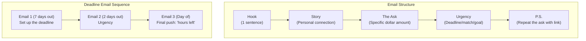

# Email Fundraising Guide

Email remains the highest-ROI fundraising channel for political campaigns at every level. A well-managed email program can generate 40-60% of total digital fundraising revenue. This guide covers list building, email structure, ask strategy, sequences, and complete templates.

---

## List Building Sources

Your email list is your most valuable digital asset. Build it from every possible source:

- **Website signup forms**: Pop-up, footer, and dedicated landing page. Offer something (policy guide, event invite) in exchange.
- **Event attendees**: Collect emails at every town hall, rally, house party, and fundraiser
- **Petition signers**: Issue-based petitions (e.g., "Sign if you support affordable housing") convert at 15-30%
- **Donor records**: Every donor from ActBlue, WinRed, or direct contributions
- **Volunteer signups**: Canvassers, phone bankers, text bankers
- **Social media lead ads**: Facebook/Instagram lead generation forms
- **Voter file match**: Match your voter contact universe against email databases (use a vendor)
- **Business cards**: Manually enter contacts from community events
- **Endorser networks**: Ask endorsing organizations to send to their lists on your behalf

Always use double opt-in or confirmed opt-in to maintain deliverability. Scrub your list quarterly by removing addresses that have not opened in 90 days.

---

## Email Frequency

| Campaign Phase | Frequency | Notes |
|--------------------------|----------------|---------------------------------------|
| Early campaign | 1x/week | Introductions, vision, list building |
| Active fundraising | 2-3x/week | Mix of fundraising and content |
| Quarterly deadline push | Daily (3-5 days)| Deadline sequence (see below) |
| Final 2 weeks | Daily | GOTV + final fundraising surge |
| Final 48 hours | 2-3x/day | Last chance appeals |

Monitor unsubscribe rates. If they exceed 0.5% per email, reduce frequency or improve content quality.

---

## Subject Line Best Practices

Your subject line determines whether anyone reads your email. Test obsessively.

- **Keep it short**: 6-10 words or under 50 characters. Mobile truncates longer lines.
- **Create curiosity**: "I wasn't going to share this" outperforms "Campaign Update #14"
- **Use urgency sparingly**: "Midnight deadline" works near deadlines; overuse trains people to ignore it
- **Personalize**: First name in subject line increases open rates 10-20% ("[Name], can I count on you?")
- **Avoid spam triggers**: Do not use ALL CAPS, excessive punctuation (!!!), or words like "free money"
- **Ask questions**: "Will you chip in before midnight?" outperforms "Donate now"
- **Test two versions**: A/B test subject lines on 20% of your list, then send the winner to the remaining 80%

High-performing subject line formulas:
- "[Name], I need to ask you something"
- "I'll be honest with you"
- "This wasn't the plan"
- "Before midnight tonight"
- "re: [relevant local issue]"
- "Quick question"

---

## Email Structure

Every fundraising email follows this five-part structure:

### 1. Hook (1 sentence)
Open with a single compelling sentence that creates urgency or emotional connection. Do not waste the first line on "Dear Supporter" filler.
> "In 12 hours, our first FEC deadline closes -- and we're $4,200 short of our goal."

### 2. Story (2-4 sentences)
Connect the ask to a personal story, a voter interaction, or a campaign moment. Make the reader feel something.
> "Last week, I met Maria at our town hall in Springfield. She works two jobs and still can't afford her daughter's insulin. She asked me: 'Will anyone in office actually fight for us?' I told her yes."

### 3. The Ask (1-2 sentences + button/link)
Be specific about the amount. Give them a reason to give that amount. Include a prominent donation link or button.
> "Will you chip in $25 right now so we can fight for families like Maria's? [DONATE $25]"

### 4. Urgency (1-2 sentences)
Explain WHY they need to act now. A deadline, a matching gift, a goal, or an opponent action.
> "We have until midnight to hit our $50,000 goal. We're at $45,800. Your $25 gets us closer."

### 5. P.S. (1-2 sentences)
Repeat the ask with the deadline. Many readers skip to the P.S. first.
> "P.S. We're $4,200 away with 12 hours left. Can you chip in $25 before midnight? [DONATE $25]"

---

## The Ask Ladder

Segment your list and escalate asks over time:

| Donor Status | First Ask | Second Ask | Stretch Ask |
|--------------------|-----------|------------|-------------|
| Non-donor | $10 | $25 | $50 |
| Small donor ($1-49)| $25 | $50 | $100 |
| Mid donor ($50-249)| $50 | $100 | $250 |
| Major donor ($250+)| $100 | $250 | $500 |
| Max-out track | $500 | $1,000 | Max contribution |

Always include multiple suggested amounts in your donation link (e.g., $10 / $25 / $50 / $100 / Other).

---

## Deadline Sequences

### 3-Email Deadline Sequence (use for FEC deadlines, month-end, or goal milestones)

**Email 1 -- Setup (3 days before deadline)**
Subject: "Our [deadline name] deadline is in 3 days"
Tone: Informational. Explain what the deadline is, why it matters, set the goal number.

**Email 2 -- Urgency (1 day before deadline)**
Subject: "We're $[amount] short -- can you help?"
Tone: Urgent but not panicked. Update the progress toward the goal. Share what is at stake.

**Email 3 -- Final (day of deadline, morning + evening)**
Subject: "[Name], this is it"
Tone: Direct, personal, final chance. Morning email sets up the close; evening email is the last call.

---

## Matching Gift Emails

Matching gifts reliably increase donation rates by 20-40%.

- Secure a match commitment from a major donor BEFORE announcing it
- Be specific: "$25,000 match from [real donor or anonymous supporter]"
- Show a progress bar or percentage matched so far
- Create real scarcity: "Only $8,000 in matching funds remain"
- Send 2-3 emails during the match period (announcement, midpoint update, final hours)

---

## Monthly Recurring Donation Asks

Recurring donors are 5x more valuable over the campaign lifecycle. Dedicate one email per month specifically to recurring asks.

- Frame it as a "sustaining" or "monthly" commitment: "Can you spare $10/month?"
- Show the math: "$10/month = $120 over the campaign -- enough to knock 2,400 doors"
- Offer a thank-you item (sticker, bumper sticker) for recurring donors
- Make cancellation easy -- this builds trust and actually reduces churn

---

## Welcome Series (3 Emails Over 7 Days)

Every new subscriber receives this automated sequence:

**Welcome Email 1 (immediately after signup)**
Subject: "Welcome to the team, [Name]"
Content: Thank them. Tell the candidate's story in 3 sentences. Ask them to follow on social media. No donation ask.

**Welcome Email 2 (Day 3)**
Subject: "Here's why I'm running"
Content: Candidate's core message. One key issue. Link to policy page or video. Soft ask: "If you believe in this, chip in $10 to help us get started."

**Welcome Email 3 (Day 7)**
Subject: "Three ways to help right now"
Content: Give three options: donate ($25), volunteer (link to signup), share (social share links). Let the reader choose their level of engagement.

---

## Complete Email Templates

### Template 1: The Deadline Ask

Subject: We're $[amount] away (midnight deadline)

[Name] --

In [X hours], our [FEC quarterly / month-end / fundraising] deadline closes. We've set a goal of $[goal amount], and right now we're $[shortfall] short.

I won't sugarcoat it -- we need your help to close this gap. [Opponent name] just reported raising $[opponent amount], and every dollar we fall short is a dollar we can't spend reaching voters with our message on [key issue].

**Will you chip in $[amount] before midnight tonight to help us hit our goal?**

[DONATE $25] [DONATE $50] [DONATE $100]

This deadline isn't just a number on a calendar. The press will report these totals. Donors and endorsers watch them. Hitting our goal shows that our campaign has real momentum.

Thank you for being part of this,
[Candidate Name]

P.S. Midnight tonight. $[shortfall] to go. Can I count on your $[amount]? [DONATE LINK]

---

### Template 2: The Story Ask

Subject: I met someone who changed my mind

[Name] --

I wasn't planning to talk about [issue] this week. Then I met [person's first name] at [location].

[2-3 sentences telling their story. Make it specific, human, and emotional. End with a quote from the person or a moment that moved the candidate.]

That conversation reminded me exactly why I got into this race. [One sentence connecting the story to the campaign's mission.]

**If stories like [person's name]'s matter to you, will you chip in $25 to help us fight for families like theirs?**

[DONATE $25]

With gratitude,
[Candidate Name]

---

### Template 3: The Matching Gift

Subject: Your donation = DOUBLED (24 hours only)

[Name] --

A generous supporter has agreed to match every dollar donated in the next 24 hours, dollar for dollar, up to $[match amount].

That means your $25 becomes $50. Your $100 becomes $200. But only until [time] tomorrow.

**Donate now to have your gift instantly doubled:**

[DONATE $25 (becomes $50)] [DONATE $50 (becomes $100)] [DONATE $100 (becomes $200)]

We have $[remaining match amount] in matching funds left. When they're gone, they're gone.

Let's make the most of this,
[Candidate Name]

P.S. Dollar-for-dollar match. 24 hours. Don't miss it. [DONATE LINK]

---

### Template 4: The Endorsement Fundraise

Subject: Big news: [Endorser name] just endorsed us

[Name] --

I'm thrilled to share that [Endorser Full Name], [their title/significance], has officially endorsed our campaign.

Here's what [he/she/they] said: "[One-sentence quote from endorser.]"

This endorsement is a powerful signal that our campaign is building the coalition we need to win. But endorsements alone don't win elections -- resources do.

**Can you add your support alongside [Endorser Name] with a $[amount] contribution today?**

[DONATE $25] [DONATE $50] [DONATE $100]

Together, we're building something real.
[Candidate Name]

---

### Template 5: The GOTV / Final Stretch

Subject: [X] days left. This is everything.

[Name] --

In [X] days, voters will decide this election. Every poll shows this race within [X] points. The outcome will come down to turnout -- and turnout comes down to resources.

Here's what your donation funds in the final stretch:
- $25 = 500 door hangers printed and delivered
- $50 = 200 targeted digital ads to undecided voters
- $100 = a full shift for a paid canvasser knocking doors

**This is the final ask I'll ever make for this campaign. Will you chip in $[amount]?**

[DONATE $25] [DONATE $50] [DONATE $100]

Whatever happens on Election Day, I want to know we left it all on the field. Thank you for being with me from the beginning.

With deep gratitude,
[Candidate Name]

P.S. [X] days. [X] points. Every dollar matters now. [DONATE LINK]
