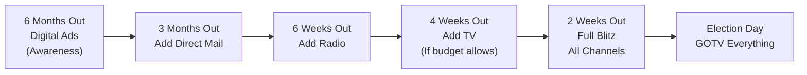

# Paid Media Planning Guide

A comprehensive guide to buying paid media for political campaigns. Covers budget allocation, digital advertising, television, radio, direct mail, compliance requirements, and campaign timeline. Every dollar of paid media should move voters -- this guide ensures your money works as hard as possible.

---

## Budget Allocation by Race Size

### Small Races (Local, Under $50K Total Budget)
- **Digital advertising**: 50-60% of media budget
- **Direct mail**: 25-35%
- **Radio**: 5-15% (if relevant market exists)
- **TV**: Generally not cost-effective at this budget level
- Rationale: Digital offers the most precise targeting and lowest entry cost for small races.

### Mid-Size Races (State Legislative, $50K-$500K Budget)
- **Digital advertising**: 40-50%
- **Direct mail**: 20-30%
- **TV (cable)**: 15-25%
- **Radio**: 5-10%
- Rationale: Cable TV becomes viable for geographic targeting. Digital still drives fundraising and persuasion.

### Large Races (Statewide / Federal, $500K+ Budget)
- **TV (broadcast + cable)**: 30-40%
- **Digital advertising**: 25-35%
- **Direct mail**: 15-20%
- **Radio**: 5-10%
- **Out-of-home (billboards, transit)**: 2-5%
- Rationale: Broadcast TV delivers unmatched reach for large audiences. Digital complements with targeting and fundraising.

---

## Digital Advertising

### Platform Selection
| Platform | Best For | Minimum Daily Budget |
|----------------|--------------------------------------|----------------------|
| Facebook/Meta | Persuasion, fundraising, GOTV | $25/day |
| Instagram | Visual storytelling, younger voters | $25/day (via Meta) |
| Google Search | Name recognition, issue capture | $15/day |
| YouTube | Video persuasion, pre-roll ads | $25/day |
| Connected TV | Streaming audience, cord-cutters | $50/day |
| Programmatic | Broad digital reach, retargeting | $50/day |
| X/Twitter | Rapid response, media shaping | $25/day |

### Targeting Methods
- **Geographic**: Target by congressional district, state legislative district, zip code, or radius around an address. Geo-targeting is mandatory for political ads.
- **Demographic**: Age, gender, household income brackets. Use voter file data for precision.
- **Interest-based**: Facebook allows targeting by interests (education, environment, veterans). Use sparingly; broad targeting with strong creative often outperforms narrow interest targeting.
- **Custom audiences**: Upload your voter file, donor list, or email list. Platforms match against their user base (typically 40-70% match rate).
- **Lookalike audiences**: Build audiences that resemble your donors or high-propensity voters. Start with 1% lookalike and expand as you scale.
- **Retargeting**: Install tracking pixels on your website. Retarget visitors who did not donate or sign up. Retargeting audiences convert 3-5x higher than cold audiences.

### Creative Types
- **Static image ads**: Fastest to produce. Use for fundraising asks, endorsements, issue positions.
- **Video ads (15-30 seconds)**: Highest engagement. Bio/intro videos for name ID; issue videos for persuasion.
- **Carousel ads**: Multiple images/messages in one ad. Good for "3 reasons to support [candidate]."
- **Lead generation ads**: Collect emails and phone numbers directly in-platform. Use for list building.
- **Event response ads**: Drive RSVPs to town halls, rallies, and fundraisers.

### A/B Testing Protocol
1. Launch every ad with at least 2 creative variations (different images, headlines, or copy)
2. Run both versions for 72 hours with equal budget
3. Measure by your primary KPI (cost per donation, cost per click, cost per video view)
4. Kill the underperformer and reallocate its budget to the winner
5. After 7 days, introduce a new challenger to test against the winner
6. Never stop testing. Creative fatigue sets in after 10-14 days.

### Compliance Requirements
- All digital ads for federal candidates must include "Paid for by [Committee Name]" -- this is an FEC requirement
- Facebook/Meta requires identity verification and "Paid for by" disclaimer on all political ads. Ads are archived in Meta's Ad Library.
- Google requires identity verification and publishes political ads in its Transparency Report
- Check your state's requirements -- many states now mandate disclaimers on digital ads for state and local races
- Save screenshots of every ad with full disclaimer text, targeting parameters, spend, and dates
- Report all digital ad spending on campaign finance disclosures in the correct reporting category

---

## Television Advertising

### Broadcast vs. Cable
| Factor | Broadcast | Cable |
|----------------|-------------------------------|-------------------------------|
| Reach | Entire DMA (media market) | Specific zones/systems |
| Cost | $500-$50,000+ per spot | $50-$500 per spot |
| Targeting | Broad demographic | Geographic + demographic |
| Best for | Statewide/federal races | State leg, congressional |
| Minimum budget | $50,000+ per flight | $5,000+ per flight |

### Daypart Selection
| Daypart | Time | Cost | Audience |
|----------------|-------------|---------|-------------------------------|
| Early morning | 6-9 AM | Low | News viewers, older adults |
| Daytime | 9 AM-4 PM | Lowest | Stay-at-home, retirees |
| Early fringe | 4-6 PM | Medium | Pre-news, mixed demo |
| Early news | 5-7 PM | High | News viewers, high propensity |
| Prime time | 7-10 PM | Highest | Broadest audience |
| Late news | 10-11 PM | High | News viewers, engaged voters |
| Late night | 11 PM-1 AM | Low | Younger adults |

**Recommended strategy**: Concentrate 60% of TV budget in early news and late news for high-propensity voter reach. Use prime time only when budget allows broad persuasion.

### Frequency Goals
- **Minimum**: Voters should see your ad 3x per week during a flight
- **Optimal**: 5-7x per week during peak persuasion or GOTV periods
- **Saturation**: 10+ per week in the final 2 weeks (if budget permits)
- A "flight" is a continuous period of airing ads (typically 2-4 weeks on, 1 week off)
- Calculate GRPs (Gross Rating Points) = Reach % x Frequency. Target 500-1,000 GRPs per week for competitive races.

### GRP / Reach / Frequency Basics
- **Reach**: The percentage of your target audience that sees your ad at least once
- **Frequency**: The average number of times each reached person sees it
- **GRPs**: Reach x Frequency. A planning unit, not a performance metric.
- Example: If your ad reaches 50% of the market and they see it an average of 4 times, that's 200 GRPs.
- Most media buyers target 1,000-1,500 total GRPs over a 4-week flight for strong impact.

---

## Radio Advertising

### Format Targeting
| Format | Audience Profile | Best For |
|-----------------|-------------------------------|-------------------------------|
| News/Talk | Older, politically engaged | Persuasion, contrast ads |
| Country | Rural, suburban, working class | Rural outreach |
| Urban/Hip-Hop | Younger, diverse | GOTV in urban areas |
| Adult Contemporary| Suburban, 30-55 | Broad persuasion |
| Spanish Language | Latino communities | Bilingual outreach |
| Sports | Men 25-54 | Male voter persuasion |
| Christian/Gospel | Faith community | Values-based messaging |

### Drive Time Value
- **Morning drive (6-10 AM)**: Highest listenership. Premium pricing. Worth it.
- **Afternoon drive (3-7 PM)**: Second-highest listenership. Strong value.
- **Midday (10 AM-3 PM)**: Lower listenership but cheaper. Good for frequency padding.
- Concentrate 70% of radio budget in drive time slots.
- Standard radio spot is 30 or 60 seconds. Use 60-second spots for introduction/bio ads; 30-second for reinforcement and GOTV.

---

## Direct Mail

### Targeting
- Use your voter file to target by: party registration, vote history (how often they vote), geography, age, gender, and modeled issue preferences
- Focus on "persuadable" voters: independents, soft partisans, and ticket-splitters with strong vote history
- GOTV mail targets infrequent voters who lean your direction based on registration or modeling
- Typical universe: 10,000-50,000 households for a state legislative race; adjust for your district

### Format Options
| Format | Cost per Piece | Best For |
|----------------------|----------------|-------------------------------|
| Postcard (6x9) | $0.40-$0.60 | Quick message, GOTV, name ID |
| Oversized (6x11) | $0.50-$0.75 | Issue contrast, endorsements |
| Letter (envelope) | $0.75-$1.25 | Personal appeal, fundraising |
| Self-mailer (fold) | $0.45-$0.65 | Policy details, biography |
| Magnet/calendar | $1.00-$2.00 | Stays on the fridge; name ID |

### Cadence
- **Minimum program**: 3 pieces over the final 6 weeks
- **Standard program**: 5 pieces over the final 8 weeks
- **Aggressive program**: 7-10 pieces over the final 12 weeks
- Space mailings 7-10 days apart so voters receive a consistent drip
- Sequence: (1) Bio/introduction, (2) Key issue, (3) Endorsements, (4) Contrast, (5) GOTV

### Mail Content Rules
- One message per mail piece. Do not cram multiple issues onto one card.
- Headline must be readable at arm's length in under 2 seconds
- Use a real photo of the candidate with voters, not a studio headshot
- Include a clear call to action: vote date, early voting info, website, or phone number
- Comply with disclaimer requirements: "Paid for by [Committee Name]" with address

---

## Campaign Media Timeline

| Weeks Out | Medium | Purpose |
|-----------|------------------------------|-------------------------------|
| 20-16 | Digital (awareness) | Name ID, list building |
| 16-12 | Digital + first mail piece | Bio/introduction |
| 12-8 | Digital + mail + cable TV | Issue persuasion |
| 8-6 | All media types active | Persuasion + contrast |
| 6-4 | Peak broadcast TV + mail | Contrast + closing argument |
| 4-2 | Everything at full volume | Closing argument + early vote |
| 2-0 | GOTV everywhere | Turnout, turnout, turnout |

### When to Start Each Medium
- **Digital**: Start the day you launch. Never stop.
- **Direct mail**: First piece drops 8-12 weeks before Election Day
- **Radio**: Begin 6-8 weeks out; intensify in final 4 weeks
- **Cable TV**: Begin 8-10 weeks out for competitive races
- **Broadcast TV**: Begin 6-8 weeks out; concentrate spending in final 4 weeks
- **Out-of-home**: If used, place 8-12 weeks out for name ID in high-traffic locations

---

## Vendor Selection Checklist

When hiring a media buyer or consultant, evaluate:

- [ ] Experience in races of your size and level
- [ ] Transparent fee structure (commission vs. flat fee vs. hybrid)
- [ ] Willingness to share raw data and invoices
- [ ] Platform certifications (Meta Business Partner, Google Partner)
- [ ] References from past candidates at a similar level
- [ ] Understanding of your state's disclosure and compliance requirements
- [ ] Ability to coordinate across digital, TV, radio, and mail for message consistency
- [ ] Reporting cadence: weekly reports minimum, with real-time dashboards for digital
