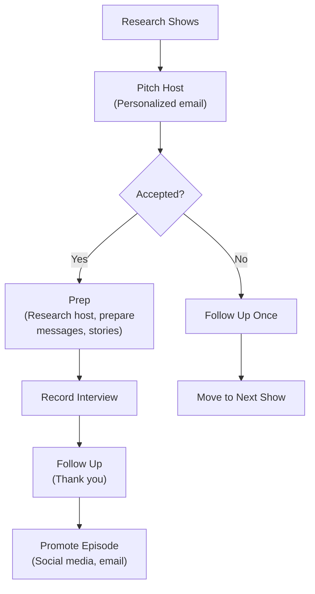

# Podcast Campaign Guide

Podcasts offer candidates extended, unfiltered time to connect with voters -- something no 30-second ad can deliver. This guide covers two tracks: guesting on existing podcasts to reach established audiences, and launching your own campaign podcast to build a direct media channel.

---

## TRACK A: Guesting on Existing Podcasts



### Step 1: Research Target Shows

Build a spreadsheet of 20-40 target podcasts with these columns:

| Column | What to Capture |
|------------------|-----------------------------------------------------|
| Show name | Full title as it appears on Apple Podcasts |
| Host name(s) | First and last names of all hosts |
| Audience size | Download estimate (check Chartable, or ask) |
| Topic focus | Politics, local news, issue-specific, community |
| Geographic reach | Local, state, regional, national |
| Episode length | Typical runtime (30 min, 60 min, etc.) |
| Format | Interview, panel, solo commentary, call-in |
| Contact info | Email, social handles, booking link |
| Past political guests | Names of candidates/officials who've appeared |
| Notes | Why this show is a fit; any personal connections |

**Where to find shows**: Search Apple Podcasts, Spotify, and Google Podcasts by your city/state name + "politics" or your key issues. Check if local newspapers, radio stations, or community organizations host podcasts. Ask supporters what they listen to. Search social media for local podcast hosts.

Priority ranking: (1) Local shows with politically engaged audiences, (2) Issue-specific shows aligned with your platform, (3) Regional/state political podcasts, (4) National shows if your race has broader significance.

### Step 2: The Pitch Email

Send a personalized pitch to each show. Never mass-email podcast hosts.

```
Subject: Guest pitch: [Your Name] on [specific topic relevant to their show]

Hi [Host First Name],

I'm a listener of [Show Name] -- your recent episode on [specific
episode topic] was [specific genuine reaction in one sentence].

I'm [Your Full Name], [running for / candidate for] [Office] in
[Jurisdiction]. I'd love to join you for a conversation about
[specific topic that fits their show, NOT just "my campaign"].

Here's why this could resonate with your audience:
- [Angle 1: a surprising or counterintuitive take you hold]
- [Angle 2: a personal story connected to the topic]
- [Angle 3: a timely news hook]

I've [appeared on X other podcasts / spoken publicly on this topic
at Y / written about this at Z], so I'm comfortable in long-form
conversation.

Happy to work around your schedule. Would any of these dates work?
[Offer 3-4 specific dates/times over the next 3-4 weeks.]

Thanks for considering,
[Your Name]
[Campaign website]
[Phone number]
```

**Pitch tips**: Reference a specific episode. Offer a topic, not just "my candidacy." Keep the email under 200 words. Follow up once after 5-7 days if no response. Do not follow up more than twice.

### Step 3: Pre-Interview Prep Sheet

Complete this worksheet before every podcast appearance:

```
PODCAST PREP SHEET
==================
Show: ____________________
Host: ____________________
Record date: ______________
Air date: _________________
Format: Live / Pre-recorded
Length: ______ minutes

HOST RESEARCH:
- Host's background: ______________________
- Host's known political leanings: _________
- Host's interview style (confrontational / conversational / friendly): ____
- Topics host returns to frequently: ________
- Recent episodes I should reference: _______

LIKELY QUESTIONS:
1. Why are you running?
2. What's your top priority?
3. How do you differ from your opponent?
4. [Issue-specific question based on show's focus]: _____
5. [Potential tough question or challenge]: _____

MY KEY MESSAGES (limit to 3):
1. ________________________________________
2. ________________________________________
3. ________________________________________

STORIES TO TELL (prepare 3-4 anecdotes):
1. Personal story: why this race is personal to me
2. Voter story: someone I met whose experience illustrates my issue
3. Credential story: a moment that proves I can do this job
4. Vision story: what success looks like if I win

BRIDGING PHRASES (to redirect off-topic questions):
- "That's an important point, and it connects to something I hear
  constantly from voters..."
- "I understand why people focus on that, but the bigger issue is..."
- "Let me answer that directly, and then I want to add..."

THE ASK (final 60 seconds):
- Website URL (spell it out phonetically)
- One specific action: donate / volunteer / attend event / vote date
- Social media handle (one platform, the easiest to remember)

POST-INTERVIEW DEBRIEF:
- What went well: ____________________
- What I'd do differently: ____________
- Follow-up commitments I made: _______
```

### Step 4: Follow-Up and Thank You

Within 24 hours of recording:
- Send a thank-you email to the host
- Share the episode on all your social media channels when it airs
- Tag the host and the show in every social post
- Ask your email list to listen, rate, and review the show
- Add the appearance to your media page on your campaign website

### Step 5: Social Promotion After Airing

For every podcast appearance, create this content package:
- 1 audiogram clip (60-90 seconds of your best moment, with waveform visual)
- 1 quote graphic (a strong one-liner from the interview, overlaid on your photo)
- 1 short video teaser (15-30 seconds for Instagram/TikTok, linking to full episode)
- 1 email to your list: "I was just on [Show Name] discussing [topic] -- listen here"
- 1 Twitter/X thread summarizing your key points with a link to the full episode

---

## TRACK B: Launching a Campaign Podcast

### Format Options

| Format | Description | Best For | Effort Level |
|--------------|-------------------------------------|---------------------------|--------------|
| Interview | Candidate interviews guests | Building coalition, depth | Medium |
| Solo | Candidate speaks directly | Personal connection | Low |
| Town Hall | Candidate takes voter questions | Engagement, transparency | High |
| Co-hosted | Candidate + consistent co-host | Conversational, fun | Medium |
| Documentary | Narrative storytelling per episode | Statewide/federal races | Very High |

**Recommended for most campaigns**: Alternate between solo episodes (candidate's perspective on issues) and interview episodes (endorsers, community leaders, voters).

### Naming Your Podcast
- Include the candidate's name for searchability: "[Name] for [Jurisdiction]"
- Or use a thematic name with the candidate as host: "Main Street Matters with [Name]"
- Avoid generic political names that blend in ("Political Talk," "The Campaign Trail")
- Keep it under 5 words. Test it by saying it aloud -- does it sound natural when someone recommends it?
- Check that the name isn't already taken on Apple Podcasts and Spotify

### Production Basics
- **Microphone**: A USB condenser mic ($50-100) dramatically improves audio quality over a phone or laptop mic. Recommended: Audio-Technica ATR2100x or Blue Yeti.
- **Recording software**: Riverside.fm, Zencastr, or SquadCast for remote interviews. Audacity (free) or GarageBand (free on Mac) for editing.
- **Episode length**: 20-30 minutes is the sweet spot for campaign podcasts. Voters are busy.
- **Intro/outro**: Record a 15-second intro with your name, the show name, and a one-line description. Use the same intro every episode for brand consistency.
- **Music**: Use royalty-free music from the YouTube Audio Library or Epidemic Sound. Never use copyrighted music.
- **Editing**: Remove long pauses, verbal tics, and false starts. Do NOT over-edit; authenticity matters more than polish.

### Distribution
- Host on a podcast hosting platform: Buzzsprout, Anchor (now Spotify for Podcasters), Libsyn, or Podbean
- Distribute to: Apple Podcasts, Spotify, Google Podcasts, Amazon Music, and iHeartRadio (most hosts auto-distribute)
- Embed a podcast player on your campaign website
- Upload full audio to YouTube as well (with a static image or simple animation)
- Submit to podcast directories within your state or region if they exist

### 8-Episode Launch Plan

Launch with 3 episodes on Day 1 (gives new listeners immediate content), then release weekly.

**Episode 1: Why I'm Running**
- The candidate's personal story and motivation
- What's at stake in this election
- Vision for the community in 2-3 sentences
- Call to action: subscribe and share

**Episode 2: Key Issue Deep Dive -- [Top Priority Issue]**
- Define the problem with local data and a voter story
- Present your specific plan (3-5 action items)
- Explain how you'd pay for it or implement it
- Why your opponent's approach falls short (briefly)

**Episode 3: Meet the Team**
- Interview your campaign manager, a key volunteer, or a longtime supporter
- Why they joined the campaign
- What the campaign experience has been like from the inside
- Humanizes the operation and shows community support

**Episode 4: Key Issue Deep Dive -- [Second Priority Issue]**
- Same structure as Episode 2 on your second major issue
- Include a voter story specific to this issue

**Episode 5: Community Leader Interview**
- Interview a local business owner, nonprofit leader, teacher, or first responder
- Focus on THEIR perspective on the community's needs
- Let the guest do most of the talking; candidate asks questions and listens

**Episode 6: Answering Your Questions**
- Solicit questions from social media, email, and canvassing
- Answer 8-10 questions directly and honestly
- Admit when you don't have a complete answer; commit to follow up

**Episode 7: The Contrast Episode**
- Lay out the clear choice voters face
- Issue-by-issue comparison of your positions vs. your opponent's record or stated positions
- Tone: firm and factual, never personal or mean-spirited
- Cite sources for every claim about the opponent

**Episode 8: The Closing Argument**
- Release 1-2 weeks before Election Day
- Summarize your vision, your plan, and what's at stake
- Include early voting information and Election Day logistics
- Thank every listener, donor, and volunteer by role
- End with a direct, emotional ask for their vote

---

## Show Notes Template

Post these with every episode on your hosting platform and website:

```
[SHOW NAME] -- Episode [#]: [Title]

[2-3 sentence description of what this episode covers.]

IN THIS EPISODE:
- [Timestamp] [Topic 1]
- [Timestamp] [Topic 2]
- [Timestamp] [Topic 3]

MENTIONED IN THIS EPISODE:
- [Link to policy page, news article, or resource discussed]
- [Link to guest's organization if interview episode]

GET INVOLVED:
- Donate: [URL]
- Volunteer: [URL]
- Vote info: [URL]

CONNECT WITH [CANDIDATE NAME]:
- Website: [URL]
- Facebook: [handle]
- Instagram: [handle]
- X/Twitter: [handle]

Paid for by [Committee Name].
```

---

## Social Promotion Package Template

For every new episode, produce and schedule:

| Asset | Platform | Timing |
|-------------------------------|--------------------------|---------------------|
| Audiogram clip (60-90 sec) | Instagram Reels, TikTok | Day of release |
| Quote card (best line) | Facebook, Instagram, X | Day of release |
| Full episode link post | Facebook, X, LinkedIn | Day of release |
| Behind-the-scenes photo | Instagram Stories | Day before release |
| "New episode" email | Email list | Day of release |
| Reminder/highlight clip | All platforms | 2 days after release |
| Listener review request | Instagram Stories, email | 3 days after release |

### Promotion Copy Templates

**Social post (day of release)**:
"New episode of [Show Name] is live. This week: [topic in 10 words or fewer]. Listen wherever you get podcasts or at [link]. [1-2 relevant hashtags]"

**Email to list**:
"Subject: New episode: [topic]. I just recorded a conversation about [topic] that I think you'll want to hear. [1 sentence teaser]. Listen here: [link]. And if you enjoy it, please share it with one person who might be interested."

**Listener review request**:
"If you've been listening to [Show Name], I have a small favor: leave a rating on Apple Podcasts. It takes 30 seconds and helps new listeners find us. Thank you. [link to show on Apple Podcasts]"
