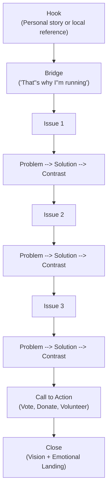

# Stump Speech Builder

A structured guide for writing campaign speeches at every length. The stump speech is the candidate's core public presentation — the speech they give dozens or hundreds of times with minor variations. This guide provides the universal structure, templates for five different time lengths, and delivery tips.

---

## Universal Speech Structure

Every campaign speech, regardless of length, follows the same six-part structure:



```
1. HOOK (5-10% of time)
   Grab attention. Make them stop checking their phones.

2. BRIDGE TO "WHY I'M RUNNING" (10-15% of time)
   Personal story. Why this race, why now, why you.

3. ISSUES (50-60% of time)
   Your 2-3 core issues. Problem → your solution → contrast with opponent.

4. CALL TO ACTION (10% of time)
   Specific asks: vote, volunteer, donate, spread the word.

5. CLOSE (5-10% of time)
   Emotional landing. Vision of what winning looks like.

6. (Optional) Q&A
   For town halls and smaller events.
```

---

## 1-Minute Speech (Elevator Pitch / Introduction)

Use at: candidate forums with strict time limits, chance encounters, meet-and-greets, rotary club introductions.

```
[HOOK — 10 seconds]
"Good [morning/evening]. I'm [Name], and I'm running for [Office] 
because [one compelling reason in plain language]."

[WHY I'M RUNNING — 15 seconds]
"I'm a [occupation/background] who has lived in [community] for 
[X years]. I got into this race because [personal motivation — 
keep it specific and human]."

[ONE ISSUE — 20 seconds]
"The number one thing I hear at every door is [issue]. 
[One sentence on the problem]. My plan is to [one specific action]. 
My opponent [one sentence contrast]."

[CALL TO ACTION + CLOSE — 15 seconds]
"I'm asking for your vote on [date]. Visit [website] to learn more. 
Together, we can [vision statement]. Thank you."
```

---

## 3-Minute Speech (Forum / Panel)

Use at: candidate forums, civic group presentations, endorsement interviews, video introductions.

```
[HOOK — 20 seconds]
Open with a story, a striking fact, or a question.
"Last month, I met a [constituent] at [location] who told me 
[brief, vivid anecdote that connects to your top issue]."

[WHY I'M RUNNING — 30 seconds]
"That conversation is why I'm running for [Office]. I'm [Name], 
a [background] and [community connection]. I've spent [X years] 
[relevant experience]. I decided to run because [motivation]."

[ISSUE #1 — 45 seconds]
"The first thing I'll fight for is [Issue #1]. Right now, 
[describe the problem with one specific fact or story]. 
My plan is to [specific solution — 2-3 concrete steps]. 
My opponent has [contrast — one sentence]."

[ISSUE #2 — 45 seconds]
"Second, I'm committed to [Issue #2]. [Problem statement]. 
I will [solution]. [Contrast]."

[CALL TO ACTION — 20 seconds]
"Here's what I need from you: [specific ask]. Go to [website]. 
If you can volunteer even one Saturday, we will win this race."

[CLOSE — 20 seconds]
"I believe [community name] deserves [vision]. On [Election Day], 
we have the chance to make that real. Thank you."
```

---

## 5-Minute Speech (Standard Stump)

Use at: campaign rallies, fundraising events, community group meetings. This is the workhorse speech.

```
[HOOK — 30 seconds]
Start with a story. Not a policy position. A real person, a real 
moment that crystallizes why this election matters.

"Two weeks ago, I knocked on a door on [Street Name]. A woman 
named [First Name] answered. She told me [vivid, specific detail 
about a struggle related to your top issue]. She looked at me and 
said, '[memorable quote].' That moment is why I'm in this race."

[BRIDGE — WHY I'M RUNNING — 45 seconds]
"I'm [Name]. I grew up [background — keep it brief]. I've worked 
as a [profession] for [X] years. I know this community because 
[specific connection: coached little league, served on the PTA, 
ran a local business]. I never planned to run for office. But when 
I saw [specific catalyst], I couldn't sit on the sidelines."

[ISSUE #1 — 90 seconds]
"The first thing I'll tackle is [Issue #1].
Here's the reality: [problem, stated with a specific fact or 
statistic that hits home].
Here's what that means for families here: [human impact — connect 
the statistic to daily life].
My plan: [Solution — 2-3 specific, concrete steps].
My opponent? [Contrast — their record, vote, or position]. 
We can do better."

[ISSUE #2 — 60 seconds]
"I'm also fighting for [Issue #2].
[Problem → human impact → your solution → contrast].
This isn't partisan — it's about [shared value]."

[ISSUE #3 — 45 seconds]
"And I'll never stop working on [Issue #3].
[Shorter treatment — problem, solution, one line of contrast]."

[CALL TO ACTION — 30 seconds]
"This election is [date]. We have [X] days. Here's what I need:
- If you can knock doors, sign up tonight at [website]
- If you can chip in $25, text [keyword] to [number]
- If nothing else, talk to your neighbors about this race
Every conversation matters in an election like this."

[CLOSE — 30 seconds]
"I got into this race because of people like [name from opening 
story]. She deserves a [representative/council member/senator] who 
shows up, listens, and fights. That's what I'll do every single day. 
Thank you. Let's go win this."
```

---

## 10-Minute Speech (Keynote / Major Event)

Use at: major fundraisers, rallies, party dinners, large community events.

Expand the 5-minute structure:
- **Hook:** Tell a fuller story (60-90 seconds)
- **Why I'm Running:** More personal background, deeper motivation (90 seconds)
- **Issues:** Three full issues with stories for each (5-6 minutes total)
  - Each issue: Story of a real person affected → the problem → your solution → contrast → tie back to the person
- **Call to Action:** Multiple specific asks, including a fundraising appeal if appropriate (60 seconds)
- **Close:** Return to the opening story. What does winning mean for that person? Paint a picture of the future. (60-90 seconds)

### 10-Minute Issue Block Template (use for each of 3 issues)

```
"Let me tell you about [Name], who I met at [location].
[30-second story of this person's experience with the issue].

[Name]'s story isn't unique. Across this district, [statistic or 
broader context — how many people face this problem].

Here's what's happening right now: [current status of the issue — 
what's failing, what's broken, who's responsible].

Here's what I'll do about it:
First, [specific action #1].
Second, [specific action #2].
Third, [specific action #3].

My opponent has had [X years / opportunities] to act on this. 
Instead, [specific inaction, vote, or contrary position].

[Name] can't wait any longer. And neither can we."
```

---

## 20-Minute Speech (Full Address)

Use at: major announcements (campaign launch, primary night, general election kickoff), commencement-style events, or when you are the sole speaker.

Structure:
- **Opening:** Extended hook and personal narrative (3-4 minutes)
- **Vision:** What kind of community/state/country do we want? (2 minutes)
- **Three Issues:** Deep treatment with multiple stories each (10-12 minutes)
- **Acknowledgments:** Thank volunteers, family, supporters by name (1-2 minutes)
- **Call to Action:** Detailed asks for different audiences (1-2 minutes)
- **Close:** Return to opening story, paint the vision, emotional crescendo (2-3 minutes)

**Key difference from shorter speeches:** The 20-minute speech allows you to develop a narrative arc. The audience should feel like they have been on a journey. Open with where we are, paint a picture of where we could be, show the path to get there, and call them to walk it with you.

---

## Delivery Tips

### Preparation

```
1. PRACTICE OUT LOUD. Reading silently is not practice. Stand up 
   and deliver the speech to an empty room, a mirror, or a friend.

2. TIME YOURSELF. Most speakers run long. If your event slot is 
   5 minutes, your speech should be 4 minutes 30 seconds in practice.

3. MEMORIZE THE STRUCTURE, NOT THE WORDS. Know your hook, your 
   issues, your close. Fill in with natural language each time. 
   A speech that sounds memorized sounds fake.

4. RECORD YOURSELF. Video on your phone. Watch for: fidgeting, 
   "um/uh," looking down, rushing through key points.

5. PRACTICE THE FIRST 30 SECONDS UNTIL IT IS AUTOMATIC. The opening 
   sets the tone. If you stumble at the start, you lose the audience.
```

### On Stage

```
1. PAUSE before you begin. Step to the podium or center of the room. 
   Make eye contact. Take a breath. Then start. The silence commands 
   attention.

2. SPEAK SLOWLY. Nerves make you speed up. Consciously slow down, 
   especially on your key message points.

3. VARY YOUR VOLUME AND PACE. Drop your voice for emotional moments. 
   Speed up slightly for energy. Pause after a key line to let it land.

4. MAKE EYE CONTACT in a pattern. Hold eye contact with one person 
   for a full sentence, then move to another section of the room.

5. USE YOUR HANDS naturally. Do not grip the podium. Do not put hands 
   in pockets. Open gestures convey confidence.

6. NEVER APOLOGIZE for your speech. Do not say "I'm not a great 
   public speaker" or "I'll keep this short." Just deliver the speech.

7. END STRONG. The last line should be delivered with energy and 
   conviction. Do not trail off. Land the close and say "Thank you" 
   with confidence.
```

### Audience Adaptation

```
SAME MESSAGE, DIFFERENT EMPHASIS:

Labor union hall → Lead with jobs/wages issue, use "working families" 
                   language, acknowledge union support
Chamber of commerce → Lead with economic development, use "business 
                      climate" language, talk about reducing bureaucracy
Senior center → Lead with healthcare/Social Security, speak about 
                cost of living, slow your pace slightly
Young voters → Lead with student debt/housing/climate, use less 
               formal tone, reference social media for follow-up
Faith community → Lead with values language, community, service; 
                  acknowledge shared moral framework
Rural audience → Lead with local examples, infrastructure, broadband; 
                 avoid sounding like an outsider
```

---

## Common Mistakes

| Mistake | Why It Fails | Fix |
|---|---|---|
| Starting with "Thank you for having me" | Boring opening; audience tunes out | Open with your hook; thank the host 30 seconds in |
| Listing every policy position | Voters remember nothing | Stick to three issues |
| Reading from notes | Looks unprepared and disconnected | Use a one-page outline with bullet points only |
| Speaking in jargon | Alienates normal voters | Use 8th-grade language. "Property tax" not "ad valorem levy" |
| No stories, all policy | Facts do not move voters; stories do | Every issue needs a human face |
| Going over time | Disrespectful to audience and other speakers | Practice to time; cut ruthlessly |
| No call to action | Speech entertains but does not convert | Always tell people what to DO next |
| Ending weakly | "So, yeah... thanks" kills momentum | Memorize your closing line; deliver it with conviction |
