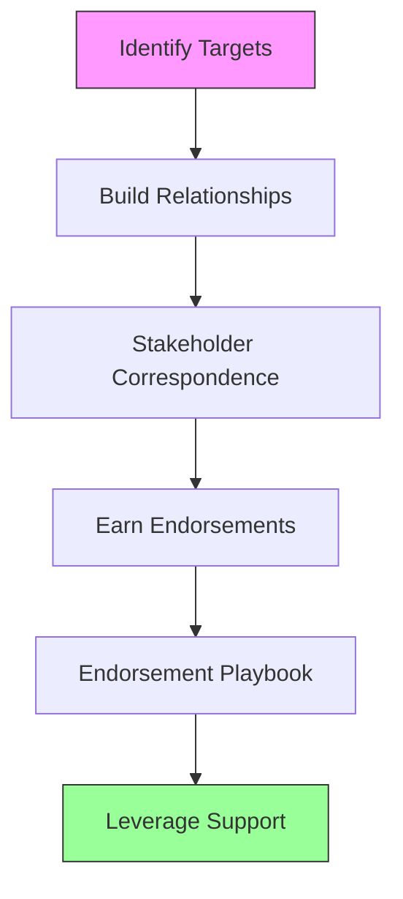

# Outreach

Guides for building external relationships and earning support from individuals and organizations outside your campaign.

## Files

- [endorsement-playbook.md](endorsement-playbook.md) -- Earning, announcing, and leveraging endorsements as social proof
- [stakeholder-correspondence.md](stakeholder-correspondence.md) -- Templates and tone guidance for writing to every stakeholder type
