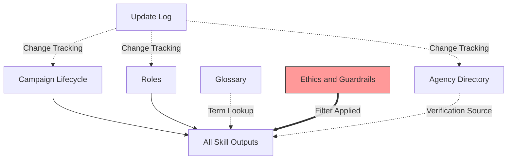

# References

Foundational reference material: directories, glossaries, role definitions, and guardrails. Consult these when you need background knowledge rather than a specific workflow.

## Files

- [agency-directory.md](agency-directory.md) -- Contact information for election agencies in all 50 states, DC, and the FEC
- [campaign-lifecycle.md](campaign-lifecycle.md) -- The 7 phases of a typical US political campaign
- [ethics-and-guardrails.md](ethics-and-guardrails.md) -- 9 core guardrails defining what this skill will and will not do
- [glossary.md](glossary.md) -- 65+ campaign terms defined, organized alphabetically
- [roles.md](roles.md) -- The 5 user roles recognized by the skill and how they shape responses
- [update-log.md](update-log.md) -- Version history and change tracking for all reference files
