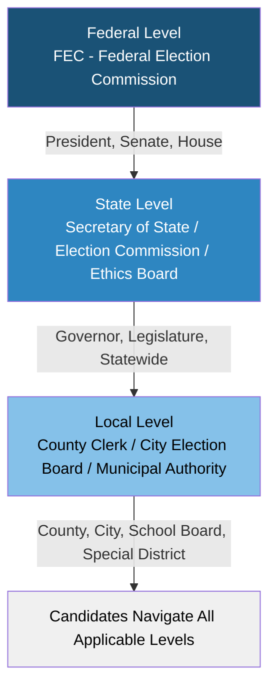

# Election Agency Directory

Contact information for election agencies in all 50 states, DC, and the FEC. All contact details should be web-verified before relying on them; agencies may update URLs and phone numbers without notice.

---

## Federal

**Federal Election Commission (FEC)** -- fec.gov -- (800) 424-9530
Administers federal campaign finance law for President, Senate, and House races.

---

## States (Alphabetical)

**Alabama** -- Secretary of State, Elections Division -- sos.alabama.gov -- (334) 242-7210

**Alaska** -- Division of Elections -- elections.alaska.gov -- (907) 465-4611

**Arizona** -- Secretary of State, Elections Division -- azsos.gov -- (602) 542-4285

**Arkansas** -- Secretary of State, Elections Division -- sos.arkansas.gov -- (501) 682-5070

**California** -- Secretary of State, Elections Division -- sos.ca.gov -- (916) 657-2166

**Colorado** -- Secretary of State, Elections Division -- sos.state.co.us -- (303) 894-2200

**Connecticut** -- Secretary of State, Elections Division -- portal.ct.gov/sots -- (860) 509-6100

**Delaware** -- Department of Elections -- elections.delaware.gov -- (302) 739-4277

**District of Columbia** -- Board of Elections -- dcboe.org -- (202) 727-2525

**Florida** -- Division of Elections -- dos.myflorida.com/elections -- (850) 245-6200

**Georgia** -- Secretary of State, Elections Division -- sos.ga.gov -- (404) 656-2881

**Hawaii** -- Office of Elections -- elections.hawaii.gov -- (808) 453-8683

**Idaho** -- Secretary of State, Elections Division -- sos.idaho.gov -- (208) 334-2852

**Illinois** -- State Board of Elections -- elections.il.gov -- (217) 782-4141

**Indiana** -- Election Division -- in.gov/sos/elections -- (317) 232-3939

**Iowa** -- Secretary of State, Elections Division -- sos.iowa.gov -- (515) 281-0145

**Kansas** -- Secretary of State, Elections Division -- sos.ks.gov -- (785) 296-4561

**Kentucky** -- State Board of Elections -- elect.ky.gov -- (502) 573-7100

**Louisiana** -- Secretary of State, Elections Division -- sos.la.gov -- (225) 922-0900

**Maine** -- Secretary of State, Elections Division -- maine.gov/sos/cec/elec -- (207) 624-7736

**Maryland** -- State Board of Elections -- elections.maryland.gov -- (410) 269-2840

**Massachusetts** -- Secretary of the Commonwealth, Elections Division -- sec.state.ma.us -- (617) 727-2828

**Michigan** -- Secretary of State, Bureau of Elections -- michigan.gov/sos -- (517) 335-3234

**Minnesota** -- Secretary of State, Elections Division -- sos.state.mn.us -- (651) 215-1440

**Mississippi** -- Secretary of State, Elections Division -- sos.ms.gov -- (601) 359-1350

**Missouri** -- Secretary of State, Elections Division -- sos.mo.gov -- (573) 751-2301

**Montana** -- Secretary of State, Elections Division -- sosmt.gov -- (406) 444-4732

**Nebraska** -- Secretary of State, Elections Division -- sos.nebraska.gov -- (402) 471-2555

**Nevada** -- Secretary of State, Elections Division -- nvsos.gov -- (775) 684-5705

**New Hampshire** -- Secretary of State, Elections Division -- sos.nh.gov -- (603) 271-3242

**New Jersey** -- Division of Elections -- nj.gov/state/elections -- (609) 292-3760

**New Mexico** -- Secretary of State, Bureau of Elections -- sos.nm.gov -- (505) 827-3600

**New York** -- State Board of Elections -- elections.ny.gov -- (518) 474-6220

**North Carolina** -- State Board of Elections -- ncsbe.gov -- (919) 814-0700

**North Dakota** -- Secretary of State, Elections Division -- sos.nd.gov -- (701) 328-4146

**Ohio** -- Secretary of State, Elections Division -- ohiosos.gov -- (614) 466-2585

**Oklahoma** -- State Election Board -- elections.ok.gov -- (405) 521-2391

**Oregon** -- Secretary of State, Elections Division -- sos.oregon.gov -- (503) 986-1518

**Pennsylvania** -- Department of State, Bureau of Elections -- dos.pa.gov -- (717) 787-5280

**Rhode Island** -- Board of Elections -- elections.ri.gov -- (401) 222-2345

**South Carolina** -- State Election Commission -- scvotes.gov -- (803) 734-9060

**South Dakota** -- Secretary of State, Elections Division -- sdsos.gov -- (605) 773-3537

**Tennessee** -- Secretary of State, Elections Division -- sos.tn.gov -- (615) 741-7956

**Texas** -- Secretary of State, Elections Division -- sos.texas.gov -- (512) 463-5650

**Utah** -- Lieutenant Governor, Elections Division -- vote.utah.gov -- (801) 538-1041

**Vermont** -- Secretary of State, Elections Division -- sos.vermont.gov -- (802) 828-2363

**Virginia** -- Department of Elections -- elections.virginia.gov -- (804) 864-8901

**Washington** -- Secretary of State, Elections Division -- sos.wa.gov -- (360) 902-4180

**West Virginia** -- Secretary of State, Elections Division -- sos.wv.gov -- (304) 558-6000

**Wisconsin** -- Elections Commission -- elections.wi.gov -- (608) 266-8005

**Wyoming** -- Secretary of State, Elections Division -- sos.wyo.gov -- (307) 777-5860

---

## Notes

- Agency names, websites, and phone numbers may change. Verify before relying on this directory.
- Many states have separate campaign finance agencies distinct from the elections division. Check the state website for the appropriate office for compliance questions.
- Local elections (county, municipal, school board) are often administered by county clerks or local boards of elections, not the state agency listed here.
