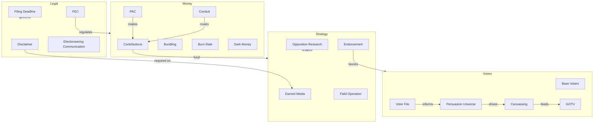

# Campaign Glossary

Concise definitions of 65+ terms commonly encountered in US political campaigns. Organized alphabetically.

---

**Advance** -- Logistical preparation for a candidate's public appearance, including venue, security, staging, and press arrangements.

**Authorized Committee** -- A political committee that has been authorized by a candidate to receive contributions or make expenditures on their behalf.

**Ballot Access** -- The set of legal requirements (petitions, fees, filing paperwork) a candidate must meet to appear on the election ballot.

**Base Voters** -- Voters who reliably support your party or candidate. GOTV targets, not persuasion targets.

**Bundling** -- The practice of collecting multiple individual contributions and delivering them together to a campaign. The bundler is not the donor but facilitates donations.

**Burn Rate** -- The rate at which a campaign spends its cash on hand, usually expressed as a percentage per reporting period. A high burn rate early on is a warning sign.

**Canvassing** -- Door-to-door voter contact, typically involving scripted conversations to identify supporters, persuade undecided voters, or mobilize known supporters.

**Caucus** -- A meeting-based method of selecting party nominees or delegates, as opposed to a primary election. Rules vary significantly by state and party.

**Conduit** -- An organization that receives earmarked contributions and forwards them to a designated candidate. ActBlue and WinRed are prominent examples.

**Contribution Limits** -- Legal caps on how much an individual, PAC, or party committee can give to a candidate per election. Limits vary by jurisdiction and are adjusted periodically for inflation at the federal level.

**Coordinated Expenditure** -- A payment made by a party committee or other entity in coordination with a candidate's campaign. Subject to limits, unlike independent expenditures.

**Dark Money** -- Political spending by nonprofit organizations (often 501(c)(4)s) that are not required to disclose their donors publicly.

**Disclaimer** -- A legally required notice on campaign communications identifying who paid for them (e.g., "Paid for by Smith for Congress").

**Earmarking** -- Directing a contribution to a specific candidate through an intermediary or conduit.

**Earned Media** -- Press coverage obtained through newsworthy events, press releases, or public statements rather than paid advertising.

**Electioneering Communication** -- A broadcast, cable, or satellite communication that refers to a clearly identified federal candidate, aired within 30 days of a primary or 60 days of a general election.

**Endorsement** -- A public declaration of support for a candidate by an individual, organization, newspaper, or elected official.

**Express Advocacy** -- Communication that explicitly urges voters to vote for or against a specific candidate (e.g., "Vote for Jones" or "Defeat Smith").

**FEC (Federal Election Commission)** -- The independent federal agency that administers and enforces campaign finance law for federal elections (President, Senate, House).

**Field Operation** -- The organized ground-level voter contact effort, including canvassing, phone banking, and GOTV activities.

**Filing Deadline** -- The date by which a candidate must submit paperwork to appear on the ballot or by which financial reports must be filed.

**527 Organization** -- A tax-exempt political organization created under Section 527 of the Internal Revenue Code. Includes parties, PACs, and other political groups.

**501(c)(4)** -- A tax-exempt social welfare organization that can engage in limited political activity. Not required to disclose donors, hence the "dark money" association.

**General Election** -- The final election in which voters choose among candidates from all parties (and independents) for a given office.

**GOTV (Get Out the Vote)** -- Organized efforts in the final days before an election to ensure identified supporters actually cast their ballots.

**Hard Money** -- Contributions made directly to candidate campaigns, subject to federal contribution limits and disclosure requirements.

**In-Kind Contribution** -- A non-monetary contribution of goods, services, or anything of value to a campaign (e.g., donated office space, volunteer-provided professional services).

**Independent Expenditure** -- A political communication that expressly advocates for or against a candidate but is made without coordination with any candidate's campaign.

**Issue Advocacy** -- Communication that discusses political issues without explicitly urging a vote for or against a specific candidate. Generally not subject to campaign finance regulation.

**Itemization Threshold** -- The cumulative contribution amount from a single donor above which the campaign must report detailed donor information (federal: $200 aggregate).

**Joint Fundraising** -- A fundraising arrangement between two or more campaign committees or political committees that share the proceeds according to an agreed allocation formula.

**Oppo Research (Opposition Research)** -- Systematic investigation into an opponent's public record, statements, finances, and background to identify vulnerabilities.

**PAC (Political Action Committee)** -- An organization that raises and spends money to elect or defeat candidates. Traditional PACs have contribution limits both for receiving and giving.

**Paid Media** -- Advertising purchased by the campaign, including TV, radio, digital, direct mail, and print ads.

**Persuasion Universe** -- The set of voters identified through targeting as potentially movable toward your candidate. These are the priority audience for persuasion messaging.

**Petition** -- A document with voter signatures submitted to election authorities to qualify a candidate for the ballot or place a measure before voters.

**Phone Banking** -- Organized telephone outreach to voters for voter identification, persuasion, fundraising, or GOTV.

**Primary Election** -- An election in which voters select their party's nominee for the general election. May be open (any voter), closed (registered party members only), or semi-open.

**Principal Campaign Committee** -- The main authorized committee of a candidate, designated to receive contributions and make expenditures on the candidate's behalf.

**Residency Requirement** -- The legal requirement that a candidate reside within the jurisdiction of the office sought, for a specified period before the election.

**Runoff Election** -- A second election held when no candidate receives the required threshold of votes (often a majority) in the initial election.

**Signature Requirement** -- The minimum number of valid voter signatures a candidate must collect on a petition to qualify for the ballot.

**Soft Money** -- Historically, funds raised outside federal contribution limits, directed to party-building activities. Largely restricted by the Bipartisan Campaign Reform Act of 2002.

**Straw Donor** -- A person who makes a contribution in their own name but is reimbursed by another person. This is illegal under federal law and most state laws.

**Super PAC (Independent Expenditure-Only Committee)** -- A political committee that may raise unlimited contributions and make unlimited independent expenditures but may not contribute directly to or coordinate with candidates.

**Surrogate** -- A person who speaks or appears publicly on behalf of a candidate, such as an elected official, celebrity, or community leader.

**Swing Voters** -- Voters who do not consistently support one party and may be persuaded to vote for either side. A key target of persuasion efforts.

**Vote Goal** -- The specific number of votes a campaign calculates it needs to win, based on projected turnout, partisan performance, and historical data.

**Voter File** -- A database of registered voters maintained by election authorities and made available (with varying restrictions) to candidates, parties, and political organizations.

**Walk Card** -- A printed sheet carried by canvassers listing targeted voters at specific addresses, with space to record contact results.

**Win Number** -- The projected number of votes needed to win the election, typically calculated as 50% + 1 of expected turnout (or the relevant threshold in multi-candidate races).
