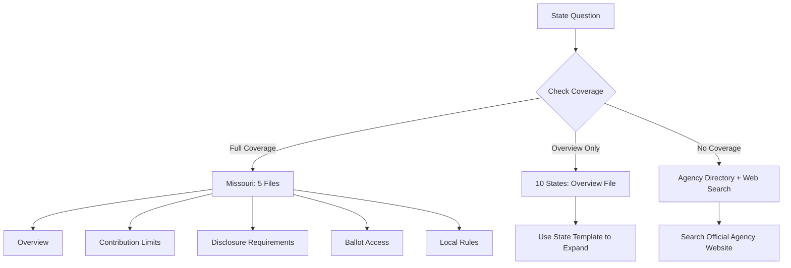

# States

State-specific election law, contribution limits, ballot access rules, and local regulations. Coverage varies by state -- some have a single overview file, others have multiple detailed files.

## Coverage Map

| State | Files | Topics |
|-------|-------|--------|
| Arizona | 1 | Overview |
| California | 2 | Overview, contribution limits |
| Florida | 1 | Overview |
| Georgia | 1 | Overview |
| Illinois | 1 | Overview |
| Michigan | 1 | Overview |
| Missouri | 5 | Overview, ballot access, contribution limits, disclosure requirements, local rules |
| New York | 1 | Overview |
| Ohio | 1 | Overview |
| Pennsylvania | 1 | Overview |
| Texas | 1 | Overview |

## Index and Template

- [_state-index.md](_state-index.md) -- Full coverage index with agency names and websites
- [_state-template.md](_state-template.md) -- Template for adding new state files
