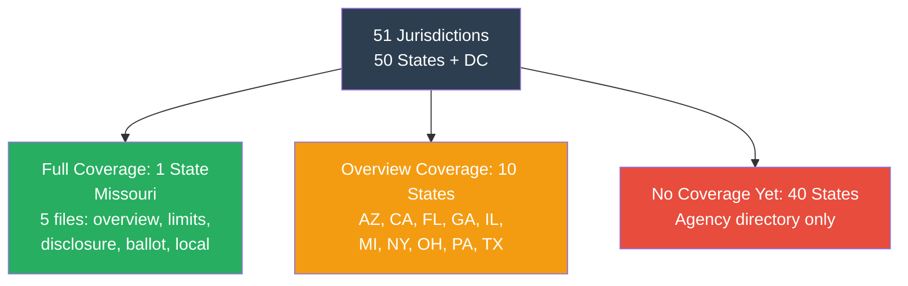

# State Coverage Index

> **STALENESS WARNING:** This index was compiled in April 2026. Coverage status reflects
> files present in this repository at that time. New states may have been added since.
> Election agency names and websites may have changed.

> **EDUCATIONAL DISCLAIMER:** This document is for educational and informational purposes
> only. It does not constitute legal advice. Campaigns should consult a qualified election
> law attorney or the relevant state filing agency for guidance specific to their situation.

---

## Coverage Summary

- **States with coverage:** 11 of 51 (50 states + DC)
- **Full coverage (overview + detail files):** Missouri
- **Overview coverage:** AZ, CA, FL, GA, IL, MI, NY, OH, PA, TX

---

## All States

| # | State | Coverage | Election Agency | Website |
|---|-------|----------|----------------|---------|
| 1 | **Alabama** | -- | Secretary of State | https://www.sos.alabama.gov |
| 2 | **Alaska** | -- | Alaska Public Offices Commission (APOC) | https://aws.state.ak.us/ApocReports/ |
| 3 | **Arizona** | Overview | Clean Elections Commission / Secretary of State | https://www.azcleanelections.gov / https://azsos.gov |
| 4 | **Arkansas** | -- | Secretary of State / Ethics Commission | https://www.sos.arkansas.gov |
| 5 | **California** | Overview | Fair Political Practices Commission (FPPC) | https://www.fppc.ca.gov |
| 6 | **Colorado** | -- | Secretary of State | https://www.sos.state.co.us |
| 7 | **Connecticut** | -- | State Elections Enforcement Commission (SEEC) | https://seec.ct.gov |
| 8 | **Delaware** | -- | Commissioner of Elections | https://elections.delaware.gov |
| 9 | **Florida** | Overview | Division of Elections | https://dos.fl.gov/elections/ |
| 10 | **Georgia** | Overview | Secretary of State / Ethics Commission | https://sos.ga.gov / https://ethics.ga.gov |
| 11 | **Hawaii** | -- | Campaign Spending Commission | https://ags.hawaii.gov/campaign/ |
| 12 | **Idaho** | -- | Secretary of State | https://sos.idaho.gov |
| 13 | **Illinois** | Overview | State Board of Elections | https://www.elections.il.gov |
| 14 | **Indiana** | -- | Election Division / Secretary of State | https://www.in.gov/sos/elections/ |
| 15 | **Iowa** | -- | Ethics and Campaign Disclosure Board | https://ethics.iowa.gov |
| 16 | **Kansas** | -- | Governmental Ethics Commission | https://www.kansas.gov/ethics/ |
| 17 | **Kentucky** | -- | Registry of Election Finance | https://kref.ky.gov |
| 18 | **Louisiana** | -- | Ethics Administration Program | https://ethics.la.gov |
| 19 | **Maine** | -- | Ethics Commission | https://www.maine.gov/ethics/ |
| 20 | **Maryland** | -- | State Board of Elections | https://elections.maryland.gov |
| 21 | **Massachusetts** | -- | Office of Campaign and Political Finance (OCPF) | https://www.ocpf.us |
| 22 | **Michigan** | Overview | Secretary of State / Bureau of Elections | https://www.michigan.gov/sos |
| 23 | **Minnesota** | -- | Campaign Finance and Public Disclosure Board | https://www.cfb.mn.gov |
| 24 | **Mississippi** | -- | Secretary of State | https://www.sos.ms.gov |
| 25 | **Missouri** | Full | Missouri Ethics Commission (MEC) | https://www.mec.mo.gov |
| 26 | **Montana** | -- | Commissioner of Political Practices (COPP) | https://politicalpractices.mt.gov |
| 27 | **Nebraska** | -- | Accountability and Disclosure Commission | https://nadc.nebraska.gov |
| 28 | **Nevada** | -- | Secretary of State | https://www.nvsos.gov |
| 29 | **New Hampshire** | -- | Secretary of State | https://www.sos.nh.gov |
| 30 | **New Jersey** | -- | Election Law Enforcement Commission (ELEC) | https://www.elec.nj.gov |
| 31 | **New Mexico** | -- | Secretary of State | https://www.sos.nm.gov |
| 32 | **New York** | Overview | Board of Elections / NYC Campaign Finance Board | https://www.elections.ny.gov / https://www.nyccfb.info |
| 33 | **North Carolina** | -- | State Board of Elections | https://www.ncsbe.gov |
| 34 | **North Dakota** | -- | Secretary of State | https://sos.nd.gov |
| 35 | **Ohio** | Overview | Secretary of State | https://www.ohiosos.gov |
| 36 | **Oklahoma** | -- | Ethics Commission | https://www.ok.gov/ethics/ |
| 37 | **Oregon** | -- | Secretary of State | https://sos.oregon.gov |
| 38 | **Pennsylvania** | Overview | Department of State (DOS) | https://www.dos.pa.gov |
| 39 | **Rhode Island** | -- | Board of Elections | https://elections.ri.gov |
| 40 | **South Carolina** | -- | State Ethics Commission | https://ethics.sc.gov |
| 41 | **South Dakota** | -- | Secretary of State | https://sdsos.gov |
| 42 | **Tennessee** | -- | Bureau of Ethics and Campaign Finance | https://www.tn.gov/tref.html |
| 43 | **Texas** | Overview | Texas Ethics Commission (TEC) | https://www.ethics.state.tx.us |
| 44 | **Utah** | -- | Lt. Governor's Office | https://voteinfo.utah.gov |
| 45 | **Vermont** | -- | Secretary of State | https://sos.vermont.gov |
| 46 | **Virginia** | -- | Department of Elections | https://www.elections.virginia.gov |
| 47 | **Washington** | -- | Public Disclosure Commission (PDC) | https://www.pdc.wa.gov |
| 48 | **Washington, DC** | -- | Office of Campaign Finance (OCF) | https://ocf.dc.gov |
| 49 | **West Virginia** | -- | Secretary of State | https://sos.wv.gov |
| 50 | **Wisconsin** | -- | Ethics Commission | https://ethics.wi.gov |
| 51 | **Wyoming** | -- | Secretary of State | https://sos.wyo.gov |

---

## Coverage Levels

- **Full:** Overview file plus detailed sub-files (contribution-limits.md,
  disclosure-requirements.md, ballot-access.md, local-rules.md)
- **Overview:** Single overview file covering all major topics at summary level
- **--:** No coverage yet. Agency name and website provided for reference.

---

## Adding Coverage

To add a new state, use the template at `states/_state-template.md`. Save the completed
file as `states/[state-name]/overview.md` (use lowercase, hyphenated state names).
Update this index to reflect the new coverage status.
