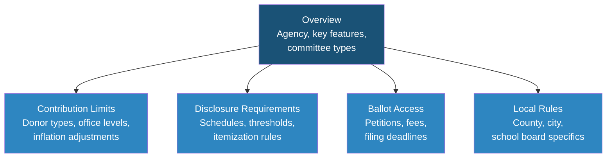

# [STATE NAME] Campaign Finance & Election Overview

> **STALENESS WARNING:** This reference was written in April 2026. Campaign finance laws,
> contribution limits, and filing deadlines change frequently through legislation, ballot
> initiatives, and inflation adjustments. Always verify current rules with the filing
> agency before making compliance decisions.

> **EDUCATIONAL DISCLAIMER:** This document is for educational and informational purposes
> only. It does not constitute legal advice. Campaigns should consult a qualified election
> law attorney or the relevant filing agency for guidance specific to their situation.

---

## Filing Agency

| Field | Details |
|-------|---------|
| **Agency Name** | [Full official name of the state election/ethics agency] |
| **Website** | [URL] |
| **Phone** | [Phone number] |
| **Address** | [Mailing address if relevant] |
| **Online Filing System** | [Name of e-filing system and URL if separate] |

If the state has multiple agencies with jurisdiction (e.g., Secretary of State for ballot
access, Ethics Commission for campaign finance), list each with its role.

---

## Key Features

Summarize 3-5 distinguishing characteristics of this state's campaign finance and election
system. Examples:

- Does the state have contribution limits or is it disclosure-only?
- Primary type (open, closed, top-two, jungle, nonpartisan)?
- Public financing programs?
- Notable recent reforms?
- Unique restrictions (resign-to-run, corporate contribution bans, etc.)?

---

## Contribution Limits

Provide a table of contribution limits per election cycle (or per election, depending on
how the state structures limits). Note whether limits are indexed for inflation/CPI.

| Donor Type | Statewide Office | State Senate | State House | Local Office |
|------------|-----------------|--------------|-------------|--------------|
| Individual | $X,XXX | $X,XXX | $X,XXX | $X,XXX |
| PAC | $X,XXX | $X,XXX | $X,XXX | $X,XXX |
| Party Committee | $X,XXX | $X,XXX | $X,XXX | $X,XXX |
| Corporate | [Allowed/Banned] | | | |
| Union | [Allowed/Banned] | | | |

**Notes:**
- State whether limits are per-election or per-cycle
- Note any inflation adjustment schedule and base year
- Note any aggregate limits
- Note any self-funding provisions that modify limits

---

## Committee Registration Requirements

- **Threshold to register:** [Dollar amount or trigger event]
- **Filing location:** [Agency and method]
- **Required officers:** [Treasurer, chairperson, etc.]
- **Committee types:** [Candidate, PAC, party, independent expenditure, etc.]
- **Bank account requirements:** [Dedicated account, state-chartered bank, etc.]
- **Registration deadline:** [Within X days of reaching threshold or declaring candidacy]

---

## Ballot Access Requirements

| Office | Filing Fee | Petition Signatures | Filing Deadline |
|--------|-----------|-------------------|-----------------|
| Governor | $X,XXX | X,XXX | [Date/description] |
| State Senate | $XXX | XXX | [Date/description] |
| State House | $XXX | XXX | [Date/description] |
| [Other offices] | | | |

**Additional notes:**
- Party vs. independent/third-party requirements
- Write-in candidacy rules
- Residency requirements
- Primary vs. general election deadlines

---

## Reporting Schedule

| Report | Period Covered | Due Date |
|--------|---------------|----------|
| Annual/Year-End | [Period] | [Date] |
| Pre-Primary (30-day) | [Period] | [Date] |
| Pre-Primary (close-in) | [Period] | [Date] |
| Pre-General (30-day) | [Period] | [Date] |
| Pre-General (close-in) | [Period] | [Date] |
| Post-Election | [Period] | [Date] |
| Quarterly (if applicable) | [Period] | [Date] |

**Itemization thresholds:**
- Contributions over $[XX] must be itemized
- Expenditures over $[XX] must be itemized
- Late/large contribution reports: contributions over $[XX] received within [X] days of
  election must be reported within [24/48] hours

---

## Prohibited Contributions

List categories of contributions that are prohibited in this state:

- [ ] Corporate contributions (direct from corporate treasury)
- [ ] Union contributions (direct from union treasury)
- [ ] Foreign national contributions
- [ ] Cash contributions over $[XX]
- [ ] Anonymous contributions over $[XX]
- [ ] Contributions from state contractors/lobbyists
- [ ] Contributions during legislative session
- [ ] [Other state-specific prohibitions]

---

## Key Differences from Federal Rules

Highlight the most important ways this state's rules differ from FEC/federal campaign
finance rules. Common differences include:

- Contribution limit amounts
- Corporate/union contribution treatment
- Reporting frequency and thresholds
- Coordination rules
- Independent expenditure rules
- Disclaimer requirements on campaign materials

---

## Local Rules Notes

Note any significant local jurisdictions with their own campaign finance rules layered on
top of state rules. Common examples:

- Major cities with local campaign finance boards
- Counties with additional disclosure requirements
- Local contribution limits that differ from state limits
- Local public financing programs

---

## Sources & Verification

- [Link to relevant state statute chapter]
- [Link to agency administrative rules]
- [Link to agency candidate guide/handbook]
- Last verified: [Date]

---

*To add a new state, copy this template, fill in all sections, and save as
`states/[state-name]/overview.md`. For states requiring deeper coverage, create
additional files for contribution-limits.md, disclosure-requirements.md,
ballot-access.md, and local-rules.md in the same directory.*
