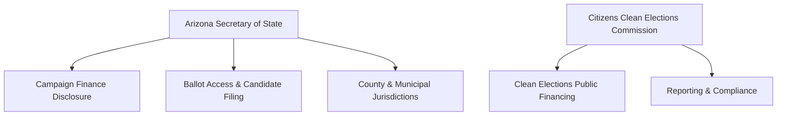

# Arizona Campaign Finance Overview

> **STALENESS WARNING:** This reference reflects Arizona Revised Statutes Title 16 and Citizens Clean Elections Commission / Secretary of State rules as of early 2025. Arizona contribution limits are adjusted biennially based on a CPI formula. The Citizens Clean Elections Act provisions are constitutionally protected but subject to legislative and judicial modification. Always verify current requirements at [azcleanelections.gov](https://www.azcleanelections.gov) and [azsos.gov](https://www.azsos.gov).

> **EDUCATIONAL DISCLAIMER:** This is educational information, not legal advice. Arizona's dual-track system (traditional and Clean Elections public financing) creates distinct compliance paths. Consult an Arizona election law attorney for guidance specific to your campaign.

---

## Filing Agencies

### Dual Oversight
**Arizona Secretary of State**
- Website: [azsos.gov](https://www.azsos.gov)
- Administers elections, candidate filings, and campaign finance disclosure for traditionally funded candidates
- Operates the electronic campaign finance filing system

**Arizona Citizens Clean Elections Commission (CCEC)**
- Website: [azcleanelections.gov](https://www.azcleanelections.gov)
- Administers the public financing (Clean Elections) program
- Provides Clean Elections funding to qualifying candidates
- Enforces Clean Elections Act compliance
- Conducts voter education and candidate debates

---

## Unique Features of Arizona Campaign Finance Law

1. **Clean Elections public financing** -- Arizona offers full public financing for candidates who qualify by collecting a threshold number of small contributions ($5 qualifying contributions); participating candidates receive a set amount of funding and agree not to raise or spend private money beyond the qualifying period
2. **"Mega PAC" designation** -- PACs that receive contributions from 500+ individuals in amounts of $10 or more and have been active for at least one year qualify as Mega PACs with higher contribution limits
3. **CPI-adjusted limits** -- contribution limits are adjusted every two years based on the Consumer Price Index
4. **Corporate contributions allowed** -- corporations may contribute directly to candidates (unlike federal law)
5. **Independent expenditure surge reporting** -- independent expenditure committees must report large IEs within 24 hours
6. **Prop 211 (Voters' Right to Know Act)** -- passed in 2022, requires disclosure of original sources of money behind political spending above certain thresholds

---

## Contribution Limits (2025-2026 Cycle -- Verify CPI Adjustments)

| Donor Type | Statewide (per election) | Legislative (per election) | Notes |
|-----------|-------------------------|--------------------------|-------|
| Individual | **$6,390** | **$6,390** | CPI-adjusted; verify current amount |
| Corporation | **$6,390** | **$6,390** | Direct corporate contributions permitted |
| PAC (regular) | **$6,390** | **$6,390** | Same as individual |
| **Mega PAC** | **$12,780** | **$12,780** | Double the regular limit (500+ contributors) |
| Political Party (state/county) | **No limit** | **No limit** | Exempt from contribution limits |
| Labor Union | **$6,390** | **$6,390** | Same as other entities |
| Candidate to Own Campaign | **No limit** | **No limit** | Not available for Clean Elections candidates |
| Cash (any source) | **$100 max** | **$100 max** | Over $100 must be traceable |

*All dollar figures are approximate based on the most recent CPI adjustment. Verify at azsos.gov.*

### Aggregate Limits
- Arizona does **not** impose aggregate limits on total giving by an individual to all candidates

---

## Clean Elections Public Financing Program

### How It Works
1. **Qualifying period:** Candidates collect **$5 qualifying contributions** from registered voters in their district
   - Statewide candidates: ~4,000 qualifying contributions needed (varies; check CCEC)
   - Legislative candidates: ~220 qualifying contributions needed
2. **Funding:** Qualifying candidates receive a **fixed amount** of public funding for the primary and (if they advance) the general election
3. **Restrictions:** Participating candidates may **not** raise or spend any private money beyond their qualifying contributions; personal funds are limited to a small seed money amount
4. **Debates:** Participating candidates must participate in CCEC-sponsored debates

### Approximate Funding Amounts (Verify with CCEC)
| Office | Primary Funding | General Funding |
|--------|----------------|-----------------|
| Governor | ~$1,130,000 | ~$1,695,000 |
| Other statewide | ~$225,000 | ~$338,000 |
| State Senate | ~$21,000 | ~$31,000 |
| State House | ~$14,000 | ~$21,000 |

*Amounts are adjusted and set by the CCEC each cycle.*

### Advantages of Clean Elections
- No fundraising obligations after qualifying
- Levels the playing field for candidates without wealthy donor networks
- Public perception of independence from special interests
- CCEC provides compliance support and voter education

### Disadvantages
- Spending is capped at the funding amount (cannot respond to high-spending opponents with additional funds, though the 2011 Supreme Court decision in *Arizona Free Enterprise Club v. Bennett* struck down matching funds provisions)
- Strict compliance requirements; even minor violations can result in repayment or disqualification
- Must participate in CCEC debates

---

## Committee Registration

### Candidate Committees (Traditional)
- File a **Statement of Organization** with the Secretary of State
- Must register before accepting contributions or making expenditures
- Must designate a committee chairperson and treasurer

### Clean Elections Candidates
- File an **Application for Certification** with the CCEC
- Submit qualifying contributions during the qualifying period
- If certified, receive funding and operate under CCEC rules

### Political Action Committees
- Register with the Secretary of State
- Must file a Statement of Organization
- **Mega PAC designation:** File for Mega PAC status after meeting the 500-contributor threshold

### Independent Expenditure Committees
- Must register and report with the Secretary of State
- Subject to Prop 211 disclosure requirements for spending above thresholds

---

## Ballot Access

### Major Party Candidates (Republican / Democrat)
- Collect **nominating petition signatures** from registered voters in the candidate's party within the district
- Signature thresholds vary by office (set as a percentage of party registration in the district)
- Filing deadline is typically in April/May of the election year
- Primary elections held in late July/early August

### Independent Candidates
- Collect petition signatures from registered voters (not registered with a recognized party, or any voter in some cases)
- Higher signature thresholds than major party candidates
- Filing deadline is earlier than major party deadlines

### Write-In Candidates
- Must file a write-in nomination paper by a specified deadline
- Write-in candidates are listed on the ballot in some contexts

---

## Reporting Schedule

### Traditional Candidates
| Report | Due Date | Coverage |
|--------|----------|----------|
| **1st pre-primary** | ~55 days before primary | Through prior period |
| **2nd pre-primary** | ~15 days before primary | Through 17 days before primary |
| **1st pre-general** | ~55 days before general | Through prior period |
| **2nd pre-general** | ~15 days before general | Through 17 days before general |
| **Post-general** | ~40 days after general | Through 30 days after general |
| **Annual (non-election year)** | January 31 | Full prior year |

### Clean Elections Candidates
- File reports on the CCEC schedule, which mirrors but may differ slightly from the Secretary of State schedule
- Must report all qualifying contributions and campaign expenditures
- Subject to audit by the CCEC after the election

### Late Contribution Reporting
- Contributions of **$1,000 or more** received after the close of the last pre-election report must be reported within **1 business day**

### Independent Expenditure Reporting
- IEs of **$1,000 or more** must be reported within **24 hours** during the period beginning 16 days before an election

### Itemization Thresholds
- Contributions over **$50** from a single source must be itemized
- All expenditures over **$250** must be itemized

---

## Prohibited Contributions

- Contributions exceeding per-election limits (for non-party donors)
- **Cash contributions exceeding $100**
- Contributions in the **name of another** (straw donors)
- **Foreign national** contributions
- **Anonymous contributions exceeding $50** (must be returned)
- Contributions by Clean Elections candidates from private sources after certification
- Contributions from entities that fail to disclose original sources as required by Prop 211

---

## Key Differences from Federal Law

| Feature | Federal | Arizona |
|---------|---------|---------|
| Individual contribution limit | $3,300/election | **$6,390/election** (CPI-adjusted) |
| Corporate contributions | Prohibited | **Allowed** (same limit as individuals) |
| Public financing | Presidential only | **Full public financing** (Clean Elections) |
| Mega PAC concept | No equivalent | **Yes** (doubled limits for qualifying PACs) |
| Party-to-candidate limit | Coordinated expenditure limits | **No limit** |
| Cash cap | $100 | **$100** (same) |
| Dark money disclosure | Limited | **Prop 211** requires original source disclosure |
| Limit adjustment | Every odd year | **Every two years (CPI)** |

---

## Local Rules Notes

- **Phoenix, Tucson, Mesa** and other charter cities may have their own campaign finance ordinances with additional or different requirements
- **Tucson** has its own Clean Elections-style program for city races
- County candidates generally follow state rules and file with the Secretary of State or county
- Some municipalities impose lower contribution limits for city races
- Local school board and special district candidates may have reduced reporting requirements
- Check with the specific municipality's clerk for local campaign finance ordinances

---

## Resources

- **Arizona Secretary of State -- Campaign Finance:** [azsos.gov/elections/campaign-finance](https://www.azsos.gov/elections/campaign-finance)
- **Citizens Clean Elections Commission:** [azcleanelections.gov](https://www.azcleanelections.gov)
- **Arizona Revised Statutes Title 16:** Election law including campaign finance
- **Prop 211 (Voters' Right to Know Act):** Information at azcleanelections.gov
- **Campaign Finance Filing System:** Available at azsos.gov
