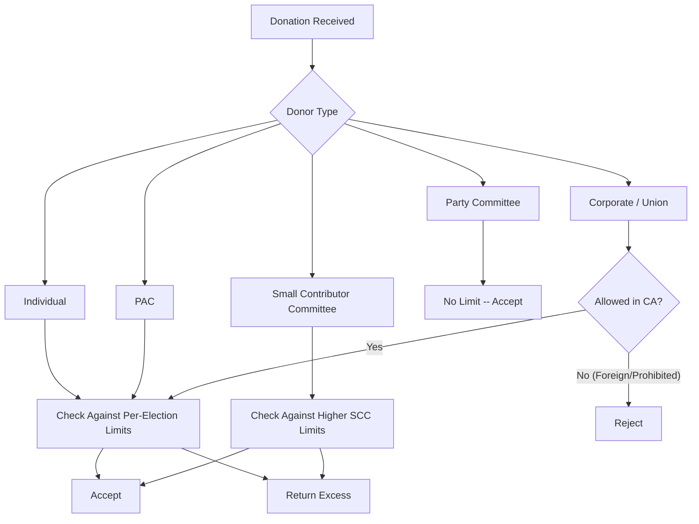

# California Contribution Limits (Detailed)

> **STALENESS WARNING:** This reference was written in April 2026. California contribution
> limits are adjusted in odd-numbered years based on the Consumer Price Index (CPI). The
> figures shown here reflect the 2025-2026 election cycle. Verify current limits at
> https://www.fppc.ca.gov before making compliance decisions.

> **EDUCATIONAL DISCLAIMER:** This document is for educational and informational purposes
> only. It does not constitute legal advice. Campaigns should consult a qualified election
> law attorney or the Fair Political Practices Commission (FPPC) for guidance specific to
> their situation.

---

## Background

California has maintained contribution limits since the passage of the Political Reform
Act of 1974 (Proposition 9). The current framework is governed by the Political Reform
Act (Government Code Sections 84100-84511) and FPPC regulations. Key milestones:

- **1974:** Proposition 9 established the Political Reform Act and created the FPPC.
- **2000:** Proposition 34 set the modern contribution limit framework.
- **2016:** AB 571 established voluntary expenditure ceilings for legislative candidates.
- **Ongoing:** Limits are adjusted biennially (odd years) based on CPI.

---

## Current Limits (2025-2026 Cycle)

All limits are **per election**. The primary and general each count as separate elections.

### Individual Contributions to Candidates

| Office | Limit Per Election |
|--------|--------------------|
| Governor | $9,100 |
| Lieutenant Governor | $9,100 |
| Attorney General | $9,100 |
| Secretary of State | $9,100 |
| Controller | $9,100 |
| Treasurer | $9,100 |
| Superintendent of Public Instruction | $9,100 |
| Insurance Commissioner | $9,100 |
| Board of Equalization | $9,100 |
| State Senator | $5,500 |
| State Assembly Member | $5,500 |

### Small Contributor Committee Contributions to Candidates

A "small contributor committee" is a PAC that has been in existence for at least six
months, receives contributions from 100 or more persons, and makes contributions to
five or more candidates. These committees receive higher limits:

| Office | Limit Per Election |
|--------|--------------------|
| Statewide offices | $18,200 |
| Legislative offices | $11,000 |

### PAC Contributions to Candidates (Non-Small Contributor)

| Office | Limit Per Election |
|--------|--------------------|
| Statewide offices | $9,100 |
| Legislative offices | $5,500 |

### Political Party Contributions to Candidates

| Donor | Limit Per Election |
|-------|--------------------|
| State central committee | No limit |
| County central committee | No limit |

Party committees may contribute without limit to candidates, but transfers between
party committees are subject to certain restrictions.

### Contributions to Committees

| Donor Type | To a PAC | To a Political Party |
|------------|----------|---------------------|
| Individual | $11,000/year | $45,400/year |
| PAC to PAC | $11,000/year | $45,400/year |

---

## Self-Funding

Candidates may contribute unlimited personal funds to their own campaign committee.
California does not have a "millionaire's amendment" that raises limits for opponents
of self-funding candidates.

---

## Independent Expenditure Rules

Independent expenditures (IEs) are expenditures made in connection with a candidate's
election but without coordination with the candidate or their campaign.

- **No dollar limit** on independent expenditures (per *Citizens United v. FEC*).
- **Disclosure required:** Any person or committee making IEs of $1,000 or more must
  file reports with the FPPC.
- **24-hour reporting:** IEs of $1,000 or more made in the last 90 days before an
  election must be reported within 24 hours.
- **"Paid for by" disclosure:** All IE communications must include the name and address
  of the person or committee paying for the communication.
- **No coordination:** IEs must be truly independent. Coordination with a candidate
  converts the expenditure into a contribution subject to limits.

---

## Voluntary Expenditure Ceilings (AB 571)

AB 571 (effective 2017) established voluntary expenditure ceilings for legislative
candidates. Candidates who accept the ceiling receive benefits:

| Office | Voluntary Ceiling |
|--------|-------------------|
| State Senate | $1,300,000 (approximate; adjusted for CPI) |
| State Assembly | $1,050,000 (approximate; adjusted for CPI) |

### Benefits of Accepting the Ceiling

- Candidate's statement in the official voter pamphlet is provided at no charge (the
  county pays the cost).
- Candidate may include a notation that they accepted the voluntary spending limit.

### Consequences of Rejecting or Exceeding the Ceiling

- Candidate must pay for their voter pamphlet statement.
- If an opponent rejects or exceeds the ceiling, the accepting candidate is released
  from the ceiling.
- If independent expenditures against the accepting candidate or in favor of their
  opponent exceed the ceiling amount, the accepting candidate is released.

---

## Corporate and Union Contributions

- **Corporate contributions:** Permitted. Subject to the same limits as individual
  contributions.
- **Union contributions:** Permitted. Subject to the same limits. Unions may also
  establish separate segregated funds (PACs).
- **LLC contributions:** Treated the same as corporate contributions.

---

## Prohibited Contributions (Quick Reference)

| Source | Permitted? | Notes |
|--------|-----------|-------|
| Individuals (including non-residents) | Yes | Subject to limits |
| Corporations | Yes | Subject to limits |
| Unions | Yes | Subject to limits |
| PACs | Yes | Subject to limits |
| Political parties | Yes | **No limit** to candidates |
| Foreign nationals | **No** | Prohibited under federal and state law |
| Anonymous (over $100) | **No** | Must identify contributor |
| Cash (over $100) | **No** | Must use traceable payment method |
| Lobbyists (to officeholders they lobby) | Restricted | Additional rules apply |
| Government contractors | Restricted | Limits apply during contract periods |

---

## Aggregate Limits

California does **not** impose aggregate limits on total giving by an individual donor
across all candidates. The U.S. Supreme Court struck down federal aggregate limits in
*McCutcheon v. FEC* (2014), and California does not maintain state-level aggregates.

---

## Loans

- Loans from a candidate to their own campaign are unlimited.
- Loans from other individuals or entities are treated as contributions subject to
  limits until repaid.
- Loans from financial institutions on commercially reasonable terms are not treated as
  contributions, provided the candidate has sufficient assets to secure the loan.
- Post-election fundraising to repay candidate loans is subject to contribution limits.

---

## CPI Adjustment Mechanism

- Limits are adjusted every odd-numbered year based on CPI changes.
- The FPPC publishes updated limits before each election cycle.
- Adjusted amounts are rounded to the nearest $100.

---

## Sources & Verification

- California Government Code, Title 9 (Political Reform Act), Sections 84100-84511
- FPPC Regulations, Title 2, Division 6
- FPPC Contribution Limits Chart (published each cycle)
- https://www.fppc.ca.gov
- Last verified: April 2026
