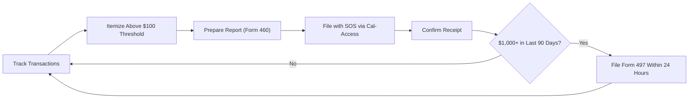

# California Disclosure & Reporting Requirements

> **STALENESS WARNING:** This reference was written in April 2026. Filing deadlines,
> form numbers, and electronic filing rules may change through legislation or FPPC
> rulemaking. Always verify current requirements at https://www.fppc.ca.gov before filing.

> **EDUCATIONAL DISCLAIMER:** This document is for educational and informational purposes
> only. It does not constitute legal advice. Campaigns should consult a qualified election
> law attorney or the Fair Political Practices Commission (FPPC) for guidance specific to
> their situation.

---

## Filing Agency

Campaign finance reports are filed with the **California Secretary of State** (for
state and legislative candidates) and/or the **local filing officer** (for local
candidates). The **Fair Political Practices Commission (FPPC)** sets the rules and
provides oversight.

- **Electronic filing:** Required for all state and legislative candidates and committees
  that raise or spend $25,000 or more in a calendar year.
- **Cal-Access system:** California's online campaign finance database at
  https://cal-access.sos.ca.gov
- **Local filing:** County and city candidates file with their local filing officer
  (county clerk, city clerk, or registrar of voters).

---

## Report Types

### Semi-Annual Reports (Form 460)

All active committees must file semi-annual statements, regardless of election activity.

| Report | Coverage Period | Due Date |
|--------|---------------|----------|
| Semi-Annual (1st half) | January 1 - June 30 | July 31 |
| Semi-Annual (2nd half) | July 1 - December 31 | January 31 |

### Pre-Election Reports (Form 460)

Committees active in an election must file pre-election statements.

| Report | Coverage | Due Date |
|--------|----------|----------|
| 1st Pre-Election | From close of last report through ~45 days before election | ~40 days before election |
| 2nd Pre-Election | From close of 1st pre-election through ~17 days before election | ~12 days before election |

Exact dates vary by election. The FPPC publishes a filing schedule for each election.

### Late Contribution Reports (Form 497)

Contributions of **$1,000 or more** received or made in the **90 days before an
election** must be reported within **24 hours**.

This applies to:
- Contributions received by a candidate committee
- Contributions made to a candidate committee
- Contributions made to a ballot measure committee (in the last 90 days)

Form 497 must be filed electronically.

### Late Independent Expenditure Reports (Form 496)

Independent expenditures of **$1,000 or more** made in the **90 days before an
election** must be reported within **24 hours**.

---

## Itemization Thresholds

### Contributions

| Category | Threshold | Required Information |
|----------|-----------|---------------------|
| Itemized contributions | $100 or more (cumulative per donor) | Full name, address, occupation, employer, date, amount |
| Non-itemized contributions | Under $100 | May be reported in aggregate |
| Anonymous contributions | $100 or less | Reported as total |
| Anonymous contributions | Over $100 | **Prohibited** -- must be returned |

### Expenditures

| Category | Threshold | Required Information |
|----------|-----------|---------------------|
| Itemized expenditures | $100 or more | Payee name, address, date, amount, description/purpose |
| Non-itemized expenditures | Under $100 | May be reported in aggregate |
| Sub-vendor payments | $500 or more | Must itemize payments made by vendors on behalf of committee |

---

## 24-Hour Reporting Period (Last 90 Days)

California's 24-hour reporting requirement is more expansive than most states:

- **Trigger:** $1,000 or more in contributions received, contributions made, or
  independent expenditures made.
- **Window:** Last 90 days before the election through election day.
- **Method:** Filed electronically via Cal-Access or the FPPC's online system.
- **Applies to:** All candidate committees, PACs, and independent expenditure committees
  active in the election.

---

## Form Reference

| Form | Purpose | When Filed |
|------|---------|-----------|
| Form 410 | Statement of Organization (committee registration) | Within 10 days of qualifying as a committee |
| Form 460 | Recipient Committee Campaign Statement (main report) | Semi-annually + pre-election |
| Form 461 | Major Donor and Independent Expenditure Report | When thresholds are met |
| Form 496 | Late Independent Expenditure Report | Within 24 hours (last 90 days) |
| Form 497 | Late Contribution Report | Within 24 hours (last 90 days) |
| Form 501 | Candidate Intention Statement | Before soliciting/receiving contributions |
| Form 700 | Statement of Economic Interests (personal financial disclosure) | Annual + assuming/leaving office |

---

## Electronic Filing Details

- **Threshold:** Committees raising or spending $25,000+ in a calendar year must file
  electronically with the Secretary of State.
- **System:** Cal-Access Electronic Filing System.
- **Third-party software:** Permitted if it produces files in the Cal-Access compatible
  format (.cal file format).
- **Local e-filing:** Many counties and cities have their own electronic filing systems
  (e.g., Los Angeles, San Francisco, San Diego). Candidates may need to file with both
  the state and local systems.
- **Paper filing:** Committees below the $25,000 threshold may file on paper.

---

## Record-Keeping Requirements

- **Bank account:** All committee funds must be deposited in a single campaign bank
  account at a financial institution in California.
- **Deposit timeline:** Contributions must be deposited within 7 days of receipt.
- **Record retention:** All records must be retained for at least 4 years after the
  date the report was filed.
- **Contributor information:** Campaigns must make "best efforts" to obtain occupation
  and employer information for contributors of $100 or more.

---

## Penalties for Non-Compliance

| Violation | Penalty |
|-----------|---------|
| Late filing | $10/day (up to 100% of the amount at issue) |
| Failure to file | FPPC enforcement action; fines up to $5,000/violation |
| Exceeding contribution limits | Fine up to three times the amount of the excess contribution |
| Failure to report IEs | $5,000/violation + potential criminal referral |
| Filing false reports | Misdemeanor; fines and potential imprisonment |
| Laundering contributions | Felony; up to 4 years in state prison |

The FPPC may also issue warning letters, negotiate stipulated agreements, or refer
matters to the Attorney General or local district attorney.

---

## Candidate Personal Financial Disclosure (Form 700)

- Required for all candidates for state and local elective office.
- Filed with the FPPC (state offices) or local filing officer (local offices).
- **Assuming Office Statement:** Filed within 30 days of assuming office.
- **Annual Statement:** Filed by April 1 each year while in office.
- **Leaving Office Statement:** Filed within 30 days of leaving office.
- **Candidate Statement:** Filed with the Declaration of Candidacy.
- Covers investments, real property, income, loans, gifts, and travel payments.

---

## Sources & Verification

- California Government Code, Title 9 (Political Reform Act)
- FPPC Regulations, Title 2, Division 6
- FPPC Campaign Filing Schedule (published each election cycle)
- Cal-Access: https://cal-access.sos.ca.gov
- https://www.fppc.ca.gov
- Last verified: April 2026
