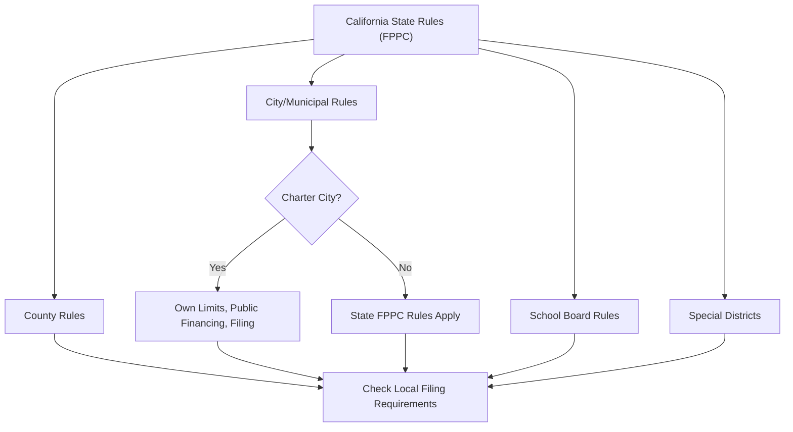

# California Local Office Election Rules

> **STALENESS WARNING:** This reference was written in April 2026. Local election rules
> in California vary significantly by jurisdiction and are subject to change through
> charter amendments, ordinances, and state legislation. Always verify current rules with
> the relevant local election authority.

> **EDUCATIONAL DISCLAIMER:** This document is for educational and informational purposes
> only. It does not constitute legal advice. Campaigns should consult a qualified election
> law attorney or the relevant election authority for guidance specific to their situation.

---

## Overview

California local elections are governed by a combination of state law (Elections Code,
Government Code) and local charters/ordinances. The state sets minimum standards, but
charter cities may impose additional or different rules -- including their own contribution
limits, public financing programs, and filing requirements. California has over 480
cities, 58 counties, and thousands of special districts, each with potential variations.

---

## Los Angeles (City)

### Election Authority

| Field | Details |
|-------|---------|
| **Authority** | City of Los Angeles, Office of the City Clerk -- Election Division |
| **Regulatory body** | Los Angeles City Ethics Commission |
| **Website** | https://ethics.lacity.org |

### Contribution Limits

Los Angeles imposes its **own contribution limits** that are separate from (and
generally lower than) state limits:

| Office | Limit Per Election |
|--------|--------------------|
| Mayor | $1,600 |
| City Controller | $1,600 |
| City Attorney | $1,600 |
| City Council | $900 |

These limits are adjusted periodically. Verify at https://ethics.lacity.org.

### Matching Funds Program

Los Angeles has a **public matching funds program** for qualifying candidates:

- **Match ratio:** $2 of public funds for every $1 of qualifying contributions (2:1).
- **Qualifying contributions:** Individual contributions from city residents, up to
  $284 matchable per contributor.
- **Spending limits:** Candidates who accept matching funds agree to expenditure ceilings.
- **Threshold:** Candidates must raise a minimum amount in qualifying contributions to
  access matching funds.
- **Administration:** Los Angeles City Ethics Commission.

### Additional Rules

- **Independent expenditure disclosure:** IEs of $1,000+ must be reported within 24 hours.
- **Bundling disclosure:** Lobbyists who bundle contributions must disclose bundled amounts.
- **Officeholder accounts:** Restricted; may not be used for campaign purposes.
- **Filing:** Candidates file with both the LA City Ethics Commission (local reports) and
  the FPPC (state reports) if applicable.

---

## San Francisco

### Election Authority

| Field | Details |
|-------|---------|
| **Authority** | San Francisco Department of Elections |
| **Regulatory body** | San Francisco Ethics Commission |
| **Website** | https://sfethics.org |

### Contribution Limits

| Office | Limit Per Election |
|--------|--------------------|
| Mayor | $500 |
| Board of Supervisors | $500 |
| City Attorney | $500 |
| Other citywide offices | $500 |

### Public Financing Program

San Francisco offers a **public financing program** for Board of Supervisors and
mayoral candidates:

- **Supervisors:** Qualifying candidates receive public funds through a matching
  program. Match ratio and caps are set by the Ethics Commission.
- **Mayor:** Separate qualifying thresholds and spending limits apply.
- **Qualification:** Candidates must collect a minimum number of qualifying
  contributions from district residents (Supervisors) or city residents (Mayor).
- **Spending limits:** Candidates who accept public financing agree to expenditure
  ceilings, which may be lifted if an opponent exceeds the ceiling.

### Ranked Choice Voting

San Francisco uses **ranked choice voting (RCV)** for most local offices:

- Voters rank candidates in order of preference.
- If no candidate receives a majority of first-choice votes, the candidate with the
  fewest votes is eliminated and their votes are redistributed.
- Process continues until a candidate achieves a majority.
- **No separate runoff elections** are held.

### Additional Rules

- **Lobbyist contribution ban:** Registered lobbyists are prohibited from contributing
  to candidates they lobby.
- **Contractor contribution restrictions:** Persons seeking city contracts may face
  contribution restrictions.
- **Electronic filing:** Required for committees raising or spending $5,000 or more.

---

## Los Angeles County

### Election Authority

| Field | Details |
|-------|---------|
| **Authority** | Los Angeles County Registrar-Recorder/County Clerk |
| **Website** | https://www.lavote.gov |

### Key Rules

- **County supervisorial races:** Subject to state contribution limits (not LA City limits).
- **Filing:** County candidates file with the LA County Registrar-Recorder.
- **Campaign finance:** State FPPC rules apply. LA County does not impose additional
  contribution limits for county offices beyond state law.
- **Election timing:** County elections are consolidated with statewide elections in
  even-numbered years.

---

## San Diego

### Election Authority

| Field | Details |
|-------|---------|
| **Authority** | San Diego City Clerk |
| **Regulatory body** | San Diego Ethics Commission |
| **Website** | https://www.sandiego.gov/ethics |

### Contribution Limits

| Office | Limit Per Election |
|--------|--------------------|
| Mayor | $700 |
| City Council | $700 |
| City Attorney | $700 |

### Additional Rules

- **No public financing program** (as of this writing).
- **Independent expenditure reporting:** Required within 24 hours for IEs of $1,000+.
- **Lobbyist restrictions:** Registered lobbyists face additional contribution restrictions.

---

## Sacramento

### Key Rules

| Office | Contribution Limit Per Election |
|--------|--------------------|
| Mayor | $700 |
| City Council | $700 |

- Sacramento does not currently have a public financing program.
- State FPPC rules apply in addition to local limits.

---

## County Offices (General)

California has 58 counties. Unless a county has adopted a local campaign finance
ordinance, county races are governed solely by state law:

- **Contribution limits:** State limits apply ($9,100 statewide equivalent offices,
  $5,500 for others -- but most county offices do not have state-level limits; check
  FPPC guidance for specific office classifications).
- **Filing:** County candidates file with the county elections official.
- **Reporting:** Same FPPC reporting schedule (semi-annual + pre-election).

---

## School Board Elections

- **Nonpartisan elections** held in even-numbered years (consolidated with general
  elections) or as scheduled by the county.
- **Filing:** Candidates file with the county elections official.
- **Filing fee:** Typically $25 or petition alternative (20-40 signatures).
- **Campaign finance:** State FPPC rules apply. No special local limits unless the
  school district or county has enacted them.
- **No contribution limits at state level** for most school board races (the FPPC has
  not set specific limits for non-state offices; local ordinances may apply).

---

## Special District Elections

California has over 3,300 special districts (water, fire, sanitation, transit, etc.).

- Elections are typically consolidated with general elections.
- **Filing:** Candidates file with the county elections official.
- **Campaign finance:** State FPPC rules apply.
- **Low activity:** Many special district races are uncontested and involve minimal
  campaign activity.

---

## Key Differences: Charter Cities vs. General Law Cities

| Feature | Charter City | General Law City |
|---------|-------------|-----------------|
| Contribution limits | May set own limits | State limits apply |
| Public financing | May establish programs | Generally no authority |
| Election timing | May set own schedule | Must follow state schedule |
| Term limits | Set by charter | Set by local ordinance or state default |
| Filing requirements | May require local filings | State filings only |

---

## Sources & Verification

- California Elections Code
- California Government Code (Political Reform Act)
- FPPC Local Jurisdiction Filing Requirements
- Los Angeles City Charter, Article VII
- San Francisco Campaign and Governmental Conduct Code
- https://www.fppc.ca.gov
- https://ethics.lacity.org
- https://sfethics.org
- Last verified: April 2026
