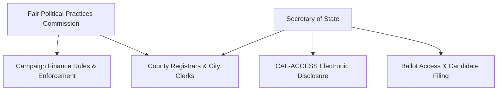

# California Campaign Finance & Election Overview

> **STALENESS WARNING:** This reference was written in April 2026. California campaign
> finance law is among the most complex in the nation and changes frequently through
> legislation, ballot propositions, and FPPC rulemaking. Contribution limits are adjusted
> in odd-numbered years. Always verify current rules with the FPPC before making
> compliance decisions.

> **EDUCATIONAL DISCLAIMER:** This document is for educational and informational purposes
> only. It does not constitute legal advice. Campaigns should consult a qualified election
> law attorney or the Fair Political Practices Commission for guidance specific to their
> situation.

---

## Filing Agency

| Field | Details |
|-------|---------|
| **Agency Name** | Fair Political Practices Commission (FPPC) |
| **Website** | https://www.fppc.ca.gov |
| **Phone** | (916) 322-5660 |
| **Toll-Free** | (866) ASK-FPPC (275-3772) |
| **Address** | 1102 Q Street, Suite 3000, Sacramento, CA 95811 |
| **Online Filing System** | CAL-ACCESS (https://cal-access.sos.ca.gov) managed by Secretary of State |

The FPPC sets rules and enforces campaign finance law. The Secretary of State administers
candidate filing and the CAL-ACCESS electronic disclosure system. County registrars and
city clerks handle local filing for certain offices.

---

## Key Features

- **Top-two primary system:** All candidates appear on a single primary ballot regardless
  of party. The top two vote-getters advance to the general election, even if they are
  from the same party. (Does not apply to presidential or local nonpartisan races.)
- **AB 571 (2023):** Raised contribution limits significantly and restructured them by
  office type. Limits are now adjusted for CPI in odd-numbered years.
- **Voluntary expenditure ceilings:** Candidates for state legislative offices may agree
  to voluntary spending limits. Those who accept receive a favorable designation in the
  Voter Information Guide. Candidates who decline or exceed the ceiling face no penalty
  but lose the designation.
- **Strict disclosure requirements:** One of the most comprehensive disclosure regimes
  in the country, including real-time online filing, campaign ad disclaimers (including
  for digital ads), and the DISCLOSE Act requirements.
- **No corporate contributions from corporations organized outside California's
  jurisdiction** -- but in practice California allows corporate contributions to
  candidates subject to limits, a shift from earlier eras.

---

## Contribution Limits (2025-2026 Cycle)

Limits are per election. Adjusted for CPI in odd-numbered years.

| Donor Type | Statewide Office | State Senate | State Assembly | Local Office |
|------------|-----------------|--------------|----------------|--------------|
| Individual | $5,500 | $5,500 | $5,500 | Varies (see local rules) |
| PAC (broad-based) | $10,000 | $10,000 | $10,000 | Varies |
| PAC (non-broad-based / small donor) | $5,500 | $5,500 | $5,500 | Varies |
| Political Party | No limit | No limit | No limit | Varies |
| Corporate | $5,500 | $5,500 | $5,500 | Varies |
| Union | $5,500 | $5,500 | $5,500 | Varies |

**Important notes:**
- Limits are **per election** (primary and general are separate).
- A "broad-based" PAC is one that has been in existence for 6+ months, receives
  contributions from 100+ persons, and contributes to 5+ candidates.
- **Aggregate limits:** No aggregate limit on total giving across all candidates.
- **Self-funding:** No limit on candidate contributions to their own campaign.
- **Lobbyist restrictions:** Registered lobbyists may not contribute to officials they
  lobby (with exceptions).
- **Bundling disclosure:** Intermediaries who deliver $5,000+ in bundled contributions
  must be disclosed.

---

## Committee Registration Requirements

- **Threshold to register:** Any person or group that receives $2,000+ in contributions
  or makes $1,000+ in expenditures to support/oppose candidates or measures.
- **Candidate committees:** Must file a Statement of Organization (Form 410) with the
  Secretary of State within 10 days of qualifying.
- **Required officers:** Treasurer required; candidate is the controlling officeholder.
- **Committee types:** Candidate-controlled, primarily formed (for/against one
  candidate/measure), general purpose (PAC), political party, independent expenditure,
  major donor ($10,000+ in a calendar year).
- **Bank account:** Dedicated campaign bank account required.
- **FPPC ID number:** Assigned upon filing Form 410; must be included on all reports.

---

## Ballot Access Requirements

| Office | Filing Fee | Petition Signatures | Filing Deadline |
|--------|-----------|-------------------|-----------------|
| Governor | $4,399.97 (2% of salary) or petition | 65-100 signatures (in lieu of fee) | ~88 days before primary |
| Lt. Governor | Variable (2% of salary) | 65-100 signatures | ~88 days before primary |
| State Senator | Variable (2% of salary) | 20-40 signatures | ~88 days before primary |
| State Assembly | Variable (2% of salary) | 20-40 signatures | ~88 days before primary |
| Independent (statewide) | -- | 1% of registered voters in jurisdiction | ~88 days before general |

**Additional notes:**
- Candidates may pay filing fee OR gather signatures in lieu of filing fee.
- Write-in candidates must file a statement of write-in candidacy.
- California's top-two primary means all candidates compete in a single primary.

---

## Reporting Schedule

| Report | Coverage Period | Due Date |
|--------|---------------|----------|
| Semi-Annual (Jan 1 - Jun 30) | Jan 1 - Jun 30 | July 31 |
| Semi-Annual (Jul 1 - Dec 31) | Jul 1 - Dec 31 | January 31 |
| Pre-Primary (1st) | Through ~40 days before primary | ~40 days before primary |
| Pre-Primary (2nd) | Through ~12 days before primary | ~12 days before primary |
| Pre-General (1st) | Through ~40 days before general | ~40 days before general |
| Pre-General (2nd) | Through ~12 days before general | ~12 days before general |

**Late contribution reports:**
- Contributions of $1,000+ received in the 90 days before an election must be reported
  within **24 hours**.
- Independent expenditures of $1,000+ in the 90 days before an election must be reported
  within **24 hours**.

**Itemization thresholds:**
- Contributions of $100+ must be itemized.
- Expenditures of $100+ must be itemized.

---

## Prohibited Contributions

- Foreign national contributions
- Anonymous contributions of $100 or more
- Cash contributions over $100
- Contributions in another's name
- Government contractor contributions (in some circumstances)
- Lobbyist contributions to officials they lobby (with exceptions)
- Contributions exceeding the per-election limit

---

## Key Differences from Federal Rules

- **Higher individual limits:** $5,500 per election vs. federal $3,300.
- **Corporate contributions allowed:** Federal law prohibits direct corporate treasury
  contributions; California allows them subject to the individual limit.
- **Top-two primary:** Fundamentally different from federal partisan primaries.
- **Voluntary expenditure ceilings:** No federal equivalent.
- **24-hour late contribution reports:** California's 90-day window and $1,000 threshold
  are more aggressive than federal requirements.
- **DISCLOSE Act disclaimer rules:** California requires more extensive "paid for by"
  disclaimers, including on digital ads, than federal law.
- **Lobbyist contribution restrictions:** Federal law does not restrict lobbyist giving.

---

## Local Rules Notes

California has extensive local campaign finance regulation:

- **Los Angeles:** LA City Ethics Commission administers separate contribution limits
  ($900 for city council, $1,600 for citywide offices as of recent cycles), public
  matching funds program, and strict disclosure rules. https://ethics.lacity.org
- **San Francisco:** Ethics Commission with public financing (matching funds),
  $500 contribution limits for Board of Supervisors. https://sfethics.org
- **San Diego:** Ethics Commission with separate local limits and independent expenditure
  rules. https://www.sandiego.gov/ethics
- **San Jose:** Local limits administered by the City Clerk.
- **Many other cities and counties** have their own contribution limits, often lower than
  state limits. Campaigns must comply with both state and local rules.

---

## Sources & Verification

- California Government Code, Title 9, Political Reform Act
- FPPC Regulations, Title 2, Division 6
- FPPC Campaign Manuals (updated periodically)
- https://www.fppc.ca.gov
- https://www.sos.ca.gov/campaign-lobbying
- Last verified: April 2026
