# Florida Contribution Limits (Detailed)

> **STALENESS WARNING:** This reference was written in April 2026. Florida contribution
> limits may change through legislation. The figures shown here reflect current statutory
> limits. Verify current limits at https://dos.fl.gov/elections/ before making compliance
> decisions.

> **EDUCATIONAL DISCLAIMER:** This document is for educational and informational purposes
> only. It does not constitute legal advice. Campaigns should consult a qualified election
> law attorney or the Florida Division of Elections for guidance specific to their situation.

---

```mermaid
flowchart TD
    D["Donation Received"] --> DT{"Donor Type"}
    DT --> IND["Individual"]
    DT --> PAC["PAC / CCE"]
    DT --> PARTY["Party Committee"]
    DT --> CORP["Corporate / Union"]
    IND --> CHECK["Check Against $3,000 Per-Election Limit"]
    PAC --> CHECK
    CORP --> CHECK
    PARTY --> RULE{"State Executive Committee?"}
    RULE -->|"Yes"| EXEMPT["No Limit -- Accept"]
    RULE -->|"No (County)"| CHECK
    CHECK --> OK["Accept"]
    CHECK --> OVER["Return Excess"]
```

## Background

Florida maintains a uniform contribution limit structure -- the same dollar limit applies
to all candidate races regardless of office level. This simplicity is unusual among
large states. Key features of Florida's system include:

- **Uniform $3,000 limit** per election for all offices (raised from $1,000 in 2013 and
  from $500 before that).
- **Electioneering Communications Organizations (ECOs)** as a distinct entity type.
- **Political committees and committees of continuous existence (CCEs)** with their own
  rules.
- **Separate "political party executive committee" contribution rules.**

---

## Current Limits

All limits are **per election**. The primary and general each count as separate elections.

### Individual Contributions to Candidates

| Office | Limit Per Election |
|--------|--------------------|
| Governor | $3,000 |
| Cabinet offices (AG, CFO, Commissioner of Agriculture) | $3,000 |
| State Senator | $3,000 |
| State Representative | $3,000 |
| County offices | $3,000 |
| Municipal offices | $3,000 |
| School board | $3,000 |
| Judicial offices | $3,000 |
| Special district offices | $3,000 |

### PAC (Political Committee) Contributions to Candidates

| Donor | Limit Per Election |
|-------|--------------------|
| Political committee to candidate | $3,000 |
| Committee of continuous existence to candidate | $3,000 |

### Political Party Contributions to Candidates

| Donor | Limit |
|-------|-------|
| State executive committee of a political party | **Unlimited** |
| County executive committee | $3,000 per election |
| National party committee | Federal limits apply for federal races |

State party executive committees may contribute without limit to state candidates. County
party committees are subject to the standard $3,000 limit.

### Contributions to Political Committees and ECOs

| Donor Type | To a Political Committee | To an ECO |
|------------|------------------------|-----------|
| Individual | **No limit** | **No limit** |
| Corporation | **No limit** | **No limit** |
| Union | **No limit** | **No limit** |
| PAC to PAC | **No limit** | **No limit** |

There is no limit on contributions to political committees or ECOs.

---

## Corporate and Union Contributions

- **Corporate contributions:** Permitted directly to candidates, subject to the $3,000
  per-election limit. Florida is one of the states that allows direct corporate giving
  to candidates.
- **Union contributions:** Permitted directly to candidates, subject to the $3,000
  per-election limit.
- **LLCs:** Treated as corporate entities.

---

## Cash Contribution Limit

Florida limits **cash contributions to $50**. Any contribution over $50 must be made by
check, cashier's check, money order, credit card, or other traceable instrument.

---

## Self-Funding

Candidates may contribute **unlimited** personal funds to their own campaign. There is
no self-funding trigger that modifies limits for other donors.

---

## Electioneering Communications Organizations (ECOs)

ECOs are a Florida-specific entity type for organizations that make electioneering
communications (broadcast, cable, print, or online communications that reference a
candidate within 30 days of a primary or 60 days of a general election).

- **No contribution limits** on donations to ECOs.
- ECOs must register with the Division of Elections.
- ECOs must file regular reports disclosing contributions and expenditures.
- ECOs may not coordinate with candidates.

---

## Independent Expenditures

- **No dollar limit** on independent expenditures (per *Citizens United*).
- Independent expenditures must be truly independent -- no coordination with the
  candidate.
- Reporting requirements apply (see Disclosure Requirements).

---

## Prohibited Contributions (Quick Reference)

| Source | Permitted? | Notes |
|--------|-----------|-------|
| Individuals | Yes | $3,000/election |
| Corporations | Yes | $3,000/election |
| Unions | Yes | $3,000/election |
| PACs | Yes | $3,000/election |
| State party executive committee | Yes | **No limit** |
| County party committee | Yes | $3,000/election |
| Foreign nationals | **No** | Prohibited |
| Anonymous (over $50) | **No** | Must identify donor |
| Cash (over $50) | **No** | Must use traceable instrument |
| Lobbyists (during session) | Restricted | May not contribute to legislative candidates during session |

---

## Aggregate Limits

Florida does **not** impose aggregate limits. A donor may give $3,000 per election to
every candidate in the state without hitting a cumulative cap.

---

## In-Kind Contributions

In-kind contributions (goods, services, anything of value other than money) count
against the $3,000 per-election limit at fair market value.

---

## Loans

- Loans from a candidate to their own campaign are unlimited (treated as self-funding).
- Loans from other individuals are treated as contributions subject to the $3,000 limit.
- Loans from financial institutions on commercially reasonable terms are not treated as
  contributions.
- Campaign loans must be reported on campaign finance reports.

---

## Sources & Verification

- Florida Statutes, Chapter 106 (Campaign Financing)
- Florida Division of Elections, Candidate Handbook
- Florida Administrative Code, Chapter 1S-2
- https://dos.fl.gov/elections/
- Last verified: April 2026
