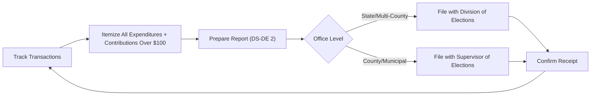

# Florida Disclosure & Reporting Requirements

> **STALENESS WARNING:** This reference was written in April 2026. Filing deadlines,
> itemization thresholds, and electronic filing rules may change through legislation or
> Division of Elections rulemaking. Always verify current requirements at
> https://dos.fl.gov/elections/ before filing.

> **EDUCATIONAL DISCLAIMER:** This document is for educational and informational purposes
> only. It does not constitute legal advice. Campaigns should consult a qualified election
> law attorney or the Florida Division of Elections for guidance specific to their situation.

---

## Filing Agency

Campaign finance reports are filed with the **Florida Division of Elections** (for state
and multi-county offices) or the **local Supervisor of Elections** (for county and
municipal offices).

- **Electronic filing:** Required for all candidates and committees. Florida mandates
  electronic filing through its online system.
- **Filing system:** Florida Division of Elections Campaign Finance Database at
  https://dos.fl.gov/elections/candidates-committees/campaign-finance/
- **Supervisor of Elections:** Each of Florida's 67 counties has an elected Supervisor
  of Elections who administers local elections and receives local candidate filings.

---

## Report Types

### Regular Reports (Non-Election Year / Off-Cycle)

Committees and candidates with open accounts must file regular reports even when not on
the ballot.

| Report | Coverage Period | Due Date |
|--------|---------------|----------|
| Monthly reports (M1-M12) | Calendar month | 10th day of the following month |

Monthly reporting applies during non-election periods.

### Election-Year Reports

During an election year, the reporting schedule intensifies as the election approaches.

| Report | Coverage | Due Date |
|--------|----------|----------|
| Regular monthly reports | Calendar month | 10th of following month |
| 60-Day Pre-Primary | Through 60 days before primary | 60 days before primary |
| 10-Day Pre-Primary | Through 10 days before primary | 10 days before primary |
| 60-Day Pre-General | Through 60 days before general | 60 days before general |
| 10-Day Pre-General | Through 10 days before general | 10 days before general |

### Special Election Reports

Special elections follow a condensed reporting schedule specified in the proclamation
calling the election.

### Termination Report

A campaign closing must file a final report (TR) showing a zero balance with no
outstanding debts, accompanied by a termination statement.

---

## Itemization Thresholds

### Contributions

| Category | Threshold | Required Information |
|----------|-----------|---------------------|
| Itemized contributions | $100 or more (cumulative) | Full name, address, occupation, employer, date, amount |
| Non-itemized contributions | Under $100 | May be reported in aggregate |
| Anonymous contributions | $50 or less | Permitted; reported in aggregate |
| Anonymous contributions | Over $50 | **Prohibited** -- must return or escheat to state |

### Expenditures

| Category | Threshold | Required Information |
|----------|-----------|---------------------|
| All expenditures | All amounts | Payee name, address, date, amount, purpose |

Florida requires itemization of **all expenditures** regardless of amount. This is
more stringent than many states.

---

## 24-Hour Reporting (Final 5 Days)

Contributions of **$1,000 or more** received during the **last 5 days before an
election** must be reported within **24 hours** of receipt.

This applies to:
- Direct monetary contributions
- In-kind contributions valued at $1,000 or more
- The report must be filed electronically.

---

## Independent Expenditure Reports

Any person or committee making independent expenditures must report them:

- **$5,000 or more:** Must file an independent expenditure report with the Division
  of Elections within 24 hours.
- Reports must identify the candidate supported or opposed and whether the expenditure
  was for or against.
- Independent expenditures must include a disclaimer identifying the person or committee
  paying for the communication.

---

## Electioneering Communications Organization (ECO) Reports

ECOs must file reports on the same schedule as political committees:

- Monthly reports during off-cycle periods.
- Pre-election reports during election periods.
- All contributions and expenditures must be disclosed.
- ECOs that make electioneering communications within 30 days of a primary or 60 days
  of a general election must include disclaimers.

---

## Report Forms and Electronic Filing

| Form / Report | Purpose |
|--------------|---------|
| DS-DE 9 | Appointment of Campaign Treasurer |
| DS-DE 2 | Campaign Treasurer's Report (main filing) |
| DS-DE 13 | Report of Independent Expenditure |
| DS-DE 100 | Candidate Oath |
| DS-DE 84 | Statement of Candidate (financial disclosure) |

### Electronic Filing Details

- **Mandatory:** All candidates and committees must file electronically. Florida does
  not accept paper filings for campaign finance reports.
- **System:** The Division of Elections provides an online filing portal.
- **Local filing:** County and municipal candidates file through their local Supervisor
  of Elections' electronic system.
- **Real-time disclosure:** Reports are available to the public online immediately upon
  filing.

---

## Record-Keeping Requirements

- **Bank account:** All campaign funds must be deposited in a single campaign depository
  (bank) designated at the time of treasurer appointment.
- **Separate accounts:** Campaign accounts must be separate from personal accounts.
- **Deposit timeline:** Contributions must be deposited within 5 business days of receipt.
- **Record retention:** All records must be retained for at least 4 years after the
  election or until termination and final audit, whichever is later.
- **Petty cash:** A petty cash fund of up to $500 may be maintained; all petty cash
  disbursements must be documented.

---

## Penalties for Non-Compliance

| Violation | Penalty |
|-----------|---------|
| Late filing | $50/day for first 3 days, then $500/day (up to 25% of total receipts/expenditures) |
| Failure to file | Automatic fine + potential disqualification from ballot |
| Exceeding contribution limits | Fine up to $5,000; excess must be returned |
| Filing false reports | First-degree misdemeanor (up to 1 year jail, $1,000 fine) |
| Willful violations | Third-degree felony (up to 5 years prison, $5,000 fine) |
| Failure to report IEs | $50/day per report |

The Florida Elections Commission investigates complaints and may impose administrative
fines, refer matters to the state attorney, or recommend further action.

---

## Candidate Financial Disclosure (Form 6)

Candidates for state and county office must file a **Full and Public Disclosure of
Financial Interests (Form 6)** or a **Statement of Financial Interests (Form 1)**:

- **Form 6:** Required for candidates for Governor, Cabinet, state legislature, county
  commission, and other specified offices. Discloses net worth, assets, liabilities,
  income, and interests.
- **Form 1:** Required for candidates for municipal office, school board, and special
  district. Less detailed than Form 6.
- **Filing deadline:** Filed with the Supervisor of Elections at the time of qualifying
  or within 30 days of qualifying.

---

## Sources & Verification

- Florida Statutes, Chapter 106 (Campaign Financing)
- Florida Statutes, Chapter 112 (Financial Disclosure)
- Florida Division of Elections, Candidate Handbook
- Florida Administrative Code, Chapter 1S-2
- https://dos.fl.gov/elections/
- Last verified: April 2026
