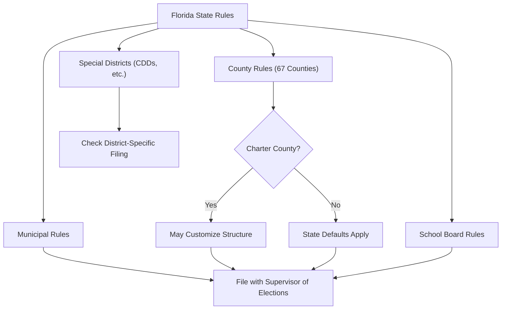

# Florida Local Office Election Rules

> **STALENESS WARNING:** This reference was written in April 2026. Local election rules
> in Florida vary by jurisdiction and are subject to change through charter amendments,
> ordinances, and state legislation. Always verify current rules with the relevant
> Supervisor of Elections or local election authority.

> **EDUCATIONAL DISCLAIMER:** This document is for educational and informational purposes
> only. It does not constitute legal advice. Campaigns should consult a qualified election
> law attorney or the relevant election authority for guidance specific to their situation.

---

## Overview

Florida local elections operate under state law (Chapters 97-106 and 166, Florida
Statutes) supplemented by county charters and municipal charters/ordinances. Florida's
67 counties each have an elected **Supervisor of Elections** who administers elections.
Charter counties and charter municipalities may adopt additional rules regarding election
procedures, term limits, and (in limited cases) campaign finance.

---

## Miami-Dade County

### Election Authority

| Field | Details |
|-------|---------|
| **Authority** | Miami-Dade County Elections Department |
| **Supervisor of Elections** | Miami-Dade Supervisor of Elections |
| **Website** | https://www.miamidade.gov/elections/ |

### Key Rules

- **Charter county:** Miami-Dade operates under a home-rule charter with a county mayor
  and 13-member Board of County Commissioners.
- **Nonpartisan elections:** County commission and mayoral races are nonpartisan.
- **Election timing:** County elections are held in **even-numbered years** on the same
  dates as state primary and general elections.
- **Term limits:** County mayor and commissioners limited to **two consecutive four-year
  terms**.
- **Campaign finance:** State rules apply ($3,000/election). Miami-Dade does not impose
  additional local contribution limits for county offices.
- **Municipalities:** Miami-Dade contains 34 municipalities, each with its own elected
  officials and election schedule. Many hold municipal elections in **odd-numbered years**
  (typically November).

### Notable Municipalities

| Municipality | Election Timing | Key Features |
|-------------|----------------|-------------|
| City of Miami | November, odd years | Strong-mayor form; 5 commissioners from districts |
| Miami Beach | November, odd years | Commission-manager form; 7 commissioners |
| Hialeah | November, odd years | Mayor-council form; 6 council members |
| Coral Gables | April, odd years | Commission-manager form; 5 commissioners |

---

## Broward County

### Election Authority

| Field | Details |
|-------|---------|
| **Authority** | Broward County Supervisor of Elections |
| **Website** | https://www.browardvotes.com |

### Key Rules

- **Charter county:** Broward operates under a home-rule charter with a county
  administrator model and 9-member County Commission.
- **Nonpartisan elections:** County commission races are nonpartisan.
- **Election timing:** County elections in **even-numbered years**.
- **Term limits:** Commissioners limited to **three consecutive four-year terms**.
- **Campaign finance:** State rules apply. No additional local contribution limits for
  county offices.
- **Municipalities:** Broward contains 31 municipalities. Municipal election schedules
  vary.
- **School board:** Broward County School Board (9 members) -- nonpartisan, elected in
  even-numbered years.

---

## Palm Beach County

### Election Authority

| Field | Details |
|-------|---------|
| **Authority** | Palm Beach County Supervisor of Elections |
| **Website** | https://www.pbcelections.org |

### Key Rules

- **Charter county:** Palm Beach operates under a home-rule charter with a county
  administrator and 7-member Board of County Commissioners.
- **Nonpartisan elections:** County commission races are nonpartisan.
- **Election timing:** County elections in **even-numbered years**.
- **Term limits:** Commissioners limited to **two consecutive four-year terms**.
- **Campaign finance:** State rules apply. No additional local limits.
- **Municipalities:** Palm Beach County contains 39 municipalities. Notable cities
  include West Palm Beach, Boca Raton, and Delray Beach.
- **Inspector General:** Palm Beach County has an Office of Inspector General that
  reviews ethics and campaign finance compliance.

---

## County Constitutional Officers

Florida counties elect constitutional officers who serve 4-year terms:

| Office | Election Cycle | Notes |
|--------|---------------|-------|
| Sheriff | Gubernatorial cycle | Partisan (except in charter counties that specify nonpartisan) |
| Property Appraiser | Gubernatorial cycle | Partisan |
| Tax Collector | Gubernatorial cycle | Partisan |
| Supervisor of Elections | Gubernatorial cycle | Partisan |
| Clerk of the Circuit Court | Gubernatorial cycle | Partisan |

### Key Rules

- Constitutional officers are elected countywide in **partisan** elections (unless a
  county charter specifies otherwise).
- Filing: Through party qualifying during the state qualifying period.
- Campaign finance: State rules apply ($3,000/election).
- Some charter counties have abolished elected constitutional officer positions and
  replaced them with appointed positions.

---

## Municipal Elections (General)

Florida municipalities hold elections under their charters and state law:

### Common Patterns

| Feature | Typical Rule |
|---------|-------------|
| Partisan/Nonpartisan | **Nonpartisan** (vast majority of Florida municipalities) |
| Election timing | March, May, or November (varies by charter) |
| Runoff | If no candidate receives a majority, a runoff is held |
| Term limits | Set by charter (commonly 2-3 consecutive terms) |
| Filing | File with the city clerk or qualifying officer |
| Campaign finance | State rules apply ($3,000/election) |

### Municipal Campaign Finance

- State contribution limits ($3,000/election) apply to all municipal candidates.
- Some municipalities have adopted **additional local contribution limits** lower than
  the state limit. However, there is ongoing legal debate about whether municipalities
  have authority to impose limits stricter than state law.
- Municipal candidates file campaign finance reports with the **municipal filing
  officer** (typically the city clerk).

---

## School Board Elections

- **Nonpartisan elections** held in **even-numbered years** on the same ballot as the
  primary election (August).
- School board members serve **four-year terms**.
- **Qualifying:** By filing fee (typically 4% of salary) or petition.
- **Campaign finance:** State rules apply ($3,000/election).
- **Filing:** Reports filed with the Supervisor of Elections.
- **67 school districts** (one per county) in Florida.
- Some school districts have single-member districts; others have at-large seats.

---

## Special District Elections

Florida has over 1,800 special districts (water management, fire rescue, community
development, etc.), many with elected governing boards.

- **Independent special districts:** Hold their own elections, typically in November.
- **Dependent special districts:** May have appointed boards or elections administered
  by the county.
- **Qualifying:** Candidates qualify by filing with the district (or Supervisor of
  Elections if the election is administered by the county).
- **Campaign finance:** State rules apply if campaign activity exceeds reporting
  thresholds.
- **Community Development Districts (CDDs):** Unique to Florida; CDD supervisors are
  initially appointed by the developer, then elected by residents after a threshold
  number of registered voters reside in the district.

---

## Supervisor of Elections Role

The Supervisor of Elections is central to Florida's election administration:

- **Elected countywide** in partisan elections (gubernatorial cycle).
- **Responsibilities:** Voter registration, ballot preparation, polling place
  management, canvassing, and local candidate qualifying.
- **Campaign finance:** Receives and maintains campaign finance reports for county
  and municipal candidates.
- **Independence:** Each county's Supervisor operates independently; there is no
  statewide unified election administration.

---

## Judicial Elections (Local Level)

- **Circuit court judges:** Nonpartisan elections in even-numbered years. If a
  qualifying candidate is unopposed, they win without appearing on the ballot.
- **County court judges:** Same nonpartisan election process.
- **Retention elections:** Appellate judges face retention votes (yes/no, no opponent).
- **Campaign finance:** State rules apply ($3,000/election). Judicial candidates are
  also subject to the Code of Judicial Conduct, which restricts certain campaign
  activities.

---

## Sources & Verification

- Florida Statutes, Chapters 97-106 (Florida Election Code)
- Florida Statutes, Chapter 166 (Municipalities)
- Florida Statutes, Chapter 125 (County Government)
- Florida Division of Elections, Candidate Handbook
- Miami-Dade County Charter
- Broward County Charter
- Palm Beach County Charter
- https://dos.fl.gov/elections/
- Last verified: April 2026
