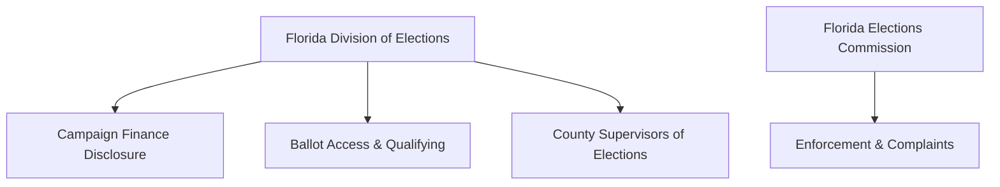

# Florida Campaign Finance Overview

> **STALENESS WARNING:** This reference reflects Florida Statutes Chapter 106 and Division of Elections rules as of early 2025. The Florida Legislature meets annually and may amend campaign finance law. Contribution limits and thresholds are set by statute and do not automatically adjust for inflation. Always verify current requirements at [dos.state.fl.us/elections/](https://dos.state.fl.us/elections/).

> **EDUCATIONAL DISCLAIMER:** This is educational information, not legal advice. Florida campaign finance law includes unique provisions such as resign-to-run requirements and closed primary rules that can have major consequences for candidates. Consult a Florida election law attorney for guidance specific to your campaign.

---

## Filing Agency

**Florida Division of Elections** (within the Department of State)
- Website: [dos.state.fl.us/elections/](https://dos.state.fl.us/elections/)
- Administers campaign finance disclosure for statewide, legislative, and multicounty candidates
- County and municipal candidates file with their **Supervisor of Elections** or local filing officer
- The Florida Elections Commission handles enforcement and complaints

---

## Unique Features of Florida Campaign Finance Law

1. **$3,000 per election contribution limit** for statewide and legislative candidates (as of 2019 statutory change)
2. **Resign-to-run law** -- elected officials must resign their current office before qualifying for another office if the terms overlap, with specific exceptions
3. **Closed primary system** -- only registered party members may vote in that party's primary, unless all candidates are of the same party and no write-in or opposition candidate qualifies
4. **Electioneering Communications Organizations (ECOs)** -- a unique Florida entity type for organizations that make electioneering communications
5. **Political committees and Committees of Continuous Existence (CCEs)** -- CCEs were grandfathered entities; new formations follow political committee rules
6. **Qualifying by fee or petition** -- candidates may qualify by paying a fee or collecting petition signatures

---

## Contribution Limits

| Donor Type | To Candidate (per election) | To Political Committee | Notes |
|-----------|---------------------------|----------------------|-------|
| Individual | **$3,000** | **No limit** | Per election (primary and general are separate) |
| Corporation | **$3,000** | **No limit** | Corporations may contribute directly |
| PAC / Political Committee | **$3,000** | **No limit** | Per election |
| Political Party (state/county exec. committee) | **$50,000** per election (statewide); scaled for other offices | **No limit** | Higher limits for party committees |
| Candidate to Own Campaign | **No limit** | N/A | Personal funds are unlimited |
| Cash (any source) | **$50 max** | **$50 max** | Over $50 must be by check, card, or electronic |
| Out-of-State Contributions | Same limits apply | Same limits | Must comply with Florida disclosure rules |

### Election-Specific Notes
- Primary and general elections are treated as **separate elections** for contribution limit purposes
- A runoff, if applicable, is a separate election
- Contributions to a candidate who is unopposed and has no opposition in either the primary or general may only accept contributions for one election

---

## Committee Registration

### Candidate Committees (Campaign Accounts)
- Candidates must open a **campaign depository** (bank account) before soliciting or receiving contributions
- File **Form DS-DE 9** (Appointment of Campaign Treasurer and Designation of Campaign Depository) with the Division of Elections or local filing officer
- Must designate a campaign treasurer (may be the candidate)

### Political Committees
- Must register with the Division of Elections before accepting contributions or making expenditures
- File **Form DS-DE 5** for registration
- Must maintain detailed records of all contributions and expenditures

### Electioneering Communications Organizations (ECOs)
- Must register before making electioneering communications
- Subject to disclosure requirements but not contribution limits on the receiving side

---

## Ballot Access

### Major Party Candidates
- **Qualifying period:** Typically a one-week window in June of the election year (set by statute)
- **Qualifying fee:** 4-6% of annual salary of the office sought (varies by office)
- **Petition alternative:** Collect signatures equal to 1% of registered voters in the district (for partisan candidates) -- petition signatures must be collected from voters registered with the candidate's party
- Must meet **residency requirements** specific to the office

### No-Party Affiliation (NPA) and Minor Party Candidates
- Petition requirement: 1% of registered voters in the district for NPA candidates (no party restriction on signers)
- Minor party candidates must qualify through their party's nomination process
- Write-in candidates file qualifying papers without a fee but receive no listed party affiliation on the ballot

### Resign-to-Run (Florida Statute 99.012)
- Any state, county, or municipal officer who qualifies for **another** state, county, or municipal office must **resign** from their current office if the terms would overlap
- The resignation is **irrevocable** once submitted
- Exceptions exist for running for federal office, or if the current term expires before the new term begins
- This applies even to running in a primary -- the resignation must be submitted at the time of qualifying

---

## Reporting Schedule

### Regular Reports
Florida uses a fixed schedule of reporting deadlines that varies by election year. The Division of Elections publishes a specific calendar each cycle.

### Election-Year Reports (Typical)
| Report | Due Date | Coverage |
|--------|----------|----------|
| Quarterly reports | As scheduled (Jan-Mar, Apr-Jun, Jul-Sep, Oct-Dec) | Standard quarterly periods |
| **60-day report** | 60 days before the primary or general election | Covers through previous period |
| **10-day report** | 10 days before the primary or general election | Covers through 11 days before election |
| **4-day report** | 4 days before the election (some races) | Late contributions |

### Non-Election Year Reports
- Quarterly reports on the 10th day following the end of each calendar quarter

### 24-Hour Reporting
- Contributions of **$1,000 or more** received after the last pre-election report must be reported within **24 hours**

### Itemization
- **All contributions** regardless of amount must be reported with the contributor's name and address
- Contributions over **$100** require occupation and employer information
- All expenditures must be itemized

---

## Prohibited Contributions

- Contributions exceeding the **$3,000 per election** limit (for applicable races)
- **Cash contributions exceeding $50**
- Contributions in the **name of another** (straw donors)
- **Foreign national** contributions
- Contributions from **state-regulated utilities** to candidates for certain offices (Public Service Commission)
- **Anonymous contributions exceeding $50** -- must be donated to charity
- Contributions from persons or entities not authorized to make political contributions under Florida law

---

## Key Differences from Federal Law

| Feature | Federal | Florida |
|---------|---------|---------|
| Individual contribution limit | $3,300/election (2023-24) | **$3,000/election** |
| Corporate contributions | Prohibited | **Allowed** (up to $3,000) |
| Union contributions | Prohibited (direct) | **Allowed** (up to $3,000) |
| Cash contribution cap | $100 | **$50** |
| Resign-to-run requirement | None | **Yes** (for overlapping state/local terms) |
| Primary type | Varies by state | **Closed** |
| Reporting frequency | Quarterly/monthly | Quarterly + 60-day/10-day pre-election |
| Public financing | Presidential only | **None at state level** |
| Electioneering communications orgs | No equivalent entity type | **ECOs are a distinct entity** |

---

## Local Rules Notes

- **County and municipal races** follow Florida Statutes Chapter 106 but candidates file with the local Supervisor of Elections or city clerk
- Some municipalities have enacted **lower contribution limits** for city races (e.g., some cities cap at $1,000)
- **Miami-Dade County** has its own ethics commission and additional campaign finance rules
- Local special districts may have separate filing requirements
- Check with the local Supervisor of Elections for jurisdiction-specific rules, qualifying dates, and filing procedures
- Some municipalities have **non-partisan elections** even though the state uses a closed primary for state offices

---

## Florida Elections Commission

The **Florida Elections Commission** (separate from the Division of Elections) is the enforcement body:
- Investigates complaints about campaign finance violations
- Can impose fines for late filing, excessive contributions, and other violations
- Late filing fines are **$50 per day** for the first 3 days and **$500 per day** after that
- Willful violations can result in fines up to $5,000 per violation and referral for criminal prosecution

---

## Resources

- **Florida Division of Elections:** [dos.state.fl.us/elections/](https://dos.state.fl.us/elections/)
- **Florida Elections Commission:** [fec.state.fl.us](https://fec.state.fl.us)
- **Florida Statutes Chapter 106:** Campaign financing
- **Florida Statutes Chapter 99:** Candidate qualifying (including resign-to-run)
- **Campaign Finance Filing System:** [dos.elections.myflorida.com/campaign-finance/](https://dos.elections.myflorida.com/campaign-finance/)
