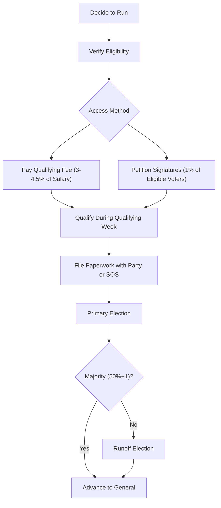

# Georgia Ballot Access (Detailed)

> **STALENESS WARNING:** This reference was written in April 2026. Georgia ballot access
> requirements, qualifying fees, and deadlines are subject to legislative changes.
> Verify current requirements at https://sos.ga.gov/elections before filing.

> **EDUCATIONAL DISCLAIMER:** This document is for educational and informational purposes
> only. It does not constitute legal advice. Candidates should consult a qualified election
> law attorney or the Georgia Secretary of State's office for guidance specific to their
> situation.

---

## Overview

Georgia uses a qualifying fee system as the primary ballot access mechanism for
major party candidates. The state's majority-vote requirement for all elections
means runoffs are common, and candidates must be prepared for the possibility of
multiple election rounds.

---

## Qualifying Fees

Major party candidates must pay a qualifying fee based on a percentage of the
annual salary of the office sought.

### Statewide Offices

| Office | Fee (% of Annual Salary) | Approximate Fee |
|--------|--------------------------|-----------------|
| Governor | 4.5% | ~$9,000 |
| Lieutenant Governor | 4.5% | ~$4,500 |
| Secretary of State | 3% | ~$3,800 |
| Attorney General | 3% | ~$5,000 |
| State School Superintendent | 3% | ~$4,600 |
| Commissioner of Insurance | 3% | ~$3,800 |
| Commissioner of Agriculture | 3% | ~$3,800 |
| Commissioner of Labor | 3% | ~$3,800 |

### Legislative Offices

| Office | Fee (% of Annual Salary) | Approximate Fee |
|--------|--------------------------|-----------------|
| State Senate | 3% | ~$530 |
| State House | 3% | ~$530 |

### Judicial Offices

| Office | Fee (% of Annual Salary) |
|--------|--------------------------|
| Supreme Court Justice | 3% |
| Court of Appeals Judge | 3% |
| Superior Court Judge | 3% |

### Fee Notes
- Fees are calculated on the annual salary at the time of qualifying
- Fees are paid to the state or county party committee (for partisan offices)
- Fees are non-refundable

---

## Petition Alternative to Qualifying Fee

Candidates who cannot or choose not to pay the qualifying fee may qualify by
petition instead.

| Office Level | Signatures Required |
|-------------|---------------------|
| Statewide offices | 1% of eligible voters in jurisdiction |
| State Senate | 1% of eligible voters in district |
| State House | 1% of eligible voters in district |
| County offices | 1% of eligible voters in jurisdiction |

### Petition Checklist
- [ ] Obtain petition forms from Secretary of State or county election office
- [ ] Collect signatures from registered voters in the jurisdiction
- [ ] Each petition page must include circulator affidavit
- [ ] File petitions by the qualifying deadline
- [ ] Signatures verified by county registrar

---

## Qualifying Period

Georgia has a specific "qualifying week" during which candidates must formally
qualify (file paperwork and pay fees):

| Detail | Rule |
|--------|------|
| Timing | Typically in March of the election year (set by party) |
| Duration | 3-day window (Monday through Wednesday, typically) |
| Location | State party headquarters (statewide) or county party (local) |
| Hours | Set by the qualifying party |

### Qualifying Week Checklist
- [ ] Confirm exact qualifying dates with state or county party
- [ ] Prepare qualifying fee payment (check or money order)
- [ ] Bring completed candidate affidavit
- [ ] File financial disclosure (if required for the office)
- [ ] Bring valid photo identification
- [ ] Confirm party registration status

---

## Majority-Vote Requirement and Runoffs

Georgia requires a **majority** of votes (50%+1) to win any election. If no
candidate receives a majority, the top two vote-getters advance to a runoff.

| Election | Runoff Timing |
|----------|---------------|
| Primary runoff | Typically 4 weeks after primary |
| General runoff | Typically 4 weeks after general (28 days per SB 202) |

### Runoff Implications
- [ ] Budget for a potential runoff election
- [ ] Contribution limits apply separately to each election (including runoffs)
- [ ] Filing and reporting requirements apply to each runoff period
- [ ] Voter turnout typically drops significantly in runoffs

---

## Independent Candidate Requirements

Independent candidates (no party affiliation) must qualify by petition:

| Office | Signatures Required | Filing Deadline |
|--------|--------------------|-----------------| 
| Statewide | 1% of registered voters | July (varies by year) |
| Congressional | 1% of registered voters in district | July |
| State legislative | 1% of registered voters in district | July |

### Independent Candidate Checklist
- [ ] Cannot have been a member of a political party in the past year (varies)
- [ ] File notice of candidacy
- [ ] Collect petition signatures from registered voters
- [ ] File petition by deadline with Secretary of State
- [ ] Pay any required filing fee

---

## Special Election Procedures

When a vacancy occurs in an elected office, the Governor typically calls a
special election:

| Detail | Rule |
|--------|------|
| Called by | Governor's proclamation |
| Qualifying | Special qualifying period set by proclamation |
| Timeline | Compressed schedule (varies by office and timing) |
| Runoff | Majority-vote requirement still applies |

---

## Party Qualifying vs. Nonpartisan Qualifying

| Type | Offices | Qualifying Authority |
|------|---------|---------------------|
| Partisan qualifying | Governor, legislature, county partisan offices | State/county party committee |
| Nonpartisan qualifying | Judges, school boards, some local offices | Secretary of State or county superintendent |

---

## Sources & Verification

- O.C.G.A. Title 21, Chapters 2 and 5
- Georgia Secretary of State Elections Division
- Georgia Government Transparency and Campaign Finance Commission
- https://sos.ga.gov/elections
- https://ethics.ga.gov
- Last verified: April 2026
