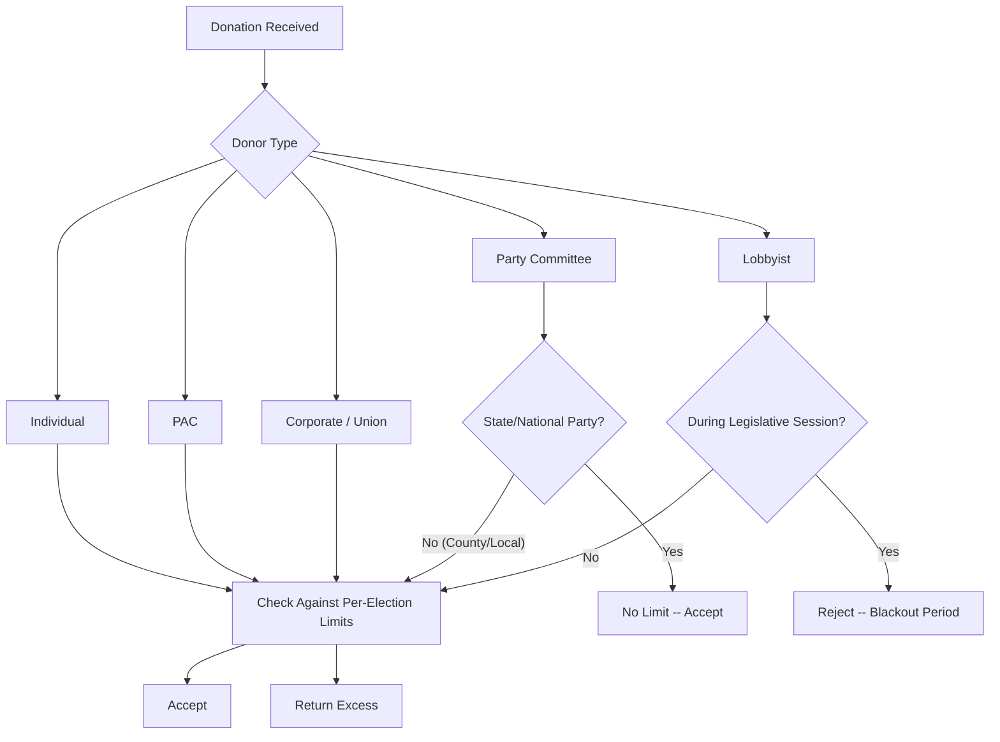

# Georgia Contribution Limits (Detailed)

> **STALENESS WARNING:** This reference was written in April 2026. Georgia contribution
> limits are set by statute and may be adjusted by the General Assembly. The figures
> shown here reflect current law as of the 2025-2026 cycle. Verify current limits at
> https://ethics.ga.gov before making compliance decisions.

> **EDUCATIONAL DISCLAIMER:** This document is for educational and informational purposes
> only. It does not constitute legal advice. Campaigns should consult a qualified election
> law attorney or the Georgia Government Transparency and Campaign Finance Commission
> (formerly Ethics Commission) for guidance specific to their situation.

---

## Background

Georgia's campaign finance laws are codified in Title 21, Chapter 5 of the Official
Code of Georgia Annotated (O.C.G.A.). The Georgia Government Transparency and Campaign
Finance Commission administers and enforces these laws. Key features:

- **Per-election limits:** Primary, primary runoff, general, and general runoff each
  count as separate elections.
- **Corporate contributions allowed:** Georgia permits direct corporate treasury
  contributions to candidates.
- **Lobbyist blackout period:** Lobbyists face restrictions during the legislative session.
- **Runoff significance:** Georgia's majority-vote requirement frequently triggers runoffs,
  making the per-election structure particularly important.

---

## Current Limits

All limits are **per election**. With Georgia's majority-vote requirement, a
candidate could potentially participate in four elections (primary, primary runoff,
general, general runoff), and a donor may give the limit for each.

### Individual Contributions to Candidates

| Office | Limit Per Election |
|--------|--------------------|
| Governor | $7,600 |
| Lieutenant Governor | $7,600 |
| Secretary of State | $7,600 |
| Attorney General | $7,600 |
| Other statewide constitutional offices | $7,600 |
| State Senate | $3,800 |
| State House of Representatives | $3,800 |

### Corporate Contributions to Candidates

| Office | Limit Per Election |
|--------|--------------------|
| Statewide offices | $7,600 |
| State Senate | $3,800 |
| State House | $3,800 |

Georgia is one of the states that allows direct corporate treasury contributions
to candidates, subject to the same limits as individual contributions.

### PAC Contributions to Candidates

| Office | Limit Per Election |
|--------|--------------------|
| Statewide offices | $7,600 |
| State Senate | $3,800 |
| State House | $3,800 |

PAC limits mirror individual contribution limits. There is no special elevated
or reduced limit for PACs.

### Party Committee Contributions to Candidates

| Donor | Limit |
|-------|-------|
| State/national party committee | **No limit** |
| County/local party committee | Subject to standard limits |

State and national party committees may contribute unlimited amounts to candidates.
County and district party committees are subject to the same limits as individuals.

### Contributions to PACs and Party Committees

| Donor Type | To a PAC | To a Party Committee |
|------------|----------|---------------------|
| Individual | **No limit** | **No limit** |
| Corporation | **No limit** | **No limit** |
| Union | **No limit** | **No limit** |
| PAC to PAC | **No limit** | **No limit** |

---

## Lobbyist Session-Period Blackout

Georgia imposes a blackout on lobbyist contributions during the legislative session:

| Rule | Details |
|------|---------|
| Blackout period | During the legislative session (typically Jan-Mar/Apr) |
| Applies to | Registered lobbyists |
| Restricted recipients | Members of the General Assembly, Governor, Lt. Governor |
| Penalty | Civil fines; potential criminal prosecution |

### Lobbyist Contribution Checklist
- [ ] Determine session dates for the current year
- [ ] No contributions to covered officials during session
- [ ] Lobbyist employers and PACs are NOT subject to blackout (only individual lobbyists)
- [ ] Blackout applies to the lobbyist personally, not to their clients or firm

---

## Bundled Contributions

Georgia law addresses aggregation of bundled contributions:

| Rule | Details |
|------|---------|
| Definition | Collecting and forwarding multiple contributions from others |
| Attribution | Each individual contribution counts against that donor's limit |
| Reporting | Bundler's identity must be reported if total exceeds threshold |
| Lobbyist bundling | Subject to additional disclosure requirements |

---

## Self-Funding

Candidates may contribute **unlimited** amounts from their own personal funds
to their own campaign committee. There is no self-funding trigger or matching
provision.

---

## Aggregate Limits

Georgia does **not** impose aggregate limits. A donor may give the maximum to
every candidate in the state.

---

## Special Rules

### In-Kind Contributions
In-kind contributions count against limits at fair market value.

### Loans
- Bank loans on commercially reasonable terms are not contributions
- Personal loans from individuals are contributions subject to limits
- Candidate self-loans are unlimited

### Cash Contributions
Cash contributions over $100 are prohibited.

### Anonymous Contributions
Contributions over $100 from unknown sources are prohibited.

---

## Prohibited Contributions (Quick Reference)

| Source | Permitted? | Notes |
|--------|-----------|-------|
| Individuals | Yes | Subject to limits |
| Corporations | Yes | Subject to limits |
| Unions | Yes | Subject to limits |
| PACs | Yes | Subject to limits |
| State/national party committees | Yes | **No limit** |
| Foreign nationals | **No** | Prohibited |
| Anonymous (over $100) | **No** | Must identify donor |
| Cash (over $100) | **No** | Must use traceable method |
| Lobbyists (during session) | **No** | Blackout period applies |

---

## Sources & Verification

- O.C.G.A. Title 21, Chapter 5 (Georgia Election Code)
- Georgia Government Transparency and Campaign Finance Commission
- https://ethics.ga.gov
- Last verified: April 2026
