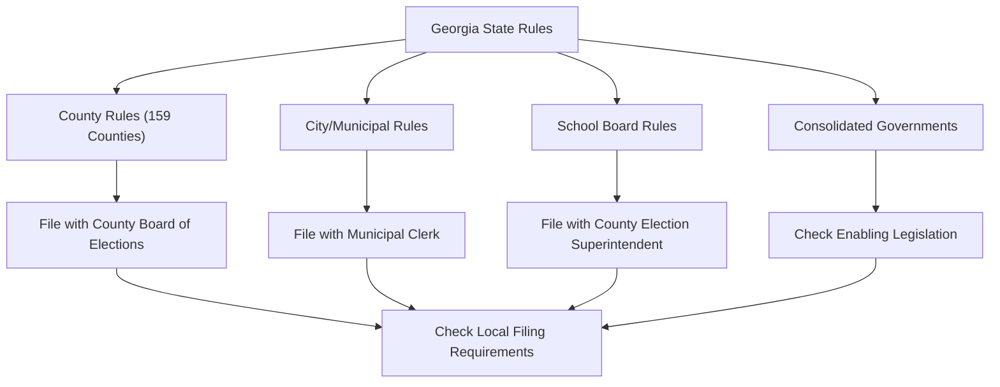

# Georgia Local Election Rules (Detailed)

> **STALENESS WARNING:** This reference was written in April 2026. Local election rules
> in Georgia vary by county and municipality. Many local governments operate under
> individual enabling legislation. Verify current local requirements with the appropriate
> county board of elections or municipal clerk before filing.

> **EDUCATIONAL DISCLAIMER:** This document is for educational and informational purposes
> only. It does not constitute legal advice. Candidates should consult a qualified election
> law attorney or the relevant local election authority for guidance specific to their
> situation.

---

## Overview

Georgia has 159 counties (second most in the nation) and hundreds of municipalities.
Local election administration is handled by county boards of elections and registration,
while some cities conduct their own elections. Georgia's majority-vote/runoff
requirement applies to local elections as well.

---

## City of Atlanta

### Government Structure

| Office | Details |
|--------|---------|
| Mayor | 4-year term, nonpartisan election |
| City Council | 15 members (12 district, 3 at-large), 4-year terms |
| City Council President | At-large, 4-year term |
| Election type | Nonpartisan with runoff if no majority |

### Atlanta Election Rules
- [ ] Nonpartisan elections held in odd-numbered years (November)
- [ ] Runoff held if no candidate receives majority
- [ ] Campaign finance reports filed with Atlanta Municipal Clerk and state
- [ ] State contribution limits apply
- [ ] Atlanta ethics code imposes additional restrictions on city officials

### Atlanta Campaign Finance
- State contribution limits apply ($7,600 statewide equivalent for city-wide,
  $3,800 for district council)
- City of Atlanta Ethics Office monitors compliance
- Additional pay-to-play restrictions for city contractors

---

## Fulton County

Fulton County encompasses most of the City of Atlanta plus northern suburbs.

| Office | Details |
|--------|---------|
| Board of Commissioners | 7 members (by district), 4-year terms |
| Chairman | Elected county-wide, 4-year term |
| Other elected offices | Sheriff, District Attorney, Clerk of Superior Court, Tax Commissioner |
| Election type | Partisan primary and general |

### Fulton County Notes
- [ ] Partisan elections in even-numbered years
- [ ] State contribution limits and disclosure rules apply
- [ ] File with Fulton County Board of Elections
- [ ] Qualifying through county party committee during qualifying week

---

## DeKalb County

| Office | Details |
|--------|---------|
| CEO (Chief Executive Officer) | Elected, 4-year term |
| Board of Commissioners | 7 members (5 district, 2 super-district), 4-year terms |
| Other elected offices | Sheriff, DA, Clerk, Tax Commissioner |
| Election type | Partisan |

### DeKalb County Notes
- [ ] Unique CEO-commission form of government
- [ ] Ethics board with oversight authority
- [ ] State campaign finance rules apply
- [ ] File with DeKalb County Board of Elections

---

## Gwinnett County

| Office | Details |
|--------|---------|
| Chairman | Elected county-wide, 4-year term |
| Board of Commissioners | 4 district members, 4-year terms |
| Other elected offices | Sheriff, DA, Clerk, Tax Commissioner |
| Election type | Partisan |

### Gwinnett County Notes
- [ ] Rapidly growing county with changing demographics
- [ ] Standard state campaign finance rules apply
- [ ] File with Gwinnett County Board of Elections

---

## Cobb County

| Office | Details |
|--------|---------|
| Chairman | Elected county-wide, 4-year term |
| Board of Commissioners | 4 district members, 4-year terms |
| Other elected offices | Sheriff, DA, Clerk, Tax Commissioner |
| Election type | Partisan |

### Cobb County Notes
- [ ] Standard commissioner-chairman form of government
- [ ] State campaign finance rules apply
- [ ] File with Cobb County Board of Elections

---

## Consolidated Governments

Georgia has several consolidated city-county governments. The most notable:

### Augusta-Richmond County

| Office | Details |
|--------|---------|
| Mayor | Elected, 4-year term |
| Commission | 10 members (8 district, 2 super-district), 4-year terms |
| Government type | Consolidated city-county |
| Election type | Nonpartisan |

### Other Consolidated Governments

| Entity | Type |
|--------|------|
| Athens-Clarke County | Unified government |
| Columbus-Muscogee County | Consolidated government |
| Macon-Bibb County | Consolidated government (2014) |

### Consolidated Government Notes
- [ ] Consolidated governments combine city and county functions
- [ ] Election rules specified in individual enabling legislation
- [ ] State campaign finance rules apply unless local charter specifies otherwise
- [ ] Qualifying may be through local election superintendent rather than party

---

## MARTA Board

The Metropolitan Atlanta Rapid Transit Authority (MARTA) board includes
appointed and elected/designated members:

| Detail | Rule |
|--------|------|
| Board composition | Members appointed by various jurisdictions |
| Direct election | MARTA board members are not directly elected by voters |
| Jurisdictions represented | City of Atlanta, Fulton County, DeKalb County, Clayton County |

MARTA board positions are appointed, not elected, so they do not involve
campaign finance or ballot access requirements.

---

## School Board Elections

Georgia school boards are elected in most districts:

| Detail | Rule |
|--------|------|
| Election type | Nonpartisan |
| Term length | 4 years (typically) |
| Qualifying | Through county election superintendent |
| Campaign finance | State rules apply |
| Majority requirement | Yes -- runoff if no majority |

### School Board Checklist
- [ ] Determine qualifying method (fee or petition)
- [ ] File with county election superintendent
- [ ] Register campaign committee with state (if raising/spending funds)
- [ ] Nonpartisan ballot -- no party affiliation listed
- [ ] Prepare for potential runoff election

---

## Runoff Implications at the Local Level

Georgia's majority-vote requirement affects local races significantly:

| Factor | Impact |
|--------|--------|
| Multi-candidate races | Common trigger for runoffs |
| Voter turnout in runoffs | Typically 30-60% of original election turnout |
| Cost to candidates | Must fund a second campaign effort |
| Contribution limits | Apply separately to runoff election |
| Timeline | Typically 28 days after original election |

### Runoff Planning Checklist
- [ ] Reserve campaign funds for potential runoff
- [ ] Contribution limits reset for the runoff election
- [ ] New pre-runoff disclosure report required
- [ ] Shorter campaign period requires rapid mobilization
- [ ] Absentee/early voting period compressed in runoffs

---

## Sources & Verification

- O.C.G.A. Title 21, Chapter 2
- Georgia Secretary of State Elections Division
- Individual county boards of elections
- Municipal charters and enabling legislation
- https://sos.ga.gov/elections
- Last verified: April 2026
