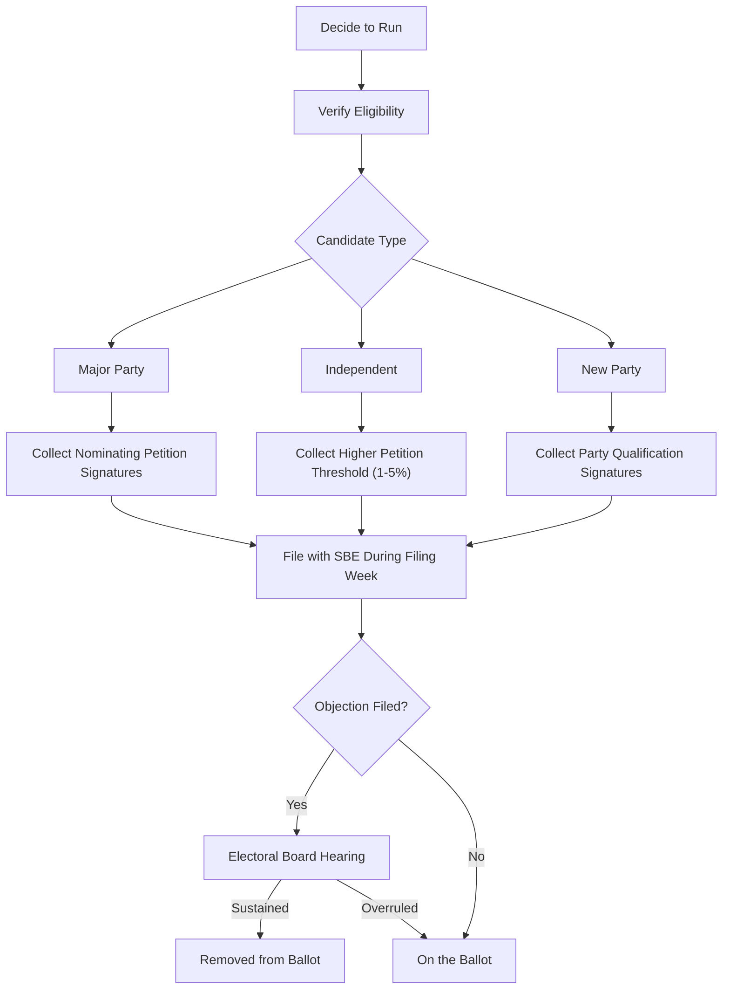

# Illinois Ballot Access Requirements

> **STALENESS WARNING:** This reference was written in April 2026. Filing deadlines,
> petition signature requirements, and fees may change through legislation or court
> order. Always verify current requirements with the Illinois State Board of Elections
> at https://www.elections.il.gov before filing.

> **EDUCATIONAL DISCLAIMER:** This document is for educational and informational purposes
> only. It does not constitute legal advice. Campaigns should consult a qualified election
> law attorney or the State Board of Elections for guidance specific to their situation.

---

## Overview

Illinois uses a partisan primary system for most offices. Major party candidates file
petitions with a set number of signatures to appear on the primary ballot. Independent
and new party candidates follow separate, more demanding petition processes. Illinois
also has an active **objection process** where petition challenges are common and
frequently result in candidates being removed from the ballot.

---

## Established Party Candidates (Primary Ballot Access)

Candidates of an established party (Democratic, Republican, or any party that received
5%+ of the vote in the last statewide election) file **nominating petitions** with the
required number of signatures.

### Statewide Offices

| Office | Signatures Required | Where Filed |
|--------|-------------------|-------------|
| Governor / Lieutenant Governor | 5,000 - 25,000 | State Board of Elections |
| Attorney General | 5,000 - 25,000 | State Board of Elections |
| Secretary of State | 5,000 - 25,000 | State Board of Elections |
| Comptroller | 5,000 - 25,000 | State Board of Elections |
| Treasurer | 5,000 - 25,000 | State Board of Elections |
| U.S. Senator | 5,000 - 25,000 | State Board of Elections |

The minimum is 5,000 and the maximum is 25,000. Candidates typically collect well above
the minimum to withstand challenges.

### Congressional and Legislative Offices

| Office | Signatures Required | Where Filed |
|--------|-------------------|-------------|
| U.S. Representative | Not less than 0.5% of qualified primary voters in district | State Board of Elections |
| State Senator | Not less than 0.5% of qualified primary voters in district (min 1,000) | State Board of Elections |
| State Representative | Not less than 0.5% of qualified primary voters in district (min 500) | State Board of Elections |

"Qualified primary voters" generally means the number of votes cast in the last primary
for the party's candidate for the relevant office or a comparable benchmark.

### County Offices

| Office | Signatures Required | Where Filed |
|--------|-------------------|-------------|
| County Board Chair / President | Varies by county population (typically 0.5% of primary voters) | County Clerk |
| County Board Member | Varies (typically 0.5%, min 25-100) | County Clerk |
| County Clerk, Treasurer, Sheriff, etc. | Varies by county | County Clerk |

### Filing Fees

Illinois does **not** charge filing fees for most offices. Ballot access is through
petition signatures only. Some local jurisdictions may charge nominal filing fees.

### Petition Signature Rules

- Signers must be **registered voters** in the relevant jurisdiction.
- Signers must be eligible to vote in the party's primary (i.e., they did not vote in
  another party's primary at the last primary election, if applicable).
- Each petition sheet must include the circulator's certification.
- Signatures must be original (no photocopies or electronic signatures).

---

## Filing Periods

| Election | Petition Filing Period |
|----------|---------------------|
| Primary (March, even years) | 106 to 99 days before primary (typically late November to early December of prior year) |
| Consolidated (April, odd years) | 113 to 106 days before election (typically mid-to-late December of prior year) |

The filing period is typically one week. Exact dates are published by the SBE.

---

## New Party and Independent Candidates

### New Party Qualification

A new political party (one that did not receive 5% of the vote in the last statewide
election) must file petitions:

| Level | Signatures Required |
|-------|-------------------|
| Statewide | 1% of votes cast in the last statewide general election (typically 25,000-35,000) |
| Congressional district | 5% of votes cast in the last general election in the district |
| Legislative district | 5% of votes cast in the last general election in the district |

### Independent Candidates

Independent candidates file petitions for the **general election** (not the primary):

| Office | Signatures Required |
|--------|-------------------|
| Statewide offices | 1% of votes cast in last statewide general election (25,000-35,000) |
| U.S. Representative | 5% of votes cast in last general in district |
| State Senator | 5% of votes cast in last general in district |
| State Representative | 5% of votes cast in last general in district |

- Independent petition filing deadline is typically in **late June** (approximately
  134 days before the general election).
- Signers must not have voted in any party primary that year.

---

## Objection Process

Illinois has a rigorous petition challenge system:

- **Who may object:** Any registered voter in the relevant jurisdiction may file an
  objection to a candidate's petition.
- **Deadline:** Objections must be filed within 5 business days after the last day of
  the filing period.
- **Grounds for objection:**
  - [ ] Insufficient valid signatures
  - [ ] Signer not registered to vote
  - [ ] Signer not in the correct jurisdiction
  - [ ] Signer voted in another party's primary
  - [ ] Duplicate signatures
  - [ ] Missing or defective circulator certification
  - [ ] Incorrect header information on petition sheets
  - [ ] Candidate ineligibility (residency, age, etc.)
- **Hearing:** Objections are heard by the relevant electoral board (State Officers
  Electoral Board for state offices, or local electoral boards).
- **Practical impact:** Objections are common in Illinois politics and frequently
  result in candidates being removed from the ballot. Meticulous petition preparation
  is critical.

### Tips for Surviving Objections

- Collect **2-3 times** the minimum number of signatures.
- Train circulators thoroughly on proper form and procedure.
- Review every petition sheet before filing for obvious errors.
- Ensure all circulators are registered voters in the relevant jurisdiction.
- Use bound volumes with sequential page numbering.

---

## Write-In Candidates

- Write-in candidates must file a **Declaration of Intent to Be a Write-In Candidate**
  with the appropriate election authority.
- **Deadline:** Typically 61 days before the election (for general elections) or the
  same as the petition filing deadline (for primaries).
- **No petition signatures** are required for write-in candidates.
- Write-in votes are counted only for candidates who have filed a valid declaration.

---

## Residency and Eligibility Requirements

| Office | Minimum Age | Residency Requirement |
|--------|------------|----------------------|
| Governor | 25 | U.S. citizen, 3 years Illinois resident |
| Lieutenant Governor | 25 | U.S. citizen, 3 years Illinois resident |
| Attorney General | 25 | U.S. citizen, Illinois resident |
| Secretary of State | 25 | U.S. citizen, Illinois resident |
| Comptroller | 25 | U.S. citizen, Illinois resident |
| Treasurer | 25 | U.S. citizen, Illinois resident |
| State Senator | 21 | 2 years Illinois resident, district resident |
| State Representative | 21 | 2 years Illinois resident, district resident |
| U.S. Senator | 30 | Illinois resident, 9 years U.S. citizen |
| U.S. Representative | 25 | Illinois resident, 7 years U.S. citizen |

---

## Key Dates (General Reference)

| Event | Typical Timing |
|-------|---------------|
| Primary petition filing period | Late November - early December (year before primary) |
| Primary election | Third Tuesday in March (even years) |
| Independent filing deadline | Late June |
| Consolidated election petition filing | Mid-to-late December (year before) |
| Consolidated election | First Tuesday in April (odd years) |
| General election | First Tuesday after first Monday in November |

---

## Sources & Verification

- Illinois Election Code (10 ILCS 5)
- SBE Candidate Guide and Filing Information
- Illinois Compiled Statutes, Chapter 10
- https://www.elections.il.gov
- Last verified: April 2026
