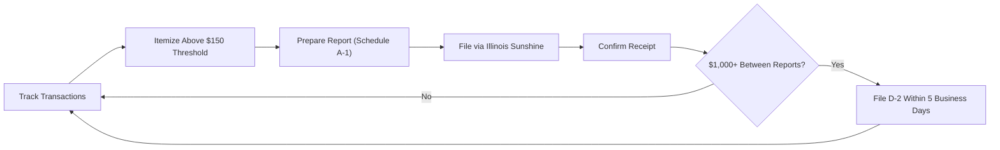

# Illinois Disclosure & Reporting Requirements

> **STALENESS WARNING:** This reference was written in April 2026. Filing deadlines,
> itemization thresholds, and electronic filing rules may change through legislation or
> SBE rulemaking. Always verify current requirements at https://www.elections.il.gov
> before filing.

> **EDUCATIONAL DISCLAIMER:** This document is for educational and informational purposes
> only. It does not constitute legal advice. Campaigns should consult a qualified election
> law attorney or the Illinois State Board of Elections (SBE) for guidance specific to
> their situation.

---

## Filing Agency

All campaign finance reports in Illinois are filed with the **Illinois State Board of
Elections (SBE)**. Unlike some states, Illinois uses a centralized filing system --
even local candidates file with the SBE.

- **Electronic filing:** Required for all political committees.
- **Filing system:** Illinois Sunshine (centralized electronic filing) at
  https://www.elections.il.gov/CampaignDisclosure/
- **Paper filing:** Not permitted for regular reports. All filings must be electronic.

---

## Report Types

### Quarterly Reports (Schedule A-1)

All active committees must file quarterly reports.

| Report | Coverage Period | Due Date |
|--------|---------------|----------|
| Q1 | January 1 - March 31 | April 15 |
| Q2 | April 1 - June 30 | July 15 |
| Q3 | July 1 - September 30 | October 15 |
| Q4 | October 1 - December 31 | January 15 |

### Semi-Annual Reports (Schedule D-1)

Committees with minimal activity may file semi-annual reports instead of quarterly:

| Report | Coverage Period | Due Date |
|--------|---------------|----------|
| 1st Half | January 1 - June 30 | July 15 |
| 2nd Half | July 1 - December 31 | January 31 |

A committee may file semi-annually if it receives less than $5,000 and spends less than
$5,000 during the six-month period, and no single contribution or expenditure exceeds
$1,000.

### Pre-Election Reports (Schedule A-1)

Committees active in an election must file pre-election reports.

| Report | Coverage | Due Date |
|--------|----------|----------|
| 30-Day Pre-Election | From close of last quarterly through 30 days before election | 30 days before election |
| 7-Day Pre-Election | From close of 30-day through 7 days before election | 7 days before election (Thursday before election) |

Pre-election reports are required for:
- Primary elections (third Tuesday in March, even years)
- General elections (first Tuesday after first Monday in November)
- Consolidated elections (first Tuesday in April, odd years)
- Special elections

### Final / Termination Report

A committee that is closing must file a final report showing zero cash on hand and no
outstanding debts, with a statement of dissolution.

---

## Itemization Thresholds

### Contributions

| Category | Threshold | Required Information |
|----------|-----------|---------------------|
| Itemized contributions | $150 or more (cumulative per donor per reporting period) | Full name, address, date, amount, occupation, employer |
| Non-itemized contributions | Under $150 | May be reported in aggregate |
| Anonymous contributions | $150 or less | Permitted; reported in aggregate |
| Anonymous contributions | Over $150 | **Prohibited** |

### Expenditures

| Category | Threshold | Required Information |
|----------|-----------|---------------------|
| Itemized expenditures | $150 or more | Payee name, address, date, amount, purpose |
| Non-itemized expenditures | Under $150 | May be reported in aggregate |

---

## Large Contribution Reports (5-Business-Day Rule)

Contributions of **$1,000 or more** received at certain times must be reported within
**5 business days**:

- **During the period between the close of the last quarterly or pre-election report
  and the election.** This ensures timely disclosure of large last-minute donations.
- Filed electronically through Illinois Sunshine.
- Applies to both monetary and in-kind contributions.

Additionally, during the **30 days before an election**, contributions of **$500 or
more** must be reported within **2 business days**.

---

## Independent Expenditure Reports

Any person or committee making independent expenditures must report them:

- **$3,000 threshold:** Independent expenditures of $3,000 or more must be reported
  within 2 business days during the 60 days before an election.
- **$1,000 threshold:** IEs of $1,000 or more must be reported within 5 business days
  at other times.
- Reports must identify the candidate supported or opposed.
- Independent expenditures exceeding $100,000 in a race trigger the "limits-off"
  provision.

---

## Form and Schedule Reference

| Schedule | Purpose |
|----------|---------|
| A-1 | Quarterly/Pre-Election Report |
| D-1 | Semi-Annual Report |
| B-1 | Final (Termination) Report |
| D-2 | Large Contribution Report |
| A-2 | Independent Expenditure Report |

---

## Electronic Filing Details

- **Mandatory:** All political committees must file electronically. Illinois does not
  accept paper filings.
- **System:** Illinois Sunshine, the centralized e-filing platform operated by the SBE.
- **Registration:** Committees must register (form D-1 Statement of Organization) before
  filing reports.
- **Software:** The SBE provides a web-based filing interface. Some committees use
  third-party campaign finance software that exports to the required format.
- **Public access:** All filings are publicly available through the Illinois Sunshine
  website immediately upon filing.

---

## Committee Registration

A political committee must register with the SBE within **3 business days** after
receiving or spending more than **$5,000** in a 12-month period.

| Registration Form | Purpose |
|-------------------|---------|
| Statement of Organization | Initial committee registration |
| Amended Statement | Changes to committee information |
| Final Report | Committee dissolution |

---

## Record-Keeping Requirements

- **Bank account:** All committee funds must be deposited in a dedicated campaign
  account at a financial institution.
- **Deposit timeline:** Contributions must be deposited within 30 days of receipt.
- **Record retention:** Records must be maintained for at least 2 years after the
  filing of the report.
- **Contributor information:** Committees must make reasonable efforts to obtain
  occupation and employer for contributors of $150 or more.

---

## Penalties for Non-Compliance

| Violation | Penalty |
|-----------|---------|
| Late filing | $50/day for first 7 days; $100/day thereafter (up to $5,000) |
| Failure to file | Civil penalty up to $5,000; potential criminal referral |
| Exceeding contribution limits | Civil penalty equal to the excess amount; mandatory refund |
| Filing false reports | Class A misdemeanor; fines and potential imprisonment |
| Failure to register committee | $150/day (up to $5,000) |
| Accepting prohibited contributions | Civil penalties; potential criminal charges |

The SBE may impose administrative fines, negotiate consent orders, or refer matters to
the State's Attorney or Attorney General.

---

## Personal Financial Disclosure (Statement of Economic Interests)

- **Required for:** All candidates for state and local office, elected officials, and
  certain appointed officials.
- **Filing deadline:** By April 30 (or within 30 days of becoming a candidate).
- **Filed with:** County clerk (for most local offices) or Secretary of State (for
  state officers and General Assembly members).
- **Covers:** Sources of income, real property, professional relationships, lobbyist
  relationships, and certain capital assets.

---

## Sources & Verification

- Illinois Election Code, Article 9 (10 ILCS 5/9)
- SBE Campaign Disclosure Filing Guide
- SBE Administrative Rules
- Illinois Sunshine: https://www.elections.il.gov/CampaignDisclosure/
- https://www.elections.il.gov
- Last verified: April 2026
