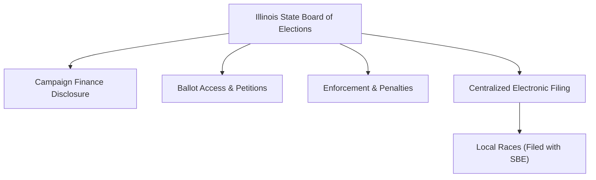

# Illinois Campaign Finance Overview

> **STALENESS WARNING:** This reference reflects the Illinois Election Code (10 ILCS 5/) and State Board of Elections rules as of early 2025. Illinois contribution limits are subject to a unique "limits-off" provision that removes caps when a self-funding candidate or independent expenditure committee exceeds certain spending thresholds. Limits may also be adjusted by the General Assembly. Always verify current requirements at [elections.il.gov](https://www.elections.il.gov).

> **EDUCATIONAL DISCLAIMER:** This is educational information, not legal advice. Illinois's limits-off provision, corporate contribution rules, and Cook County/Chicago-specific considerations create unique compliance challenges. Consult an Illinois election law attorney for guidance specific to your campaign.

---

## Filing Agency

**Illinois State Board of Elections (SBE)**
- Website: [elections.il.gov](https://www.elections.il.gov)
- Administers campaign finance disclosure for all state and local candidates
- Operates the electronic campaign finance filing system
- Enforces campaign finance law and assesses penalties
- All committees, including local ones, file with the SBE (Illinois uses a centralized filing system)

---

## Unique Features of Illinois Campaign Finance Law

1. **"Limits-off" provision** -- contribution limits are automatically removed for a race when a self-funding candidate contributes personal funds exceeding a threshold, or when an independent expenditure committee spends above a threshold in that race. Once limits are off, all candidates in that race may accept unlimited contributions for the remainder of the election cycle.
2. **Corporate contributions allowed** -- unlike federal law and many states, Illinois permits direct corporate contributions to candidates
3. **Union contributions allowed** -- labor unions may contribute directly to candidates
4. **Centralized filing** -- all campaign finance reports, even for local races, are filed with the State Board of Elections
5. **Transfer limits differ from contribution limits** -- transfers between political committees have separate rules
6. **Pay-to-play restrictions** -- state contractors and their family members face contribution restrictions to the officeholder awarding the contract (Executive Order and statute)

---

## Contribution Limits (2025-2026 Cycle -- Verify Current Amounts)

| Donor Type | To Statewide Candidate (per election) | To GA Candidate (per election) | To Local Candidate (per election) | Notes |
|-----------|--------------------------------------|-------------------------------|----------------------------------|-------|
| Individual | **$5,800** | **$5,800** | **$5,800** | Per election cycle (primary + general combined for some calculations) |
| Corporation | **$5,800** | **$5,800** | **$5,800** | Direct corporate contributions permitted |
| Labor Union | **$5,800** | **$5,800** | **$5,800** | Direct union contributions permitted |
| PAC | **$58,000** | **$58,000** | **$58,000** | 10x the individual limit |
| Political Party (state central) | **No limit** | **No limit** | **No limit** | Party committees exempt from limits |
| Political Party (legislative caucus) | **No limit** | **No limit** | N/A | Caucus committees also exempt |
| Candidate to Own Campaign | **No limit** | **No limit** | **No limit** | But may trigger limits-off (see below) |
| Cash (any source) | **No specific statutory cap** | Same | Same | But best practice to use traceable methods for any significant amount |

*Note: Illinois contribution limits are per election cycle unless otherwise specified. Verify current limits at elections.il.gov.*

### Limits-Off Provision (Critical Feature)

The contribution limits are automatically **suspended** for all candidates in a race when:

1. **Self-funding trigger:** A candidate contributes personal funds to their own campaign exceeding **$250,000** (for statewide races) or **$100,000** (for General Assembly/local races) within a single reporting period
2. **Independent expenditure trigger:** An independent expenditure committee spends more than **$250,000** (statewide) or **$100,000** (GA/local) in a single race within a single reporting period

**When limits go off:**
- All contribution limits are removed for **every candidate** in that race (not just the self-funder or the target of the IE)
- Limits remain off for the remainder of that election cycle
- The SBE posts notice when limits are suspended for a particular race
- Candidates must monitor SBE notices to know when limits-off applies to their race

**Strategic implications:** The limits-off provision means campaigns must be prepared for the possibility that a wealthy opponent or a large IE could eliminate contribution caps mid-race. This fundamentally affects fundraising strategy.

---

## Committee Registration

### Candidate Committees (Political Committees)
- File a **Statement of Organization (Form D-1)** with the State Board of Elections
- Must register within **5 business days** of receiving contributions or making expenditures exceeding **$5,000** in any 12-month period (or $3,000 for local committees)
- Must designate a chairperson and treasurer
- Must designate a campaign depository

### Political Action Committees
- Register with the SBE using Form D-1
- Same $5,000 threshold triggers registration
- May be organized as an **independent expenditure committee** (Super PAC equivalent) that accepts unlimited contributions but makes only independent expenditures

### Ballot Initiative Committees
- Must register with the SBE
- **No contribution limits** apply to ballot initiative committees

### Political Party Committees
- State central, congressional district, county, and ward/township committees register with the SBE
- Exempt from contribution limits when giving to candidates

---

## Ballot Access

### Major Party Candidates (Democrat / Republican)
- Collect **nominating petition signatures** from primary voters in the district
- Signature thresholds:
  - Statewide office: **5,000-10,000 signatures** (with distribution requirements)
  - State Senate: **1,000 signatures** (minimum)
  - State House: **500 signatures** (minimum)
- Petitions circulated during a window preceding the filing deadline (typically late November for the following March primary)
- Primary elections held in **March** of even-numbered years
- Filing fee: generally none for state offices (petition-based qualification)

### Independent and Minor Party Candidates
- Must collect petition signatures equal to **1% of votes cast** in the last general election in the relevant district (for statewide) or **5% of votes cast** (for local/legislative in some cases -- thresholds vary)
- Filing deadline is later than major party filing
- New parties must qualify through petition

### Write-In Candidates
- Must file a **Declaration of Intent to be a Write-In Candidate** by a specified deadline

---

## Reporting Schedule

### Quarterly Reports
| Report | Due Date | Coverage |
|--------|----------|----------|
| **Q1** | April 15 | January 1 through March 31 |
| **Q2** | July 15 | April 1 through June 30 |
| **Q3** | October 15 | July 1 through September 30 |
| **Q4 / Year-End** | January 15 | October 1 through December 31 |

### Election-Related Reports (Election Year)
| Report | Due Date | Coverage |
|--------|----------|----------|
| **Pre-primary (30 days)** | 30 days before primary | Through 35 days before primary |
| **Pre-primary (5 days)** | 5 days before primary (D-5) | Through 12 days before primary |
| **Pre-general (30 days)** | 30 days before general | Through 35 days before general |
| **Pre-general (5 days)** | 5 days before general (D-5) | Through 12 days before general |

### A-1 Reports (Last-Minute Contributions -- Critical)
- Any contribution of **$1,000 or more** received during the period between the last pre-election report and the election must be reported within **2 business days** on a **Form A-1**
- This applies to both primary and general election periods
- Filed electronically with the SBE

### Independent Expenditure Reporting
- Independent expenditures of **$1,000 or more** in any election must be reported within **2 business days** during the 60 days before the election
- At other times, IEs aggregate and are reported on regular periodic reports

### Itemization Thresholds
- Contributions over **$150** from a single source must be itemized with name, address, occupation, and employer
- All expenditures over **$150** must be itemized

---

## Prohibited Contributions

- Contributions exceeding per-election limits (when limits are in effect)
- Contributions in the **name of another** (straw donors)
- **Foreign national** contributions
- **Anonymous contributions exceeding $150** -- must be donated to charity or the state
- **Pay-to-play violations:** State contractors (and their family members and affiliated entities) may not contribute to the officeholder or agency head who awarded the contract; contributions exceeding $375 per year to such officials are prohibited under the State Officials and Employees Ethics Act
- Contributions from persons or entities under **debarment** from state contracts
- Using **public funds** for campaign contributions

---

## Key Differences from Federal Law

| Feature | Federal | Illinois |
|---------|---------|---------|
| Individual contribution limit | $3,300/election | **$5,800/election** (when limits are on) |
| Corporate contributions | Prohibited | **Allowed** ($5,800 limit) |
| Union contributions | Prohibited (direct) | **Allowed** ($5,800 limit) |
| PAC-to-candidate limit | $5,000/election | **$58,000/election** |
| Limits-off provision | None | **Yes** (self-funding or large IE triggers removal of all limits) |
| Party-to-candidate limit | Coordinated expenditure limits | **No limit** |
| Cash contribution cap | $100 | **No specific statutory cap** |
| Reporting | Quarterly/monthly | Quarterly + D-30/D-5 pre-election |
| Public financing | Presidential | **None** |
| Pay-to-play | Limited | **Yes** (statutory restriction for state contractors) |

---

## Local Rules Notes

- **All campaign finance reports**, including for local races, are filed with the **State Board of Elections** (centralized system)
- **Chicago** does not impose separate city contribution limits, but the city has its own ethics ordinance with provisions affecting campaign conduct (City of Chicago Board of Ethics)
- **Cook County** follows state rules; no separate county contribution limits
- **Collar counties (DuPage, Lake, Will, Kane, McHenry)** follow state rules
- Local municipalities generally cannot impose their own contribution limits that differ from state law
- **Home rule municipalities** may have limited authority to regulate campaign practices through ethics ordinances
- **Judicial candidates** are subject to the Illinois Code of Judicial Conduct and Supreme Court rules regarding campaign fundraising, in addition to the Election Code

---

## Electronic Filing

- The SBE operates an electronic filing system for all campaign finance reports
- Electronic filing is **mandatory** for all committees that have received contributions or made expenditures exceeding **$10,000** in any reporting period
- Committees below the threshold may file on paper or electronically
- The SBE provides the Sunshine Database for public access to all filed reports
- Filing system available at [elections.il.gov](https://www.elections.il.gov)

---

## Pay-to-Play Restrictions (Important)

Illinois enacted significant pay-to-play restrictions affecting campaign contributions:

- **State contractors** (and their family members, officers, and affiliated entities) may not contribute more than **$375 per calendar year** to the officeholder or agency head who awarded the contract
- Contributions exceeding $375 to the contracting authority during the contract period may result in contract voidance
- The restrictions apply to contracts valued at **$50,000 or more**
- A searchable database of restricted contributors is maintained by the SBE
- These restrictions are in addition to (not instead of) regular contribution limits

---

## Resources

- **Illinois State Board of Elections:** [elections.il.gov](https://www.elections.il.gov)
- **Campaign Disclosure Filing System:** Available at elections.il.gov
- **Illinois Election Code (10 ILCS 5/):** Available at ilga.gov
- **Current Contribution Limits and Limits-Off Status:** Published by the SBE
- **Sunshine Database (Public Disclosure):** [elections.il.gov/CampaignDisclosure/](https://www.elections.il.gov/CampaignDisclosure/)
- **State Officials and Employees Ethics Act (Pay-to-Play):** 5 ILCS 430/
