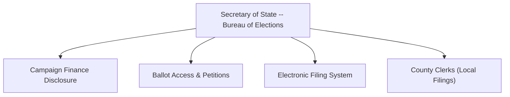

# Michigan Campaign Finance Overview

> **STALENESS WARNING:** This reference reflects Michigan Campaign Finance Act (MCL 169.201 et seq.) and Secretary of State / Bureau of Elections rules as of early 2025. Michigan adjusts contribution limits periodically based on the Consumer Price Index. The Michigan Legislature may amend campaign finance law at any time. Always verify current requirements at [michigan.gov/sos/elections/campaign-finance](https://www.michigan.gov/sos/elections/campaign-finance).

> **EDUCATIONAL DISCLAIMER:** This is educational information, not legal advice. Michigan's open primary system, low cash contribution cap, and specific corporate/union rules require careful attention. Consult a Michigan election law attorney for guidance specific to your campaign.

---

## Filing Agencies

**Michigan Secretary of State -- Bureau of Elections**
- Website: [michigan.gov/sos/elections](https://www.michigan.gov/sos/elections)
- Administers campaign finance disclosure for statewide, legislative, and judicial candidates
- Operates the electronic campaign finance filing system
- County and local candidates file with the **county clerk**

---

## Unique Features of Michigan Campaign Finance Law

1. **Open primary** -- Michigan uses an open primary system where voters choose which party's primary to vote in on election day without pre-registering with a party (though the voter receives only one party's ballot)
2. **$20 cash contribution limit** -- one of the lowest cash contribution caps in the nation
3. **Corporate and union direct contributions prohibited** -- corporations and unions may not contribute directly to candidates; they must use PACs
4. **Super PACs recognized** -- Michigan law accommodates independent expenditure-only committees
5. **Bundling disclosure** -- intermediaries who bundle contributions may be subject to disclosure requirements
6. **Late contribution reporting** -- contributions of $1,000+ received in the final days before an election require expedited 24-hour reporting

---

## Contribution Limits (2025-2026 Cycle -- Verify CPI Adjustments)

| Donor Type | Statewide (per election) | State Senate (per election) | State House (per election) | Notes |
|-----------|-------------------------|---------------------------|--------------------------|-------|
| Individual | **$7,150** | **$1,775** | **$1,175** | CPI-adjusted; verify current |
| Corporation | **Prohibited** | **Prohibited** | **Prohibited** | Must use PAC |
| Labor Union | **Prohibited** | **Prohibited** | **Prohibited** | Must use PAC |
| PAC (independent) | **$7,150** | **$1,775** | **$1,175** | Same as individual |
| Political Party (state central) | **$68,000** (per election) | **$10,000** | **$10,000** | Higher party limits |
| Political Party (district/county) | **$34,000** | **$5,000** | **$5,000** | Lower than state central |
| Candidate to Own Campaign | **No limit** | **No limit** | **No limit** | Personal funds unlimited |
| Cash (any source) | **$20 max** | **$20 max** | **$20 max** | Extremely low cap |

*All dollar figures are approximate based on the most recent CPI adjustment. Verify at michigan.gov/sos.*

### Aggregate Limits
- Michigan does **not** impose aggregate limits on total contributions from one individual to all candidates

---

## Committee Registration

### Candidate Committees
- File a **Statement of Organization** with the Secretary of State (statewide/legislative) or county clerk (local)
- Must register before accepting contributions or making expenditures
- Must designate a **treasurer** -- the candidate may serve as treasurer
- Must designate a **campaign depository** (bank account)

### Political Action Committees
- Register with the Secretary of State
- Must be organized by a sponsoring organization (corporation, union, trade association, etc.) or as an independent PAC
- **Independent expenditure committees** (Super PACs) must register and file reports but may accept unlimited contributions if they make only independent expenditures

### Political Party Committees
- State central committees, congressional district committees, and county committees register with the Secretary of State or county clerk
- Subject to specific contribution limits when giving to candidates

### Ballot Question Committees
- Committees supporting or opposing ballot proposals must register and report
- **No contribution limits** apply to ballot question committees

---

## Ballot Access

### Major Party Candidates (Republican / Democrat)
- File an **Affidavit of Identity** and collect **nominating petition signatures** from registered voters in the district
- Signature thresholds vary by office:
  - Governor: **15,000-30,000 signatures** (with distribution requirements across congressional districts)
  - State Senate: **500-1,000 signatures** (varies)
  - State House: **200-500 signatures** (varies)
- Filing deadline is typically in April of the election year
- Primary elections held in **August** (first Tuesday after the first Monday)
- Filing fees: Michigan generally does not charge filing fees; qualification is by petition

### Independent and Third-Party Candidates
- Must collect petition signatures (generally higher thresholds than major party candidates)
- Filing deadline is earlier
- Minor parties must qualify for ballot access through petition drives

### Write-In Candidates
- Must file a **Declaration of Intent** as a write-in candidate by the specified deadline (typically 4 PM on the second Friday before the election)

---

## Reporting Schedule

### Regular Reports
| Report | Due Date | Coverage |
|--------|----------|----------|
| **January Annual** | Last business day of January | Full prior year (or period since last report) |
| **April Quarterly** | April 25 | January 1 through April 20 |
| **July Quarterly** | July 25 | April 21 through July 20 |
| **October Quarterly** | October 25 | July 21 through October 20 |

### Election-Related Reports
| Report | Due Date | Coverage |
|--------|----------|----------|
| **Pre-primary** | 11th day before primary (late July) | Through 16 days before primary |
| **Post-primary** | ~35 days after primary | Through 20 days after primary |
| **Pre-general** | 11th day before general (late October) | Through 16 days before general |
| **Post-general** | ~35 days after general | Through 20 days after general |

### Late Contribution Reporting (24-Hour Rule)
- Contributions of **$1,000 or more** received after the close of the last pre-election report and before the election must be reported within **24 hours**
- Filed electronically

### Independent Expenditure Reporting
- Independent expenditures exceeding **$100** must be reported
- IEs of **$1,000 or more** made within 45 days of an election require reporting within **48 hours**

### Itemization Thresholds
- Contributions over **$100** from a single source in a reporting period must be itemized with name, address, occupation, and employer
- Contributions of $20.01 to $100 require name and address
- All expenditures over **$50** must be itemized

---

## Prohibited Contributions

- **Corporate contributions** directly to candidates
- **Labor union contributions** directly to candidates
- **Cash contributions exceeding $20**
- Contributions in the **name of another** (straw donors)
- **Foreign national** contributions
- **Anonymous contributions exceeding $50** -- must be returned or sent to the state
- Contributions from **persons under 18** (Michigan restricts minor contributions more than federal law)
- Contributions made using **public funds**
- Contributions from one **candidate committee to another** are restricted (with exceptions for party transfers)

---

## Key Differences from Federal Law

| Feature | Federal | Michigan |
|---------|---------|---------|
| Individual contribution limit | $3,300/election | **$7,150/election** (statewide); lower for legislative |
| Corporate contributions | Prohibited | **Prohibited** (same) |
| Union contributions | Prohibited (direct) | **Prohibited** (direct, same) |
| Cash cap | $100 | **$20** (much lower) |
| Primary type | Varies by state | **Open primary** |
| Limit adjustment | Every odd year | **CPI-adjusted periodically** |
| Minor contributions | Allowed | **Restricted (under 18)** |
| Party-to-candidate limit | Coordinated expenditure limits | **$68,000** (statewide, state central) |
| Public financing | Presidential | **None** |
| Reporting | Quarterly/monthly | Quarterly + pre/post election |

---

## Local Rules Notes

- **County and local candidates** file campaign finance reports with the **county clerk** rather than the Secretary of State
- **Detroit** follows state campaign finance law; the city does not impose separate contribution limits, but has a local ethics ordinance
- **Ann Arbor, Grand Rapids, Lansing** and other cities follow state rules
- Michigan generally does not authorize municipalities to impose their own campaign finance limits beyond state law
- **School board** candidates are subject to the same Campaign Finance Act provisions
- **Judicial candidates** are subject to the Campaign Finance Act and the Michigan Code of Judicial Conduct, which imposes additional restrictions on campaign activity and fundraising
- Some local charter provisions may add procedural requirements -- check with the local clerk

---

## Electronic Filing

- The Bureau of Elections provides the **Campaign Finance Reporting System** for electronic filing
- Electronic filing is **required** for candidates and committees that receive contributions or make expenditures exceeding **$5,000** in a calendar year
- Committees below the threshold may file electronically or on paper
- The filing system is available at the Secretary of State's website

---

## Resources

- **Michigan Secretary of State -- Campaign Finance:** [michigan.gov/sos/elections/campaign-finance](https://www.michigan.gov/sos/elections/campaign-finance)
- **Michigan Campaign Finance Act (MCL 169.201 et seq.):** Available at legislature.mi.gov
- **Bureau of Elections Campaign Finance Filing System:** Available at michigan.gov/sos
- **Current Contribution Limits:** Published by the Secretary of State
- **Campaign Finance Manual:** Published by the Bureau of Elections
