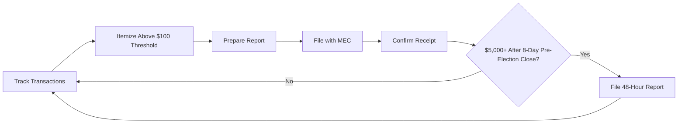

# Missouri Disclosure & Reporting Requirements

> **STALENESS WARNING:** This reference was written in April 2026. Filing deadlines,
> itemization thresholds, and electronic filing rules may change through legislation or
> MEC rulemaking. Always verify current requirements at https://www.mec.mo.gov before
> filing.

> **EDUCATIONAL DISCLAIMER:** This document is for educational and informational purposes
> only. It does not constitute legal advice. Campaigns should consult a qualified election
> law attorney or the Missouri Ethics Commission for guidance specific to their situation.

---

## Filing Agency

All campaign finance reports are filed with the **Missouri Ethics Commission (MEC)**.

- **Electronic filing:** Required for all committees that raise or spend $5,000 or more.
  Committees below this threshold may file on paper but electronic filing is encouraged.
- **Filing system:** MEC Electronic Filing System at https://www.mec.mo.gov/EthicsWeb/Filing/
- **Paper forms:** Available on the MEC website for committees not required to file
  electronically.

---

## Report Types

### Quarterly Reports

All active committees must file quarterly reports regardless of whether they are on the
ballot that cycle.

| Report | Coverage Period | Due Date |
|--------|---------------|----------|
| Q1 (January) | October 1 - December 31 | January 15 |
| Q2 (April) | January 1 - March 31 | April 15 |
| Q3 (July) | April 1 - June 30 | July 15 |
| Q4 (October) | July 1 - September 30 | October 15 |

### Pre-Election Reports

Committees with candidates on the ballot or committees making expenditures related to
an upcoming election must file pre-election reports.

| Report | Coverage | Due Date |
|--------|----------|----------|
| 30-Day Pre-Election | From close of last report through 30 days before election | 30 days before election day |
| 8-Day Pre-Election | From close of 30-day report through 8 days before election | 8 days before election day |

Pre-election reports are required for:
- Primary elections (typically first Tuesday in August)
- General elections (first Tuesday after first Monday in November)
- Special elections
- Municipal elections (April, for Kansas City and St. Louis)

### Post-Election Report

| Report | Coverage | Due Date |
|--------|----------|----------|
| 30-Day Post-Election | From close of last report through 30 days after election | 30 days after election day |

### Termination Report

A committee that is closing must file a termination report showing a zero balance with
no outstanding debts or obligations. The report must be filed with a Statement of
Committee Dissolution (MCE-2).

---

## Itemization Thresholds

### Contributions

| Category | Threshold | Required Information |
|----------|-----------|---------------------|
| Itemized contributions | $100 or more | Full name, address, employer, occupation, date, amount |
| Non-itemized contributions | Under $100 | May be reported in aggregate |
| Anonymous contributions | $100 or less | Reported as total anonymous contributions |
| Anonymous contributions | Over $100 | **Prohibited** -- must be returned or donated to charity |

### Expenditures

| Category | Threshold | Required Information |
|----------|-----------|---------------------|
| Itemized expenditures | $100 or more | Payee name, address, date, amount, purpose |
| Non-itemized expenditures | Under $100 | May be reported in aggregate |

---

## Large/Late Contribution Reports

Contributions of **$5,000 or more** received after the closing date of the 8-day
pre-election report but before the election must be reported to the MEC within
**48 hours** of receipt.

This applies to:
- Direct monetary contributions
- In-kind contributions valued at $5,000 or more
- Loans received of $5,000 or more

The 48-hour report is filed electronically through the MEC filing system.

---

## Independent Expenditure Reports

Any person or committee making independent expenditures totaling $500 or more in
support of or opposition to a clearly identified candidate must file an independent
expenditure report.

- **48-hour reports** are required for independent expenditures of $5,000 or more made
  within 8 days of an election.
- Reports must include the name of the candidate(s) supported or opposed and whether
  the expenditure was for or against.

---

## Electioneering Communications

Electioneering communications -- broadcast, cable, or satellite communications that
refer to a clearly identified candidate and are made within 30 days of a primary or
60 days of a general election -- must be reported if they cost $500 or more.

---

## Record-Keeping Requirements

Committees must maintain records for all financial transactions:

- **Deposit records:** All contributions must be deposited within 5 business days of
  receipt into the committee's dedicated campaign bank account.
- **Receipts:** Keep records of all contributions including date received, contributor
  information, and amount.
- **Expenditure records:** Retain invoices, receipts, canceled checks, and bank
  statements for all expenditures.
- **Retention period:** Records must be retained for at least 5 years after the report
  is filed (or 5 years after the committee terminates, whichever is later).

---

## Penalties for Non-Compliance

| Violation | Penalty |
|-----------|---------|
| Late filing | $10/day for each day late (up to amount of the filing fee or $1,000) |
| Failure to file | Referral to Attorney General; civil penalties up to $10,000 |
| Knowing violation of contribution limits | Class A misdemeanor |
| Filing false reports | Class D felony |
| Failure to itemize | MEC may require amended report; repeated violations subject to penalty |

The MEC may also issue warning letters, negotiate consent orders, or refer matters
to the local prosecuting attorney or the Attorney General.

---

## Electronic Filing Details

- **Who must file electronically:** Any committee that receives contributions or makes
  expenditures of $5,000 or more in a reporting period.
- **Software:** The MEC provides a free web-based filing system. Third-party software
  may be used if it produces files in MEC-compatible format.
- **Signatures:** Electronic filings are authenticated through the MEC's login system.
  No physical signature is required for electronic filings.
- **Amendments:** Amendments to previously filed reports can be filed electronically.
  Amended reports must clearly indicate what has been changed.

---

## Candidate Personal Financial Disclosure

In addition to campaign finance reports, candidates for certain offices must file a
Personal Financial Disclosure (PFD) statement with the MEC:

- Required for candidates for statewide office, General Assembly, and certain appointed
  positions.
- Must be filed within 30 days of becoming a candidate.
- Covers the prior calendar year.
- Includes sources of income, real property holdings, business interests, and
  liabilities.

---

## Sources & Verification

- Missouri Revised Statutes, Chapter 130
- MEC Filing Guidelines and Instructions
- MEC Administrative Rules, 28 CSR 40
- https://www.mec.mo.gov
- Last verified: April 2026
