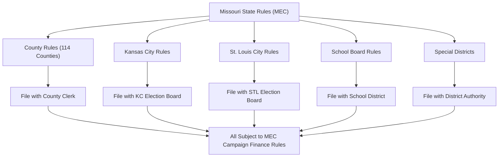

# Missouri Local Office Election Rules

> **STALENESS WARNING:** This reference was written in April 2026. Local election rules,
> especially for Kansas City and St. Louis, are subject to change through charter
> amendments, ordinances, and state legislation. Always verify current rules with the
> relevant local election authority.

> **EDUCATIONAL DISCLAIMER:** This document is for educational and informational purposes
> only. It does not constitute legal advice. Campaigns should consult a qualified election
> law attorney or the relevant election authority for guidance specific to their situation.

---

## Overview

Missouri local elections operate under a layered system. State campaign finance law
(Chapter 130, RSMo) applies to all candidates, but election administration, filing
procedures, and election timing vary significantly by jurisdiction type. The two most
distinctive jurisdictions are Kansas City and St. Louis City, each of which has its own
Board of Election Commissioners and unique rules.

---

## Kansas City

### Election Authority

| Field | Details |
|-------|---------|
| **Authority** | Kansas City Board of Election Commissioners |
| **Website** | https://www.kceb.org |
| **Phone** | (816) 842-4820 |

### Key Rules

- **Nonpartisan elections:** All Kansas City municipal elections are nonpartisan. Party
  labels do not appear on the ballot.
- **Election timing:** Municipal elections are held in **odd-numbered years** (city
  council, mayor). The general municipal election is the first Tuesday after the first
  Monday in **June**. If a primary is needed, it is held in **April**.
- **Term limits:** Mayor and council members are limited to **two consecutive four-year
  terms**.
- **Filing:** Candidates file with the Kansas City Election Board.
- **Campaign finance:** State MEC rules apply. Kansas City does not have a separate local
  campaign finance board or additional local contribution limits.
- **Districts:** Kansas City uses a mix of at-large and district council seats. Six
  council members are elected from districts, six are elected at-large (three from each
  side of the state line, as Kansas City spans Jackson, Clay, Platte, and Cass counties).
- **Mayor:** Elected citywide.

### Kansas City School District (KCPS)

- Nonpartisan elections held in **April** of odd-numbered years.
- School board members serve staggered four-year terms.
- Candidates file with the Kansas City Election Board.
- No local campaign finance rules beyond state law.

---

## St. Louis City

### Election Authority

| Field | Details |
|-------|---------|
| **Authority** | St. Louis City Board of Election Commissioners |
| **Website** | https://www.stlouis-mo.gov/government/departments/board-election-commissioners/ |
| **Phone** | (314) 622-4336 |

### Key Rules

- **Independent city:** St. Louis City is an independent city, separate from St. Louis
  County. It functions as both a city and a county.
- **Partisan primaries, nonpartisan general:** Following the passage of **Proposition D**
  in November 2020, St. Louis City moved to an **approval voting** system for the
  nonpartisan primary and a **top-two general** for mayor and Board of Aldermen starting
  in 2021. Verify current structure as further charter changes may have occurred.
- **Election timing:** Municipal primary in **March**, general in **April** (odd years).
- **Board of Aldermen:** St. Louis reduced its Board of Aldermen from 28 wards to 14
  wards following 2020 redistricting changes. Members serve four-year terms.
- **Mayor:** Four-year term. No term limits (as of this writing; verify current charter).
- **Campaign finance:** State MEC rules apply. St. Louis City does not maintain a
  separate campaign finance regulatory body or impose additional limits.
- **Filing:** Candidates file with the St. Louis City Board of Election Commissioners.

### Special Considerations

- St. Louis City voters also elect a **Comptroller** and **President of the Board of
  Aldermen** in municipal elections.
- City revenue-related ballot measures follow separate procedures.

---

## St. Louis County

### Election Authority

| Field | Details |
|-------|---------|
| **Authority** | St. Louis County Board of Election Commissioners |
| **Website** | https://www.stlouisco.com/YourGovernment/Elections |
| **Phone** | (314) 615-1800 |

### Key Rules

- **County executive and council:** Partisan elections held in even-numbered years
  alongside state elections.
- **Standard state rules apply** for campaign finance and ballot access.
- **Municipalities within the county:** St. Louis County contains approximately 88
  municipalities, many with their own elected officials. Municipal elections are
  generally nonpartisan and held in April of odd-numbered years.
- **Filing:** County candidates file with the county Board of Election Commissioners.
  Municipal candidates file with their local election authority or the county board.

---

## County Offices (General)

Missouri has 114 counties plus St. Louis City. County offices follow this general
pattern:

### County Commission / County Council

- Most counties use a three-member county commission (presiding commissioner elected
  countywide, two district commissioners).
- Charter counties (Jackson, St. Louis, St. Charles, Jefferson, Greene, Jasper, Clay,
  Cass, Boone, Franklin, and Buchanan counties) may have different structures
  (county executive + council).
- Elections are partisan, held in even-numbered years.

### Other Elected County Offices

| Office | Term | Election Cycle |
|--------|------|---------------|
| Sheriff | 4 years | Even years (gubernatorial cycle) |
| Prosecuting Attorney | 4 years | Even years (presidential cycle) |
| County Clerk | 4 years | Even years |
| Recorder of Deeds | 4 years | Even years |
| Collector | 4 years | Even years |
| Assessor | 4 years | Even years |
| Treasurer | 4 years | Even years |
| Coroner/Medical Examiner | 4 years | Even years |
| Public Administrator | 4 years | Even years |
| Surveyor | 4 years | Even years |

Not all counties elect all of these offices. Charter counties may combine or appoint
some positions.

### Filing

- County candidates file with the **county clerk** (not the Board of Election
  Commissioners, unless the county has one).
- Filing deadline: Same as state offices (last Tuesday in March in election year).
- Filing fees: $25-$100 depending on the office and county classification.

---

## School Board Elections

- **Nonpartisan elections** held on the first Tuesday in **April**.
- **Filing period:** Candidates file a declaration of candidacy with the school district
  secretary between mid-December and mid-January (exact dates vary by year; check with
  the district).
- **Filing fee:** Typically $25-$50 or no fee, depending on the district.
- **No petition requirement** for most school board seats (some districts may require
  a minimal number of signatures).
- **Campaign finance:** State MEC rules apply. Committees must register with the MEC
  and file reports if they exceed the $500 threshold.
- **Term:** Most school board members serve three-year terms, though some districts use
  four-year terms.

---

## Municipal Elections (Non-Charter Cities)

- Most Missouri municipalities hold **nonpartisan elections** in **April of odd-numbered
  years**.
- Aldermen/council members typically serve **two-year terms** (some cities have
  four-year terms).
- Mayors may be elected by voters or selected from among council members, depending on
  the city's form of government.
- **Filing:** Candidates file with the city clerk.
- **Filing fees:** Vary by municipality, generally nominal ($5-$50).
- **Campaign finance:** State MEC rules apply. There are no additional local contribution
  limits unless specifically enacted by the municipality.

---

## Special Districts

Missouri has numerous special districts (fire protection, ambulance, library, water,
sewer, levee, etc.) with elected boards.

- Elections typically held in **April** on the same ballot as school board and municipal
  elections.
- **Filing:** Candidates file a declaration of candidacy with the district.
- **Filing period:** Similar to school boards (mid-December to mid-January).
- **Campaign finance:** State MEC rules apply if campaigns exceed the $500 threshold.
  Most special district campaigns are small enough that MEC registration is not triggered.
- **No filing fee** for most special district positions.

---

## Judicial Elections

Missouri uses the **Missouri Plan** (nonpartisan court plan) for selecting judges in
certain courts:

- **Appellate courts and some circuit courts** (in Jackson County, St. Louis City,
  St. Louis County, Clay County, and Platte County): Judges are appointed by the
  Governor from a panel, then face **retention elections** (yes/no vote, no opponent).
- **Other circuit courts:** Judges are elected in **partisan elections** in even-numbered
  years.
- **Associate circuit judges:** Elected in partisan elections in all circuits.
- Judicial candidates are subject to campaign finance limits and MEC reporting.

---

## Campaign Finance Rules for All Local Offices

Regardless of the type of local office, the following state rules apply:

- **Contribution limits:** Same $2,875/election limit applies to all offices.
- **Committee registration:** Required if the campaign receives or spends over $500.
- **Reporting:** Same MEC reporting schedule (quarterly reports + pre/post-election
  reports for the relevant election).
- **Itemization:** Same $100 threshold.
- **No additional local limits** unless a home-rule municipality or charter county has
  enacted them (which is rare in Missouri).

---

## Sources & Verification

- Missouri Revised Statutes, Chapter 115 (Elections)
- Missouri Revised Statutes, Chapter 130 (Campaign Finance)
- Kansas City Charter and Code of Ordinances
- St. Louis City Charter
- https://www.sos.mo.gov/elections
- https://www.mec.mo.gov
- Last verified: April 2026
