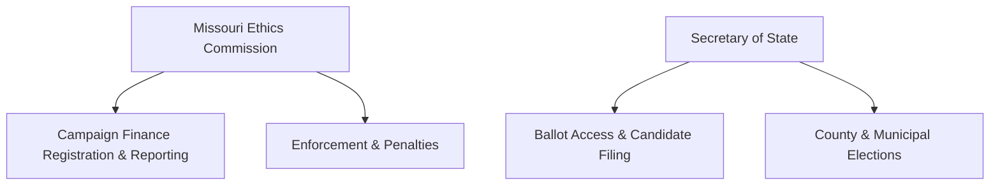

# Missouri Campaign Finance & Election Overview

> **STALENESS WARNING:** This reference was written in April 2026. Missouri campaign
> finance laws have undergone major changes in recent years (limits removed in 2008,
> reinstated in 2016 via Constitutional Amendment 2, adjusted biennially for CPI).
> Contribution limits shown here reflect the 2025-2026 cycle. Always verify current
> figures with the Missouri Ethics Commission before making compliance decisions.

> **EDUCATIONAL DISCLAIMER:** This document is for educational and informational purposes
> only. It does not constitute legal advice. Campaigns should consult a qualified election
> law attorney or the Missouri Ethics Commission for guidance specific to their situation.

---

## Filing Agency

| Field | Details |
|-------|---------|
| **Agency Name** | Missouri Ethics Commission (MEC) |
| **Website** | https://www.mec.mo.gov |
| **Phone** | (573) 751-2020 |
| **Toll-Free** | (800) 392-8660 |
| **Address** | P.O. Box 1370, Jefferson City, MO 65102 |
| **Online Filing System** | MEC Electronic Filing System (https://www.mec.mo.gov/EthicsWeb/Filing/) |

The MEC handles campaign finance registration, reporting, and enforcement. The Secretary
of State handles ballot access, candidate filing, and election administration.

---

## Key Features

- **Contribution limits reinstated in 2016** after being struck down and then removed
  from 2008-2016. Constitutional Amendment 2 (August 2016 ballot) restored limits with
  CPI adjustments every two years.
- **Disclosure-based system:** Missouri emphasizes transparency through regular reporting
  rather than heavy regulatory restrictions.
- **No public financing program** for state candidates.
- **Open primary system:** Voters do not register by party but must choose one party's
  ballot in the primary.
- **Strong local government layer:** Kansas City and St. Louis have distinct municipal
  election rules and timelines.
- **Lobbyist contribution restrictions** during legislative session.

---

## Contribution Limits (2025-2026 Cycle)

Limits are per election (primary and general are separate elections). Adjusted biennially
based on CPI, rounded to the nearest $25.

| Donor Type | Statewide Office | State Senate | State Representative |
|------------|-----------------|--------------|---------------------|
| Individual | $2,875 | $2,875 | $2,875 |
| Committee (PAC) | $2,875 | $2,875 | $2,875 |
| Party Committee | Unlimited | Unlimited | Unlimited |
| Corporate | $2,875 | $2,875 | $2,875 |
| Union | $2,875 | $2,875 | $2,875 |

**Important notes:**
- Limits are **per election** (primary, general, and any runoff are separate)
- Party committees (state and county level) may give unlimited amounts to candidates
- No aggregate limit on total contributions a donor may give across all candidates
- Self-funding by candidates from personal funds is unlimited
- Limits apply to direct contributions; independent expenditures are unlimited
- See `contribution-limits.md` for full detail on all office types and donor categories

---

## Committee Registration Requirements

- **Threshold to register:** Any person or group that receives contributions or makes
  expenditures exceeding $500 in a calendar year for the purpose of influencing an
  election must form a committee.
- **Candidate committees:** Must be formed before accepting contributions or making
  expenditures. File a Statement of Committee Organization (MCE-1) with the MEC.
- **Required officers:** Treasurer required for all committees. Candidate serves as
  chairperson of their own committee.
- **Committee types:** Candidate committee, continuing committee (PAC), political party
  committee, exploratory committee, ballot measure committee, and independent expenditure
  committee.
- **Bank account:** Dedicated campaign bank account required at a financial institution
  in Missouri.
- **Registration deadline:** Within 30 days of organization or within 10 days of
  exceeding the $500 threshold, whichever is sooner.

---

## Ballot Access Requirements

| Office | Filing Fee | Petition Signatures | Filing Deadline |
|--------|-----------|-------------------|-----------------|
| Governor | $200 | None (major party) | Last Tuesday in March (primary year) |
| Lt. Governor | $100 | None (major party) | Last Tuesday in March |
| Secretary of State | $100 | None (major party) | Last Tuesday in March |
| Attorney General | $100 | None (major party) | Last Tuesday in March |
| State Senator | $100 | None (major party) | Last Tuesday in March |
| State Representative | $50 | None (major party) | Last Tuesday in March |
| Independent/Third Party (statewide) | -- | 10,000 signatures | Varies |
| Independent/Third Party (district) | -- | 2% of voters in last election | Varies |

**Additional notes:**
- Major party candidates file a Declaration of Candidacy with the Secretary of State
  and pay the filing fee. No petition signatures required.
- Independent and third-party candidates must gather petition signatures in lieu of
  filing fees.
- Write-in candidates must file a declaration of intent before the election.
- See `ballot-access.md` for complete details including local offices and deadlines.

---

## Reporting Schedule

| Report | Coverage Period | Due Date |
|--------|---------------|----------|
| January Quarterly | Oct 1 - Dec 31 | January 15 |
| April Quarterly | Jan 1 - Mar 31 | April 15 |
| July Quarterly | Apr 1 - Jun 30 | July 15 |
| October Quarterly | Jul 1 - Sep 30 | October 15 |
| 30-Day Pre-Election | Through 30 days before election | 30 days before election |
| 8-Day Pre-Election | Through 8 days before election | 8 days before election |
| Post-Election (30-Day) | Through 30 days after election | 30 days after election |

**Itemization thresholds:**
- Contributions of $100 or more must be itemized (name, address, employer/occupation)
- Expenditures of $100 or more must be itemized
- **Large contribution reports:** Contributions of $5,000+ received after the 8-day
  pre-election report must be reported within 48 hours
- See `disclosure-requirements.md` for full reporting details and electronic filing rules

---

## Prohibited Contributions

- Foreign national contributions
- Anonymous contributions over $100 (anonymous contributions of $100 or less are
  permitted but must be reported as aggregate anonymous contributions)
- Cash contributions over $100
- Contributions in the name of another person (straw donor prohibition)
- Lobbyist contributions to legislative candidates during regular legislative session
  (January-May) and the 30 days before session
- Contributions from entities that hold a state gaming license (to certain officials)

---

## Key Differences from Federal Rules

- **Lower contribution limits:** Federal individual limit is $3,300/election (2025-2026);
  Missouri is $2,875/election for all office levels.
- **Corporate and union contributions allowed:** Unlike federal law, which prohibits
  direct corporate and union treasury contributions to candidates, Missouri permits them
  subject to the same limits as individuals.
- **Party committee exception:** Missouri state and county party committees may give
  unlimited amounts to candidates, unlike federal party contribution limits.
- **Itemization threshold:** Missouri requires itemization at $100 (federal is $200).
- **No "best efforts" for employer/occupation:** Missouri requires employer and
  occupation for all itemized contributions without a best-efforts exception.
- **Lobbyist session restrictions:** Federal law has no equivalent session-based
  contribution ban.

---

## Local Rules Notes

Missouri's major cities have election rules that differ from the standard state framework:

- **Kansas City:** Nonpartisan municipal elections held in odd years. City campaign
  finance rules administered by the KC Board of Election Commissioners.
- **St. Louis City:** Separate from St. Louis County. Municipal elections follow city
  charter rules. The Board of Election Commissioners handles city elections.
- **St. Louis County:** County executive and council races follow standard state rules.
- **School boards and special districts:** Generally nonpartisan with April election
  dates. Lower filing fees. Campaign finance rules still governed by state MEC rules.

See `local-rules.md` for detailed coverage of local election requirements.

---

## Sources & Verification

- Missouri Revised Statutes, Chapter 130 (Campaign Finance Disclosure)
- Missouri Ethics Commission Candidate Guide
- Missouri Secretary of State Candidate Filing Information
- https://www.mec.mo.gov
- https://www.sos.mo.gov/elections
- Last verified: April 2026
