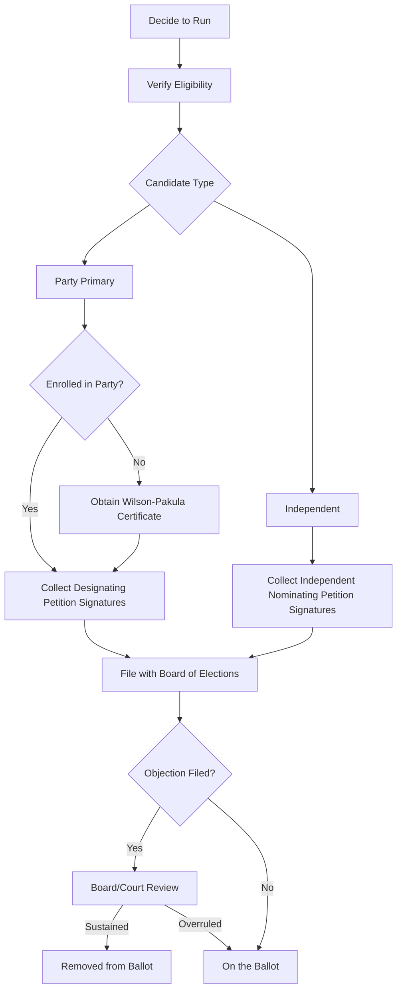

# New York Ballot Access Requirements

> **STALENESS WARNING:** This reference was written in April 2026. Filing deadlines,
> signature requirements, and party rules may change through legislation or court order.
> New York ballot access law is complex and frequently litigated. Always verify current
> requirements with the New York State Board of Elections at https://www.elections.ny.gov
> before filing.

> **EDUCATIONAL DISCLAIMER:** This document is for educational and informational purposes
> only. It does not constitute legal advice. Campaigns should consult a qualified election
> law attorney or the Board of Elections for guidance specific to their situation.

---

## Overview

New York's ballot access system is among the most complex in the nation. It features
**designating petitions** for party primaries, **independent nominating petitions** for
non-party candidates, the **Wilson-Pakula certificate** for cross-party nominations, and
an aggressive **objection process** that knocks many candidates off the ballot on
technicalities. Careful attention to petition form, signature gathering, and filing
procedures is essential.

---

## Party Primary Ballot Access (Designating Petition)

To appear on a party primary ballot, a candidate must file a **designating petition**
signed by enrolled party members in the relevant jurisdiction.

### Signature Requirements

| Office | Signatures Required | Source |
|--------|-------------------|--------|
| Governor | 15,000 (min 100 per congressional district, from at least half of CDs) | Enrolled party members statewide |
| Lieutenant Governor | Runs on joint ticket with Governor | Same petition |
| State Comptroller | 15,000 (same distribution rule) | Enrolled party members statewide |
| Attorney General | 15,000 (same distribution rule) | Enrolled party members statewide |
| U.S. Senator | 15,000 (same distribution rule) | Enrolled party members statewide |
| U.S. Representative | 1,250 (or 5% of enrolled party members, whichever is less) | Enrolled party members in district |
| State Senator | 1,000 (or 5% of enrolled, whichever is less) | Enrolled party members in district |
| State Assembly | 500 (or 5% of enrolled, whichever is less) | Enrolled party members in district |
| NYC Mayor | 7,500 (5% cap applies) | Enrolled party members citywide |
| NYC City Council | 450 (5% cap applies) | Enrolled party members in district |

### Key Rules for Designating Petitions

- Signers must be **enrolled members of the candidate's party** and registered voters
  in the relevant jurisdiction.
- Petition sheets must contain specific header information (office, party, election
  district details).
- Each sheet must be signed by a **subscribing witness** who is an enrolled party
  member in the relevant jurisdiction.
- Volumes of petitions must be bound and filed together.
- Collect significantly **more signatures than the minimum** (typically 1.5-2x) to
  withstand challenges.

---

## Party Committee Authorization (Wilson-Pakula Certificate)

A candidate who is **not enrolled** in a party may still appear on that party's primary
ballot if they receive a **Wilson-Pakula certificate** from the appropriate party
committee:

- The party's **county committee** (for local races) or **state committee** (for
  statewide races) must vote to authorize the non-member candidate.
- The certificate must be filed with the Board of Elections.
- Without a Wilson-Pakula, a non-enrolled candidate may not appear on a party primary
  ballot (even if they collect enough petition signatures).

---

## Independent Nominating Petitions

Candidates running outside the party system file **independent nominating petitions**
to appear on the general election ballot.

### Signature Requirements

| Office | Signatures Required |
|--------|-------------------|
| Governor | 15,000 (min 100 per congressional district, from at least half of CDs) |
| U.S. Senator | 15,000 (same distribution rule) |
| U.S. Representative | 3,500 (or 5% of total enrolled voters, whichever is less) |
| State Senator | 3,000 (or 5% of total enrolled voters, whichever is less) |
| State Assembly | 1,500 (or 5% of total enrolled voters, whichever is less) |

- Signers must be **registered voters** in the jurisdiction (any party or no party).
- Signers may **not** have signed a designating petition for the same office or voted
  in a party primary for the same office.
- Independent petitions have a later filing window than designating petitions.

---

## Petition Filing Periods

| Petition Type | Filing Window |
|--------------|--------------|
| Designating petitions (party primary) | Typically early-to-mid April (specific dates vary by year) |
| Independent nominating petitions | Typically late May through mid-August |
| Objections to petitions | Within 3-6 days of filing deadline (varies by petition type) |

Exact dates are published by the NYSBOE for each election year.

---

## Objection Process

New York's objection process is aggressive and frequently used:

- **Any registered voter** in the relevant jurisdiction may file objections to a
  candidate's petition.
- **Grounds for objection:** Invalid signatures, insufficient signatures, improper
  petition form, witness defects, residency issues, and more.
- **Specific objections required:** The objector must specify which signatures or
  pages are challenged and on what grounds.
- **Board review:** The county or state Board of Elections reviews objections and makes
  a determination.
- **Court review:** Challenged candidates may bring proceedings in court to contest
  Board determinations.
- **Practical impact:** Many candidates are knocked off the ballot through objections.
  This makes careful petition preparation critical.

### Common Objection Grounds

- Signer not enrolled in the correct party
- Signer not registered in the correct jurisdiction
- Duplicate signatures
- Date errors or missing dates
- Subscribing witness defects (wrong party enrollment, wrong jurisdiction)
- Cover sheet errors
- Pages out of order or improperly bound

---

## Party Ballot Access

A political party maintains its ballot line in New York by receiving at least **130,000
votes** (or 2% of total votes cast, whichever is greater) for **Governor** in the most
recent gubernatorial election.

### Current Recognized Parties

Major parties and any minor parties that met the threshold are recognized. The specific
list changes after each gubernatorial election; verify the current list with the NYSBOE.

### New Party Qualification

A new party may qualify by:
- Filing an independent nominating petition with 15,000+ signatures for Governor,
  then having the candidate receive 130,000+ votes (or 2%) in the general election.

---

## Write-In Candidates

- Write-in candidates are permitted in all elections.
- **No filing required** for write-in candidacy (unlike many states).
- Write-in votes are counted for any person whose name is written in.
- Practical viability is low -- write-in candidates rarely win in New York.

---

## Residency and Eligibility Requirements

| Office | Minimum Age | Residency Requirement |
|--------|------------|----------------------|
| Governor | 30 | 5 years New York resident |
| Lieutenant Governor | 30 | 5 years New York resident |
| State Comptroller | 30 | 5 years New York resident |
| Attorney General | 30 | 5 years New York resident |
| State Senator | 18 | 1 year district resident, citizen |
| State Assembly | 18 | 1 year district resident, citizen |
| U.S. Senator | 30 | New York resident, 9 years U.S. citizen |
| U.S. Representative | 25 | New York resident, 7 years U.S. citizen |
| NYC Mayor | 18 | 1 year NYC resident |
| NYC City Council | 18 | 1 year district resident |

---

## Key Dates (General Reference)

| Event | Typical Timing |
|-------|---------------|
| Designating petition filing | Early-to-mid April |
| Objection period | Shortly after petition filing deadline |
| Primary election | Fourth Tuesday in June |
| Independent petition filing | Late May through mid-August |
| General election | First Tuesday after first Monday in November |

---

## Sources & Verification

- New York Election Law, Articles 6-7
- NYSBOE Political Calendar (published each year)
- NYSBOE Petition Filing Instructions
- https://www.elections.ny.gov
- Last verified: April 2026
