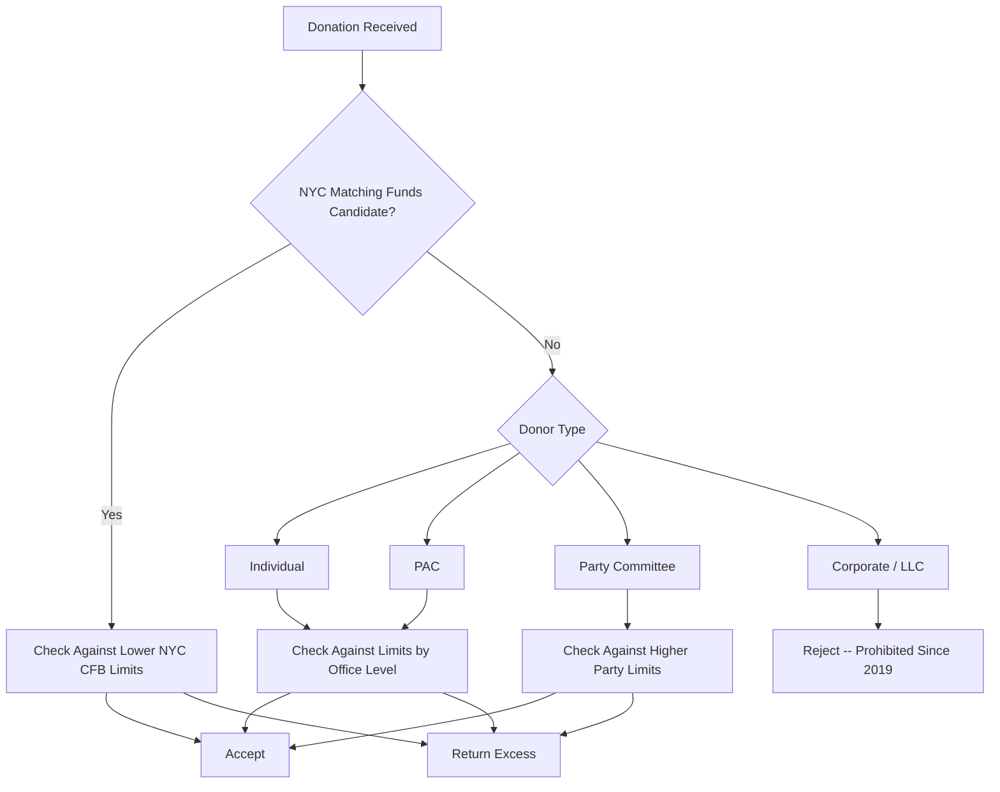

# New York Contribution Limits (Detailed)

> **STALENESS WARNING:** This reference was written in April 2026. New York contribution
> limits are set by statute and may change through legislation. NYC matching funds rules
> are set by the NYC Campaign Finance Board and are subject to separate adjustments.
> Verify current limits at https://www.elections.ny.gov and https://www.nyccfb.info
> before making compliance decisions.

> **EDUCATIONAL DISCLAIMER:** This document is for educational and informational purposes
> only. It does not constitute legal advice. Campaigns should consult a qualified election
> law attorney or the relevant election board for guidance specific to their situation.

---

## Background

New York has a complex contribution limit system that varies significantly by office
level. Key features include:

- **Limits vary by office** -- Governor races have much higher limits than Assembly races.
- **LLC loophole closed** (2019): LLCs are now treated as corporations, not individuals.
- **NYC has a separate system** with its own (lower) limits and an 8:1 public matching
  funds program administered by the NYC Campaign Finance Board (CFB).
- **Corporate contributions:** Prohibited for state races (since 2019 reforms).

---

## Current Limits -- State Elections (Outside NYC Program)

All limits are for the **full election cycle** (primary + general combined), not
per-election, unless otherwise noted. These limits apply to candidates who do not
participate in the NYC matching funds program.

### Individual Contributions to Candidates

| Office | Limit Per Election Cycle |
|--------|------------------------|
| Governor / Lieutenant Governor | $70,100 |
| State Comptroller | $47,100 |
| Attorney General | $47,100 |
| State Senate | $19,300 |
| State Assembly | $9,700 |

### Family Member Contributions

Contributions from the candidate's family members (spouse, children, parents, siblings)
are subject to the same limits as other individuals.

### PAC Contributions to Candidates

| Office | Limit Per Election Cycle |
|--------|------------------------|
| Governor / Lieutenant Governor | $70,100 |
| State Comptroller | $47,100 |
| Attorney General | $47,100 |
| State Senate | $19,300 |
| State Assembly | $9,700 |

PACs are called "political committees" in New York law. They are subject to the same
per-candidate limits as individuals.

### Constituted (Party) Committee Contributions to Candidates

| Committee Level | Limit |
|----------------|-------|
| State committee | Varies by office (higher than individual limits) |
| County committee | Varies by office |
| Assembly district committee | Varies by office |

Party committee limits are generally higher than individual/PAC limits and vary by
office. Consult the NYSBOE contribution limit chart for exact figures.

---

## Corporate and Union Contributions

- **Corporate contributions:** **Prohibited** for all state and local races. This
  prohibition was enacted in 2019 as part of comprehensive campaign finance reform.
- **LLC contributions:** LLCs are treated as **corporations** (not individuals) and
  therefore **prohibited** from contributing to candidates. This closed a significant
  loophole that previously allowed unlimited LLC giving.
- **Union contributions:** Permitted. Unions may contribute from their general treasury
  funds, subject to the same limits as individuals.
- **Partnership contributions:** Attributed to individual partners based on their
  share of the partnership.

---

## NYC Campaign Finance Board Limits (Participating Candidates)

Candidates who participate in the NYC matching funds program are subject to **lower
contribution limits** set by the CFB:

### NYC Contribution Limits (Participating Candidates)

| Office | Limit Per Election |
|--------|--------------------|
| Mayor | $2,000 |
| Public Advocate | $2,000 |
| Comptroller | $2,000 |
| Borough President | $1,500 |
| City Council | $1,000 |

These limits are significantly lower than state limits and are a condition of
receiving matching funds.

### NYC 8:1 Matching Funds

The NYC matching funds program matches qualifying small-dollar contributions at a
ratio of **$8 in public funds for every $1** in eligible contributions:

| Office | Matchable Amount Per Contributor | Maximum Public Funds Per Candidate |
|--------|-------------------------------|-----------------------------------|
| Mayor | First $250 | ~$7,800,000 |
| Public Advocate | First $250 | ~$4,000,000 |
| Comptroller | First $250 | ~$4,000,000 |
| Borough President | First $175 | ~$1,500,000 |
| City Council | First $175 | ~$320,000 |

- **Qualifying:** Candidates must raise a threshold number of small contributions from
  constituents within the relevant jurisdiction.
- **Eligible contributions:** Only contributions from NYC residents are matchable.
- **Contribution size:** Only the first $250 (or $175) of each contribution is matched.
  Larger contributions are permitted (up to the limit) but the excess is not matched.

---

## Self-Funding

- **State races:** Candidates may contribute unlimited personal funds to their own
  campaign.
- **NYC program:** Participating candidates face **self-funding limits**. Exceeding
  the limit disqualifies the candidate from receiving matching funds.

---

## Aggregate Limits

New York imposes **annual aggregate limits** on individual giving:

| Recipient Type | Annual Aggregate Limit |
|---------------|----------------------|
| To all candidates combined | $150,000 per year |
| To all PACs combined | No aggregate limit |
| To all party committees combined | No aggregate limit |

---

## Independent Expenditures

- **No dollar limit** on independent expenditures (per *Citizens United*).
- IEs must be truly independent -- no coordination with candidates.
- Reporting requirements apply for IEs of $1,000 or more.
- **Super PACs:** Must register as independent expenditure committees and file regular
  reports.

---

## Prohibited Contributions (Quick Reference)

| Source | Permitted? | Notes |
|--------|-----------|-------|
| Individuals | Yes | Subject to limits (varies by office) |
| Corporations | **No** | Prohibited (since 2019) |
| LLCs | **No** | Treated as corporations |
| Unions | Yes | Subject to same limits as individuals |
| PACs | Yes | Subject to limits |
| Partnerships | Yes | Attributed to individual partners |
| Party committees | Yes | Higher limits than individuals |
| Foreign nationals | **No** | Prohibited |
| Anonymous (over $99) | **No** | Must identify donor |
| Cash (over $100) | **No** | Must use traceable instrument |

---

## Loans

- Loans from a candidate to their own campaign are unlimited (state races).
- Loans from others are treated as contributions subject to limits.
- Bank loans on commercially reasonable terms are not treated as contributions.
- Outstanding loans must be reported and are subject to post-election repayment rules.

---

## Sources & Verification

- New York Election Law, Article 14
- New York State Board of Elections Contribution Limit Charts
- NYC Campaign Finance Act (NYC Administrative Code, Chapter 7)
- NYC Campaign Finance Board Rules
- https://www.elections.ny.gov
- https://www.nyccfb.info
- Last verified: April 2026
