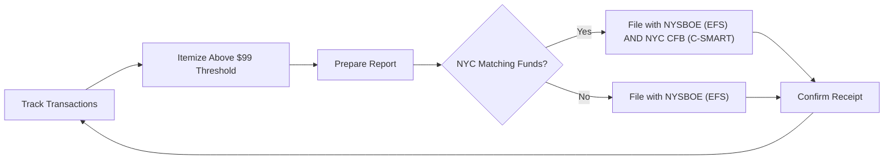

# New York Disclosure & Reporting Requirements

> **STALENESS WARNING:** This reference was written in April 2026. Filing deadlines,
> itemization thresholds, and electronic filing rules may change through legislation or
> NYSBOE/CFB rulemaking. Always verify current requirements at https://www.elections.ny.gov
> and https://www.nyccfb.info before filing.

> **EDUCATIONAL DISCLAIMER:** This document is for educational and informational purposes
> only. It does not constitute legal advice. Campaigns should consult a qualified election
> law attorney or the relevant election board for guidance specific to their situation.

---

## Filing Agencies

New York has two primary filing authorities, and NYC candidates may need to file with both:

| Agency | Jurisdiction | Website |
|--------|-------------|---------|
| New York State Board of Elections (NYSBOE) | All state and local candidates | https://www.elections.ny.gov |
| NYC Campaign Finance Board (CFB) | NYC candidates in matching funds program | https://www.nyccfb.info |

- **NYSBOE:** All candidates for state and local office file campaign finance reports
  with the NYSBOE through the NYSBOE Electronic Filing System (EFS).
- **NYC CFB:** NYC candidates participating in the matching funds program must **also**
  file with the CFB through its C-SMART disclosure system. This is a dual filing
  requirement.

---

## Report Types -- State (NYSBOE)

### Semi-Annual Reports

All active committees must file semi-annual reports.

| Report | Coverage Period | Due Date |
|--------|---------------|----------|
| January Periodic | July 12 through January 11 | January 15 |
| July Periodic | January 12 through July 11 | July 15 |

### Pre-Election Reports

Candidates on an upcoming ballot file pre-election reports.

| Report | Coverage | Due Date |
|--------|----------|----------|
| 32-Day Pre-Election | From close of last report through 36 days before election | 32 days before election |
| 11-Day Pre-Election | From close of 32-day report through 15 days before election | 11 days before election |

### Post-Election Report

| Report | Coverage | Due Date |
|--------|----------|----------|
| 27-Day Post-Election | From close of last report through 20 days after election | 27 days after election |

### Special Elections

Special election reporting follows condensed schedules specified by the NYSBOE.

### Termination

A committee winding down must file a termination report showing a zero balance and no
outstanding obligations.

---

## Report Types -- NYC (CFB)

NYC participating candidates must file with both the NYSBOE and the CFB. The CFB has
its own reporting schedule:

| Report | Typical Due Date |
|--------|-----------------|
| January Disclosure | Mid-January |
| March Disclosure | Mid-March |
| May Disclosure | Mid-May |
| July Disclosure | Mid-July |
| Pre-Primary (32-day and 11-day) | Per election calendar |
| Pre-General (32-day and 11-day) | Per election calendar |
| Post-Election | ~January 15 following election year |

The CFB publishes detailed reporting schedules for each election cycle.

---

## Itemization Thresholds

### Contributions (NYSBOE)

| Category | Threshold | Required Information |
|----------|-----------|---------------------|
| Itemized contributions | Over $99 | Full name, address, occupation, employer, date, amount |
| Non-itemized contributions | $99 or less | May be reported in aggregate |
| Anonymous contributions | $99 or less | Permitted; reported in aggregate |
| Anonymous contributions | Over $99 | **Prohibited** |

### Contributions (NYC CFB -- Additional Requirements)

| Category | Threshold | Required Information |
|----------|-----------|---------------------|
| All contributions | $1 or more | Full donor information required for matching eligibility |
| Intermediaries (bundlers) | All amounts | Must identify intermediary and all contributors bundled |

The CFB requires more detailed reporting than the NYSBOE minimum to verify matching
funds eligibility.

### Expenditures

| Category | Threshold | Required Information |
|----------|-----------|---------------------|
| Itemized expenditures | Over $50 | Payee name, address, date, amount, purpose |
| Non-itemized expenditures | $50 or less | May be reported in aggregate |

---

## Late / Large Contribution Reports

- **State races:** Contributions of **$1,000 or more** received in the period between
  the 11-day pre-election report and election day must be reported within **24 hours**.
- **NYC races:** The CFB may require additional disclosure for late contributions
  received close to the election.

---

## Independent Expenditure Reports

Independent expenditure committees must file reports with the NYSBOE:

- **$1,000 threshold:** IEs of $1,000 or more must be reported.
- **24-hour reports:** Required during the pre-election period for IEs of $1,000+.
- Reports must identify the candidate supported or opposed.

---

## Electronic Filing

### NYSBOE E-Filing

- **Required for:** All committees that raise or spend $1,000 or more in a reporting
  period (effectively, nearly all active committees).
- **System:** NYSBOE Electronic Filing System (EFS).
- **Software:** The NYSBOE provides free filing software. Third-party software may be
  used if compatible.
- **Paper filing:** Permitted only for committees below the $1,000 threshold.

### NYC CFB C-SMART

- **Required for:** All NYC participating candidates (mandatory for matching funds).
- **System:** C-SMART (Campaign and Smart Management Application for Reporting
  and Tracking).
- **Training:** The CFB provides mandatory compliance training for participating
  candidates and their treasurers.
- **Dual filing:** NYC candidates must file with BOTH the NYSBOE (EFS) and the CFB
  (C-SMART).

---

## Record-Keeping Requirements

- **Bank account:** All campaign funds must be deposited in a committee bank account.
- **Deposit timeline:** Contributions should be deposited promptly; the CFB requires
  deposit within 10 business days for participating NYC candidates.
- **Record retention:** Records must be retained for at least 5 years.
- **Contributor information:** Best efforts required to obtain occupation and employer
  for contributions over $99.
- **NYC CFB records:** Participating candidates must maintain detailed records of all
  transactions for CFB audit purposes.

---

## Penalties for Non-Compliance

### State (NYSBOE)

| Violation | Penalty |
|-----------|---------|
| Late filing | $100 for first week; additional penalties for continued delinquency |
| Failure to file | Referral to enforcement counsel; civil penalties |
| Exceeding contribution limits | Fine and required refund of excess |
| Filing false reports | Criminal misdemeanor |
| Willful violations | Potential felony charges |

### NYC (CFB)

| Violation | Penalty |
|-----------|---------|
| Late filing | Reduction in matching funds payments |
| Failure to comply with CFB rules | Repayment of matching funds; penalties up to $10,000 |
| Exceeding spending limits | Repayment of matching funds; penalties |
| Fraud | Criminal referral; repayment of all public funds |

The CFB conducts **mandatory post-election audits** of all participating candidates.
Deficiencies found in the audit can result in repayment obligations and penalties.

---

## Personal Financial Disclosure

- **State officials and candidates:** Must file an Annual Statement of Financial
  Disclosure with the Joint Commission on Public Ethics (JCOPE) / Commission on
  Ethics and Lobbying in Government.
- **NYC officials and candidates:** Must file a financial disclosure report with the
  NYC Conflicts of Interest Board.
- **Filing deadline:** May 15 (annual) or within 30 days of assuming office.
- **Covers:** Sources of income, investments, real property, positions held, gifts,
  and outside activities.

---

## Sources & Verification

- New York Election Law, Articles 14-16
- NYC Campaign Finance Act (Administrative Code, Chapter 7)
- NYSBOE Filing Calendars and Guides
- NYC CFB Candidate Handbook
- https://www.elections.ny.gov
- https://www.nyccfb.info
- Last verified: April 2026
