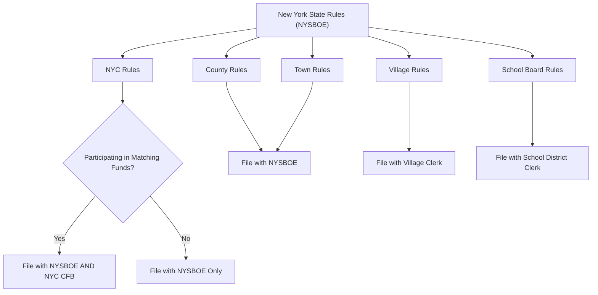

# New York Local Office Election Rules

> **STALENESS WARNING:** This reference was written in April 2026. Local election rules
> in New York vary significantly by jurisdiction and are subject to change through
> legislation, charter amendments, and local law. Always verify current rules with the
> relevant Board of Elections or local election authority.

> **EDUCATIONAL DISCLAIMER:** This document is for educational and informational purposes
> only. It does not constitute legal advice. Campaigns should consult a qualified election
> law attorney or the relevant election authority for guidance specific to their situation.

---

## Overview

New York local elections operate under state Election Law supplemented by city charters,
county charters, and local laws. The most distinctive jurisdiction is New York City,
which has its own Campaign Finance Board (CFB) with an 8:1 matching funds program and
separate spending limits. Outside NYC, local races are governed primarily by state rules,
though some counties and cities have adopted additional regulations.

---

## New York City

### Election Authority

| Field | Details |
|-------|---------|
| **Authority** | NYC Board of Elections |
| **Campaign finance** | NYC Campaign Finance Board (CFB) |
| **CFB website** | https://www.nyccfb.info |
| **BOE website** | https://vote.nyc |

### NYC Offices

| Office | Term | Term Limits | Election Cycle |
|--------|------|------------|---------------|
| Mayor | 4 years | 2 consecutive terms | Odd years (2025, 2029...) |
| Public Advocate | 4 years | 2 consecutive terms | Odd years |
| Comptroller | 4 years | 2 consecutive terms | Odd years |
| Borough President (5) | 4 years | 2 consecutive terms | Odd years |
| City Council (51 districts) | 4 years | 2 consecutive terms | Odd years |
| District Attorney (5 counties) | 4 years | No term limits | Odd years |

### NYC Matching Funds Program (8:1)

The CFB matching funds program is one of the most generous public financing systems in
the nation:

- **Match ratio:** $8 of public funds for every $1 of eligible contributions.
- **Eligible contributions:** From NYC residents only; matched up to $250 (citywide
  offices) or $175 (City Council and Borough President).
- **Contribution limits (participating candidates):**

| Office | Limit Per Election |
|--------|--------------------|
| Mayor | $2,000 |
| Public Advocate | $2,000 |
| Comptroller | $2,000 |
| Borough President | $1,500 |
| City Council | $1,000 |

### NYC Spending Limits (Participating Candidates)

Candidates who opt into the matching funds program agree to expenditure ceilings:

| Office | Spending Limit Per Election (approximate) |
|--------|------------------------------------------|
| Mayor (primary) | $7,900,000 |
| Mayor (general) | $7,900,000 |
| Public Advocate / Comptroller (primary) | $4,600,000 |
| Public Advocate / Comptroller (general) | $4,600,000 |
| Borough President (primary) | $1,900,000 |
| Borough President (general) | $1,900,000 |
| City Council (primary) | $254,000 |
| City Council (general) | $254,000 |

Spending limits may be lifted if an opponent does not participate or exceeds the limit.
Exact amounts are adjusted each cycle by the CFB.

### NYC Ranked Choice Voting

NYC uses **ranked choice voting (RCV)** for primary and special elections (not general
elections) for city offices:

- Voters rank up to 5 candidates in order of preference.
- If no candidate receives a majority of first-choice votes, the last-place candidate
  is eliminated and their votes are redistributed.
- Process continues until a candidate achieves a majority.

### NYC Dual Filing Requirement

NYC candidates who participate in the matching funds program must file with **both**:
1. **NYSBOE** (state campaign finance reports through EFS)
2. **NYC CFB** (detailed disclosure through C-SMART)

Non-participating candidates file only with the NYSBOE.

---

## Nassau County

### Key Rules

| Field | Details |
|-------|---------|
| **Authority** | Nassau County Board of Elections |
| **Government** | County Executive + 19-member Legislature |

- **Partisan elections** held in odd-numbered years.
- County executive and legislators serve **four-year terms**.
- **Campaign finance:** State NYSBOE rules apply. Nassau County does not impose
  additional local contribution limits.
- **Filing:** Campaign finance reports filed with NYSBOE.
- **Town elections:** Nassau County contains 3 towns (Hempstead, North Hempstead,
  Oyster Bay) with their own elected supervisors and boards.

---

## Suffolk County

### Key Rules

| Field | Details |
|-------|---------|
| **Authority** | Suffolk County Board of Elections |
| **Government** | County Executive + 18-member Legislature |

- **Partisan elections** held in odd-numbered years.
- County executive serves a **four-year term**; legislators serve **two-year terms**.
- **Campaign finance:** State NYSBOE rules apply. No additional local limits.
- **Town elections:** Suffolk County contains 10 towns with elected supervisors and
  boards.

---

## Westchester County

### Key Rules

| Field | Details |
|-------|---------|
| **Authority** | Westchester County Board of Elections |
| **Government** | County Executive + 17-member Board of Legislators |

- **Partisan elections** held in odd-numbered years.
- County executive and legislators serve **four-year terms**.
- **Campaign finance:** State NYSBOE rules apply. Westchester has considered but not
  adopted additional local campaign finance restrictions (as of this writing).
- **Municipalities:** Westchester contains numerous cities, towns, and villages with
  their own elected officials.

---

## County and Town Offices (General)

New York has 62 counties (including the 5 NYC boroughs). Outside NYC, counties elect
various officials:

### Common Elected County Offices

| Office | Term | Election Cycle |
|--------|------|---------------|
| County Executive (charter counties) | 4 years | Odd years |
| County Legislature / Board of Supervisors | 2-4 years | Varies |
| District Attorney | 4 years | Odd years |
| Sheriff | 4 years | Odd years |
| County Clerk | 4 years | Odd years |
| County Treasurer | 4 years | Odd years (where elected) |

### Town Offices

| Office | Term | Election Cycle |
|--------|------|---------------|
| Town Supervisor | 2-4 years | Odd years |
| Town Board Members | 2-4 years | Odd years |
| Town Clerk | 2-4 years | Odd years |
| Town Justice | 4 years | Odd years |
| Highway Superintendent | 2-4 years | Odd years |

- **Partisan or nonpartisan:** Most town elections are partisan.
- **Filing:** Candidates file designating petitions (party primary) or independent
  nominating petitions with the county Board of Elections.

---

## Village Elections

New York villages have their own election system:

- **Nonpartisan elections** held in **March** (separate from all other elections).
- Village elections are **not administered** by the county Board of Elections; they are
  run by the village itself.
- **Nominating petitions:** Filed with the village clerk. Signature requirements are low
  (typically 5% of voters who voted in the last village election or 100, whichever
  is less).
- **Campaign finance:** State NYSBOE rules apply, but many village campaigns fall below
  reporting thresholds.

---

## School Board Elections

- **Budget vote and school board elections** held on the **third Tuesday in May**.
- **Nonpartisan** -- no party designations.
- **Petitions:** Candidates file nominating petitions with the school district clerk.
  Signature requirements vary (typically 25-100 depending on district size).
- **Campaign finance:** State rules apply. Most school board campaigns are small enough
  that they fall below reporting thresholds.
- **NYC exception:** NYC school governance is handled through community education
  councils and the Panel for Educational Policy, not traditional elected school boards.

---

## Judicial Elections

- **Supreme Court:** Elected by judicial district in partisan elections (even years).
  Candidates are nominated by judicial district conventions, not petitions.
- **County Court:** Elected in partisan elections (varies by county).
- **Family Court, Surrogate's Court:** Elected in some counties; appointed in NYC.
- **Civil/Criminal Court (NYC only):** Nominated by party conventions.
- **Campaign finance:** State NYSBOE rules apply. Judicial candidates must also comply
  with the Code of Judicial Conduct.

---

## Sources & Verification

- New York Election Law
- NYC Charter and Administrative Code
- NYC Campaign Finance Board Candidate Handbook
- NYSBOE Political Calendar
- https://www.elections.ny.gov
- https://www.nyccfb.info
- https://vote.nyc
- Last verified: April 2026
