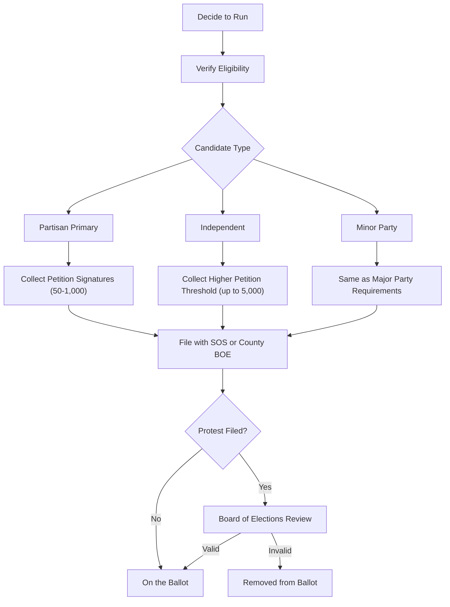

# Ohio Ballot Access (Detailed)

> **STALENESS WARNING:** This reference was written in April 2026. Ohio ballot access
> requirements, filing deadlines, and petition signature thresholds are subject to
> legislative changes and court rulings. Verify current requirements at
> https://www.ohiosos.gov/elections/candidates/ before filing.

> **EDUCATIONAL DISCLAIMER:** This document is for educational and informational purposes
> only. It does not constitute legal advice. Candidates should consult a qualified election
> law attorney or the Ohio Secretary of State's office for guidance specific to their
> situation.

---

## Overview

Ohio uses a combination of petition signatures and filing deadlines to regulate
ballot access. The state has a partisan primary system in which candidates run
within their party's primary to earn the general election nomination. Independent
and minor-party candidates follow separate pathways.

---

## Partisan Primary Candidates

### Petition Signature Requirements

| Office | Signatures Required | Filing Deadline |
|--------|--------------------|-----------------| 
| Governor | 1,000 | 90 days before primary |
| U.S. Senator | 1,000 | 90 days before primary |
| U.S. Representative | 50 | 90 days before primary |
| State Senator | 50 | 90 days before primary |
| State Representative | 50 | 90 days before primary |
| Statewide row offices | 50-1,000 | 90 days before primary |
| County offices | 25-50 | 90 days before primary |
| Municipal offices | Varies by charter | Varies |

### Primary Petition Rules
- [ ] Signatures must come from registered voters in the candidate's district
- [ ] Signatures must come from voters registered with the candidate's party
- [ ] Petition forms must be obtained from the Secretary of State or county BOE
- [ ] Circulator must be a registered Ohio voter
- [ ] Each petition part-petition must include circulator's statement
- [ ] File petitions with Secretary of State (statewide) or county BOE (local)

---

## Independent Candidates

Independent candidates bypass the partisan primary and go directly to the
general election ballot, but face higher signature requirements.

| Office | Signatures Required | Filing Deadline |
|--------|--------------------|-----------------| 
| Governor | 5,000 | Prior to primary day (varies) |
| U.S. Senator | 5,000 | Prior to primary day |
| U.S. Representative | Varies by district | Prior to primary day |
| State Senator | 50-500 | Prior to primary day |
| State Representative | 50-500 | Prior to primary day |

### Independent Candidate Checklist
- [ ] Cannot have voted in any party's primary in the current cycle
- [ ] Must file declaration of candidacy
- [ ] Must file qualifying petition with required signatures
- [ ] Petition signatures must come from registered voters in the district
- [ ] Signers cannot have voted in a party primary that cycle

---

## Minor Party Candidates

A "minor party" in Ohio is one that received at least 3% but less than 20% of the
total vote for governor or president in the most recent election.

| Requirement | Details |
|------------|---------|
| Party qualification | 3% of vote in last gubernatorial/presidential race |
| Candidate petition | Same as major party requirements |
| New party formation | Petition with signatures equal to 1% of last gubernatorial vote |

---

## Write-In Candidates

| Requirement | Details |
|------------|---------|
| Declaration of intent | Must file with appropriate election authority |
| Filing deadline | 72 days before general election |
| Write-in primary | Not available; write-in applies to general only |

Write-in votes are counted only if the candidate has filed a declaration of
intent to be a write-in candidate.

---

## Judicial Candidates

Ohio elects judges on a **nonpartisan ballot** for the general election, though
judicial candidates run through partisan primaries.

| Court | Petition Requirement |
|-------|---------------------|
| Supreme Court | 1,000 signatures |
| Court of Appeals | 50 signatures |
| Common Pleas Court | 50 signatures |
| Municipal/County Court | 25-50 signatures |

### Judicial Candidate Notes
- [ ] Judicial races appear on a separate nonpartisan section of the ballot
- [ ] Party affiliation is not listed next to judicial candidates' names
- [ ] Judicial candidates are subject to the Ohio Code of Judicial Conduct
- [ ] Campaign speech restrictions apply per Supreme Court rules

---

## Filing Fees

Ohio does **not** charge filing fees for candidates. Ballot access is petition-based
rather than fee-based.

---

## Key Deadlines Checklist

- [ ] Form candidate committee and file statement of organization
- [ ] Obtain petition forms from SOS or county BOE
- [ ] Circulate petitions within the required time window
- [ ] File petitions by the deadline (typically 90 days before primary)
- [ ] Verify all circulator statements are complete and notarized
- [ ] File declaration of candidacy
- [ ] Confirm placement on ballot after review period

---

## Petition Challenges

Any qualified elector may protest a candidate's petition within 10 days of filing.
The protest is heard by the relevant board of elections or the Secretary of State.

Common grounds for protest:
- Insufficient valid signatures
- Signatures from voters outside the district
- Signatures from voters not registered with the candidate's party
- Circulator irregularities
- Candidate residency issues

---

## Sources & Verification

- Ohio Revised Code, Chapters 3501, 3513, 3517
- Ohio Secretary of State Candidate Information
- https://www.ohiosos.gov/elections/candidates/
- Last verified: April 2026
